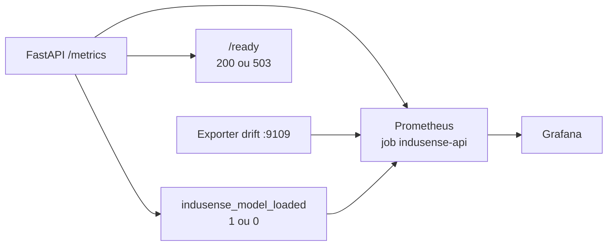

# Fiches TD — version APPRENANT · Sprint 3 CISIA (InduSense 4.0)

> **Windows, macOS ou Linux :** gardez ouvert
> [`guide_multiplateforme_apprenant_sprint3.md`](guide_multiplateforme_apprenant_sprint3.md).
> Les blocs PowerShell de ces fiches sont la voie Windows ; le guide donne, pour
> chaque module, les commandes zsh/bash, chemins, contrôles HTTP, Docker,
> Prometheus, Locust et Game Day équivalents. Les fichiers à produire et les
> résultats attendus sont identiques sur les trois systèmes.

> **Pour l'apprenant, à distance.** Chaque fiche est **auto-portante** : tu peux avancer seul, à ton rythme.
> Structure : 🎯 Objectif · 📖 Rappel théorique (à lire avant) · 🧰 Préflight · 🔧 Étapes · ✅ Preuve à fournir · ⚠️ Pièges · 🧭 Pour aller plus loin.
> Le **corrigé** est fourni à part (le formateur l'ouvre au fil de l'eau). Si tu bloques, **appelle le formateur** (visio/chat).
> Données de référence : `temperature` + `pressure_bar`, cible `panne`. **Trois fichiers, trois populations — nommer le fichier avant de citer un taux :** (1) **Gold contrôlé** `data/gold/gold_dataset.csv` = **2 096 lignes, 208 positifs, ≈ 9,9 %** (capteurs joints + features, prêt à l'emploi) ; (2) **échantillon brut** `data/raw/` (= `data/sample/`, byte-identiques) = **≈ 1 920 lignes, 4 machines, ≈ 10,4 %** (200/1 920 ; ≈ 10,5 % sur les 1 896 lignes entraînables après `dropna`) ; (3) **jeu complet** (hors dépôt, via `INDUSENSE_DATA_DIR`) = **65 625 lignes, 15 machines, panne ≈ 4,78 %**. Python **3.13**. Repo : **`CISIA_24082026_Parcours`**.
> 🎯 **Échelle des chiffres.** **4,7802 %** (3 137/65 625), référentiel complet de **15 machines** et +73 FP sont **réservés au jeu complet** (hors dépôt). Les variantes vérifiées sont `MACH-01`, `MACH_01`, `M-06` et `M-2` ; leur nombre total n'est pas fourni par la source de vérité. Le Gold `data/gold/gold_dataset.csv` vaut **≈ 9,9 %** (208/2 096) et l'échantillon `data/raw/` ≈ `data/sample/` **≈ 10,4 %** (200/1 920) : **jamais 4,78 %** — chaque jeu a son propre dénominateur. Pour retrouver 4,78 %, pointer le flux sur les **données complètes** via `INDUSENSE_DATA_DIR` (cf. `95_snippet_donnees_reelles.md` §4).

---

## Fiche TD 23 — Refactoring & structure projet (US3.1 · C6)

🎯 **Objectif.** Transformer le notebook du Sprint 2 en **package Python `src/` importable et testé**, avec une CLI et une config propre.

🧭 **Contexte — pourquoi · quoi · résultat · comment.**
- **Pourquoi.** En production, un notebook n'est ni testable ni déployable. Pour brancher une API (J2) puis Docker et le monitoring (J3→J6) sur *ton* modèle, il faut d'abord un **code packagé** : c'est le socle de tout le Sprint 3.
- **Quoi.** Transformer le code du Sprint 2 en **package `indusense` installable** (`src/`, `pyproject.toml`, CLI, config `pydantic-settings`) et prouver que les features temporelles utilisent uniquement le passé. Le split temporel réutilisable par machine est l'exercice avancé.
- **Résultat attendu (definition of done).** `uv run pytest -q` à **0 échec**, le test de normalisation ciblé vert, `uv run ruff check .` propre, `uv run indusense --help` répond, `uv run python --version` = 3.13.x. `test_cleaning.py` n'est exigé que si l'extension est jouée.
- **Comment.** Tu pars du repo `CISIA_24082026_Parcours` (cloné), tu complètes les trous (feature, test anti-leakage, `normalize_machine_id`), puis tu **prouves par les commandes**. Si tu bloques, appelle le formateur.

📖 **Rappel théorique (à lire avant le TP).**
Un notebook est parfait pour explorer, mais **impossible à industrialiser** : ordre d'exécution implicite, variables globales, code non testé, rien de réutilisable. Industrialiser, c'est d'abord **séparer les responsabilités** dans un *package* : `data/` (chargement), `features/` (transformation), `models/` (entraînement/prédiction), `api/`, `cli.py`. Le fichier **`pyproject.toml`** déclare les dépendances, la version de Python, le *packaging* et les *scripts* (la commande `indusense`). On gère la configuration via **`pydantic-settings`** (valeurs par défaut + surcharge par `.env`), ce qui évite les chemins « en dur ». Enfin, le piège **n°1** en maintenance prédictive est la **fuite de données** (*data leakage*) : si on mélange passé et futur lors du découpage train/test (split non temporel), le modèle « triche » et son score est faussement excellent. La règle : **trier et découper par machine ET par temps**. On verrouille **Python 3.13** (`>=3.13,<3.14`) avec `uv.lock` pour que tout le monde ait le même environnement.

🧰 **Préflight.**
```powershell
if (-not (Test-Path -LiteralPath .\pyproject.toml)) {
    throw "Ouvrir le terminal à la racine CISIA_24082026_Parcours : pyproject.toml absent."
}
if (-not (Test-Path -LiteralPath .\uv.lock)) {
    throw "Ouvrir le terminal à la racine CISIA_24082026_Parcours : uv.lock absent."
}
uv venv --python 3.13          # force le venv du projet en 3.13
uv sync --frozen --extra dev   # environnement pré-scellé : extras déjà lockés, on ne mute jamais le lock
uv run python --version        # DOIT afficher Python 3.13.x (fait foi, meme si python global = 3.14)
uv run python -c "import indusense; print(indusense.__file__)"
git status --short -- uv.lock  # aucune sortie attendue
```
Si `uv` est introuvable : `winget install --id astral-sh.uv -e` puis rouvre le terminal. Si `code` est introuvable : `winget install --id Microsoft.VisualStudioCode -e`.

🔧 **Étapes.**
1. **Explorer la structure** `src/indusense/` (data/features/models/api/cli). *Ce que tu dois voir :* des modules courts, à responsabilité unique.
2. **Compléter une fonction de feature** dans `features/temporal.py` (trou à remplir), puis l'importer. *Note :* `shift(1)` vient **avant** le `rolling` (sinon fuite).
3. **Écrire/compléter le test anti-leakage de feature** dans `tests/test_temporal.py` : vérifier que `shift(1)` précède le rolling et que la ligne t ne se voit pas elle-même. Le **split** train/test temporel est traité dans le TD avancé, sans confondre les deux mécanismes.
4. **Activité IDs machines** : compléter `normalize_machine_id`, prédire les quatre sorties, puis les prouver :
```powershell
$normalizationCheck = @'
from indusense.data.loaders import normalize_machine_id as n
ids = ("MACH-01", "MACH_01", "M-06", "M-2")
print([n(raw) for raw in ids])
'@
uv run python -c $normalizationCheck
uv run pytest tests/test_loaders.py -q -k normalize_machine_id
```
La sortie attendue est `['MACH-01', 'MACH-01', 'MACH-06', 'MACH-02']` et pytest termine à **0 échec**.
5. **Lancer la qualité** :
```powershell
uv run pytest -q        # tes tests doivent être VERTS
uv run ruff check .     # aucune erreur
uv run indusense --help # la CLI répond (train / predict)
```

💻 **Extension si le groupe avance — extraire une fonction propre.**
Crée `src/indusense/features/cleaning.py` :
```python
from __future__ import annotations
import pandas as pd

def clean_sensor_data(
    df: pd.DataFrame,
    sensor_cols: tuple[str, ...] = ("temperature", "pressure_bar"),
) -> pd.DataFrame:
    df = df.drop_duplicates().copy()
    for col in sensor_cols:
        df[col] = df.groupby("machine")[col].transform(lambda s: s.fillna(s.median()))
    return df
```
Crée `tests/test_cleaning.py` :
```python
import pandas as pd
from indusense.features.cleaning import clean_sensor_data

def test_clean_sensor_data_imputes_by_machine():
    df = pd.DataFrame({
        "machine": ["MACH-01", "MACH-01", "MACH-02", "MACH-02"],
        "temperature": [10.0, None, 30.0, None],
        "pressure_bar": [100.0, 102.0, 200.0, None],
    })
    out = clean_sensor_data(df)
    assert out.loc[1, "temperature"] == 10.0
    assert out.loc[3, "temperature"] == 30.0
```
Puis prouve :
```powershell
uv run pytest tests/test_cleaning.py -q
uv run ruff check .
```
*Intérêt :* tu extrais une fonction **propre, testée, au bon endroit** (`features/`) — exactement l'esprit du module.

🧱 **Auditer le pyproject scellé (exercice socle).** Le starter est déjà verrouillé : **ne modifie ni `pyproject.toml` ni `uv.lock`**. Retrouve (1) `requires-python = ">=3.13,<3.14"` ; (2) les dépendances applicatives ; (3) l'extra `dev` ; (4) le script `indusense = "indusense.cli:main"`. Puis prouve :
```powershell
Select-String -Path .\pyproject.toml -Pattern 'requires-python','optional-dependencies','indusense\s*='
git diff -- pyproject.toml uv.lock   # aucune sortie attendue
uv sync --frozen --extra dev
uv run python -c "import indusense; print(indusense.__file__)"
uv run indusense --help
uv run pytest -q
uv run ruff check .
```
Le détail **bloc par bloc** de `pyproject.toml` est dans le **manuel de révision** (fiche 23).

✅ **Preuve à fournir.** Captures : normalisation exacte + pytest à **0 échec** + ruff propre + `indusense --help` + `uv run python --version` = 3.13.x + `uv.lock` inchangé. Ajouter `test_cleaning.py` uniquement si l'extension a été réalisée.

⚠️ **Pièges.** Confondre split temporel et `shift(1)` (les deux sont nécessaires) · oublier que le package s'installe (`uv sync --frozen --extra dev`) avant l'import · IDs machines non normalisés · venv en 3.14 au lieu de 3.13 · muter le lock avec `uv add`.

❓ **FAQ.** « `src/` vs code à la racine ? » → on teste le **package installé** (comme en prod). « `uv` vs `pip` ? » → plus rapide **et** `uv.lock` (versions exactes, identiques partout). « Un split temporel dispense-t-il de `shift(1)` ? » → non : le split protège l'évaluation ; le shift protège la feature à chaque instant.

🚀 **TD avancé — pour les rapides (optionnel, plus difficile).**
*Tu as fini et tout est vert ? Industrialise l'anti-fuite, sans filet.*
🎯 **But.** Remplacer le « cas d'école » par une fonction de **split temporel réutilisable** + un test **paramétré** qui prouve l'absence de fuite sur **toutes** les machines (pas un seul cas).
🔧 **À faire.**
1. Crée `src/indusense/features/split.py` avec une fonction **pure** (sans état, testable) :
```python
from __future__ import annotations
import pandas as pd

def temporal_split(
    df: pd.DataFrame, ts_col: str = "timestamp",
    group_col: str = "machine", test_frac: float = 0.2,
) -> tuple[pd.DataFrame, pd.DataFrame]:
    """Split temporel PAR machine : les test_frac derniers points (dans le temps)
    de CHAQUE machine vont en test. Aucune fuite passe -> futur."""
    df = df.sort_values([group_col, ts_col])
    trains, tests = [], []
    for _, g in df.groupby(group_col, sort=False):
        k = int(round(len(g) * (1 - test_frac)))
        trains.append(g.iloc[:k]); tests.append(g.iloc[k:])
    return pd.concat(trains), pd.concat(tests)
```
2. Crée `tests/test_split.py` qui **paramètre** plusieurs machines et prouve que, pour chacune, `max(train.ts) <= min(test.ts)` :
```python
import pandas as pd, pytest
from indusense.features.split import temporal_split

@pytest.mark.parametrize("machines", [["MACH-01"], ["MACH-01", "MACH-02", "MACH-03"]])
def test_no_time_leakage_per_machine(machines):
    rows = []
    for m in machines:
        for t in range(20):
            rows.append({"machine": m,
                         "timestamp": pd.Timestamp("2024-01-01") + pd.Timedelta(hours=t),
                         "temperature": float(t)})
    tr, te = temporal_split(pd.DataFrame(rows), test_frac=0.25)
    for m in machines:
        assert tr[tr.machine == m].timestamp.max() <= te[te.machine == m].timestamp.min()
```
3. **Prouve** :
```powershell
uv run pytest tests/test_split.py -q
uv run ruff check .
```
🧠 **Défi bonus (sans filet).** Écris un test qui **doit échouer** si on remplace le split par `train_test_split(..., shuffle=True)`, puis explique le score « trop beau » en 2 lignes : le futur contamine le train.
✅ **Preuve (TD avancé).** `test_split.py` vert (2 paramétrages) + le test « anti-shuffle » bien **rouge** quand on triche.

🧭 **Pour aller plus loin.** Mettre en place `pre-commit` (ruff + black) en local et vérifier qu'un commit déclenche le hook.
---

## Fiche TD 24 — CI/CD + tests + versioning (US3.1 · C6)

🎯 **Objectif.** Doter le package d'une **CI verte** (GitHub Actions) et d'une **stratégie de versioning** données/modèle.

🧭 **Contexte — pourquoi · quoi · résultat · comment.**
- **Pourquoi.** Sans CI, une régression entre dans `main` sans qu'on la voie ; sans versioning données/modèle, un résultat n'est **pas reproductible**. Les deux garantissent que le code livré au reste du sprint reste **toujours vert** et **traçable**.
- **Quoi.** Une **CI GitHub Actions** (lint + format + tests + build) avec garde `needs: quality`, **pre-commit** (ruff/black/**gitleaks**) en première ligne locale, et une **stratégie de versioning** (DVC pour les gros fichiers, registry MLflow pour le cycle de vie du modèle).
- **Résultat attendu (definition of done).** Une PR avec **CI verte** (jobs `quality` + `build`), `pre-commit run --all-files` vert, `dvc status` propre, `versioning_strategy.md` rédigé.
- **Comment.** Tu pars du repo du module 23 (déjà vert), tu ajoutes le job `build`, tu installes pre-commit, tu fais un `dvc add`, puis tu écris la stratégie. **Python 3.13 partout** (surtout pas 3.11 !).

📖 **Rappel théorique.**
La **CI** (*Continuous Integration*) rejoue **automatiquement**, à chaque *push*/*pull request*, ce que tu fais à la main : lint, format, tests, build. Bénéfice : la branche `main` reste **toujours verte** (elle compile et passe les tests), et les régressions sont attrapées **avant** le *merge*. En complément, **`pre-commit`** est la première ligne de défense **locale** : il bloque un commit fautif (et **détecte les secrets** avant qu'ils n'entrent dans l'historique Git — un secret committé est **compromis à vie**, même supprimé ensuite). Git versionne le **code**, pas les **gros fichiers** : pour les datasets/modèles, on utilise **DVC** (un pointeur léger `.dvc` dans Git + le contenu sur un *remote*) et un **registry MLflow** pour le cycle de vie du modèle (`candidate → Staging → Production → Archived`), ce qui rend la **promotion** tracée et le **rollback** possible.

🧰 **Préflight.** Repo du module 23 fonctionnel (`uv run pytest` vert). Les outils du jour sont **déjà lockés** dans l'environnement pré-scellé (**dvc** en prod, **mlflow** dans l'extra `mlops`, **pre-commit** dans l'extra `dev`) — on **ne mute pas** le lock :
```powershell
uv sync --frozen --extra dev --extra mlops     # dvc + mlflow + pre-commit déjà résolus dans uv.lock
uv run dvc --version          # préflight : échoue franchement si un outil manque
uv run pre-commit --version   # (2 lignes : `&&` n'existe pas en Windows PowerShell 5.1)
```

🔧 **Étapes.**
1. **pre-commit** :
```powershell
uv run pre-commit install
uv run pre-commit run --all-files
```
*Tu dois voir :* ruff corrige tout seul, black reformate, **gitleaks bloque** un faux secret. Règle secrets : `.env` local **gitignoré**, secrets **GitHub** en CI, **jamais dans le code**.
2. **Workflow CI** `.github/workflows/ci.yml` : vérifier `python-version: "3.13"` (pas 3.11 !), `uv sync --frozen --extra dev` (CI reproductible : jamais de résolution à la volée), puis `uv run ruff check .` + `uv run black --check .` + `uv run pytest -q`.
3. **Ajouter le job `build`** (le squelette a `quality` mais pas `build`) :
```yaml
build:
  needs: quality
  runs-on: ubuntu-latest
  steps:
    - uses: actions/checkout@v4
    - uses: astral-sh/setup-uv@v3
    - name: Build wheel
      run: uv build
    - name: Upload artifact
      uses: actions/upload-artifact@v4
      with:
        name: indusense-wheel
        path: dist/*.whl
```
`needs: quality` = on ne fabrique pas un artefact à partir d'un code qui ne passe pas les tests.
Pousse ta branche puis ouvre sur GitHub une **Pull Request en brouillon (Draft)** vers `main` : le workflow
est déclenché par l'événement `pull_request`, donc un simple commit local ne peut pas produire la preuve
Actions. Ne fusionne pas la PR pendant le TD ; conserve son URL et une capture du job `quality`.
4. **DVC** (preuve simple, sans remote complexe) :
```powershell
uv run dvc init
uv run dvc remote add -d -f localstore ..\dvc-store
git rm --cached -- data/sample/capteurs_temperature.csv
uv run dvc add data/sample/capteurs_temperature.csv
git add .dvc data/sample/capteurs_temperature.csv.dvc data/sample/.gitignore
uv run dvc push
git status
uv run dvc status
```
`git rm --cached` retire le fichier de l'index Git **sans le supprimer du disque** ; il doit impérativement
précéder `dvc add` si Git suit déjà le CSV. Le remote s'appelle partout `localstore`.
5. **Écrire `versioning_strategy.md`** :
```markdown
# Stratégie de versioning — InduSense
## Code
Toute modification passe par une PR. La PR doit avoir une CI verte : ruff, black, pytest, build.
## Données
Les datasets volumineux sont suivis avec DVC. Git conserve les pointeurs, pas les fichiers lourds.
## Modèle
Les artefacts modèle sont accompagnés de model_metadata.json. Promotion : Candidate -> Staging -> Production -> Archived.
## Secrets
Aucun secret dans Git. Secrets locaux dans .env, secrets CI dans GitHub Actions secrets.
## Contrat d'expérience vision — rappel cohorte de juin
| Champ | Valeur / preuve |
|---|---|
| run_id MLflow | à produire |
| méthode / score | à produire : MSE, SSIM validée ou PatchCore réel |
| split ou hash ; résolution ; seed | à produire |
| seuil et calibration | seuil propre à chaque score ; à produire |
| carte d'erreur / artefact | chemin à produire |
| durée ; pic mémoire ; énergie/CO2e | à mesurer, jamais extrapoler |
| statut | MESURES=NOT_READY tant que les preuves manquent |
```

Pour comparer deux méthodes, garder split/hash, scène, résolution, seed et budget identiques ; pour étudier la résolution, ne faire varier que ce facteur. **MSE et SSIM n'ont pas la même échelle : leur seuil se calibre séparément.** Les coûts tabulaires de `_ressources_marine/eco_comparatif.csv` ne sont pas des coûts vision et ne doivent pas être recopiés ici.

🧪 **Debug (à savoir corriger).**
- CI verte en local mais **rouge sur GitHub** → un test dépend d'un **fichier local non committé**.
- **Build lancé malgré des tests rouges** → `needs: quality` oublié.
- **Secret supprimé** du dernier commit → insuffisant : il faut le **révoquer** (historique compromis).

✅ **Preuve à fournir.** PR avec **CI verte** (jobs quality + build) + `dvc status` propre + `versioning_strategy.md` + `pre-commit run --all-files` vert.

⚠️ **Pièges.** Pin Python 3.11 au lieu de 3.13 · test non hermétique (dépend d'un fichier local non committé) · `needs:` oublié · secret en clair.

❓ **FAQ.** « DVC remplace Git ? » → non : Git = **code**, DVC = **gros fichiers**. « Un secret supprimé est-il safe ? » → non, il reste dans l'**historique** → le **révoquer**.

🚀 **TD avancé — pour les rapides (optionnel, plus difficile).**
*CI verte et `dvc status` propre ? Durcis la chaîne, multi-OS (PC/Mac).*
🎯 **But.** (a) Faire **échouer** la CI sous un seuil de **couverture** ; (b) prouver un **aller-retour DVC complet** avec un *remote* **local OS-neutre** (pas seulement `dvc add`).
🔧 **À faire.**
1. **Couverture** — un **gate** de couverture (`pytest-cov` n'est **pas** dans le lock pré-scellé : préflight qui échoue franchement s'il manque, sans jamais muter le lock) :
```powershell
# préflight : s'arrête franchement si pytest-cov manque, sans jamais muter le lock
uv run python -c "import pytest_cov"
if ($LASTEXITCODE -ne 0) {
    throw "pytest-cov absent du lock pré-scellé. Le faire pré-sceller (voir formateur)."
}
uv run pytest -q --cov=indusense --cov-report=term-missing --cov-fail-under=70
```
puis, dans `.github/workflows/ci.yml`, remplace l'étape `pytest` du job `quality` par cette commande. *Effet attendu :* la CI **rougit** si la couverture passe sous 70 %.
2. **Remote DVC local (multi-OS)** — un dossier **relatif** au repo (jamais `/tmp` ni `C:\…` en dur) :
```powershell
uv run dvc remote add -d -f localstore .dvc-remote  # remplace proprement le remote du socle
uv run dvc add data/sample/capteurs_temperature.csv
uv run dvc push                                # le contenu part vers .dvc-remote/
# vider le cache de façon multi-OS (pas de rm -rf), puis restaurer :
uv run python -c "import shutil,pathlib; shutil.rmtree(pathlib.Path('.dvc/cache'), ignore_errors=True)"
uv run dvc pull
uv run dvc status                              # -> "up to date"
```
Ajoute `.dvc-remote/` à `.gitignore` (une ligne).
3. **Garde-fou CI** — une étape (runner Linux) qui **échoue** si un gros fichier est suivi par Git par erreur :
```bash
# ⚠️ Cette ligne s'exécute sur le RUNNER UBUNTU de GitHub Actions (donc en bash), pas dans ton
# terminal Windows : `grep`, `&&`, `||` et `{ ...; }` n'existent pas en PowerShell 5.1.
git ls-files data/ | grep -E '\.csv$' && { echo "ERREUR: CSV suivi par Git"; exit 1; } || echo "OK: data hors Git"
```
*Le contrôle équivalent **sur ton poste**, si tu veux le jouer avant de pousser :*
```powershell
$trackedCsv = git ls-files data/ | Select-String -Pattern '\.csv$'
if ($trackedCsv) { throw "ERREUR: CSV suivi par Git" }
"OK: data hors Git"
```
🧠 **Défi bonus (registry MLflow).** Écris `scripts/promote_model.py` qui lit `model_metadata.json`, passe le modèle de `Staging` à `Production` dans MLflow et **archive** l'ancien — chemins via `pathlib`, **aucun** chemin OS en dur.
✅ **Preuve (TD avancé).** CI qui **rougit** sous 70 % puis reverdit ; aller-retour `dvc push` → `dvc pull` → `dvc status` propre ; `git ls-files data/` ne renvoie **aucun** `.csv`.

🧭 **Pour aller plus loin.** Enregistrer le modèle dans MLflow en stage `Staging`.
---

## Fiche TD 25 — API Design & REST (FastAPI) (US3.2 · C7)

🎯 **Objectif.** Exposer le modèle via une **API REST FastAPI** au contrat clair (entrées/sorties/erreurs), documentée (**Swagger**) et testée. Compétence **C7** (architecture cible).

🧭 **Contexte — pourquoi · quoi · résultat · comment.**
- **Pourquoi.** Un modèle industrialisé (J1) ne sert à rien tant qu'il n'est pas **appelable**. L'API REST est le **point d'entrée** que Docker (J3), l'orchestration (J4) et le monitoring (J6) viendront tous brancher : c'est le **contrat** sur lequel repose tout le reste du sprint.
- **Quoi.** Exposer le modèle via une **API FastAPI v0** (`/health`, `/ready`, `/predict-tabular`, `/predict-image`), au contrat **Pydantic** aligné sur le module 22, **documentée par Swagger** auto-générée (`/docs`) et testée au `TestClient`.
- **Résultat attendu (definition of done).** `/docs` affiche les **4 routes** ; `/health` → 200, `/ready` → 200 (ou **503** sans modèle), `/predict-tabular` → proba + décision **avec** clé (**401** sans) ; la suite M25 incluant `test_readiness_probe.py` prouve **200 / 401 / 422 / 503** ; la porte `validate_model_card.py` contrôle structure, provenance et benchmark. La carte prépare **C4** ; **C5** exige encore des preuves réelles.
- **Comment.** Tu pars du repo des modules 23-24 (vert), tu écris les schémas, le chargement au `lifespan`, les routes, la clé API, puis tu **prouves par `/docs` et les tests**. Le modèle se charge **une seule fois** au démarrage, **jamais** par requête.

📖 **Rappel théorique (à lire avant le TP).**
Une API REST organise l'accès par **ressources** et **verbes HTTP**. Le squelette expose `GET /health`, `GET /ready`, `POST /predict-tabular`, `POST /predict-image`. Les entrées/sorties sont **validées par Pydantic** (`schemas.py` : `SensorReading`, `TabularPredictionRequest` avec **min 7 relevés**, `PredictionResponse`). Les **codes HTTP** portent le sens : **200** ok, **401** non authentifié, **422** entrée invalide, **503** pas prêt. `/health` = *liveness* (le process tourne) ; `/ready` = *readiness* (le modèle est chargé, **503** sinon). Le modèle se charge **une fois au démarrage** (`lifespan`), jamais à chaque requête. **FastAPI génère `/docs` (Swagger) tout seul** depuis les schémas — la doc est dérivée du code, elle ne peut pas mentir (livrable du spec : *produire la documentation Swagger*).

🧰 **Préflight.** Repo du module 23/24 OK ; FastAPI/uvicorn sont déjà dans l'environnement pré-scellé (`uv sync --frozen --extra dev`). Ouvre **deux terminaux PowerShell** dans VS Code avec **Terminal > Nouveau terminal** : le terminal 1 restera occupé par Uvicorn ; toutes les preuves se lancent dans le terminal 2. Les variables PowerShell ne passent pas d'un terminal à l'autre.

**Terminal 1 — serveur :**
```powershell
cd CISIA_24082026_Parcours
uv sync --frozen --extra dev
if ($LASTEXITCODE -ne 0) { throw 'Synchronisation verrouillée impossible.' }
if (-not (Test-Path -LiteralPath .\.env)) {
    Copy-Item -LiteralPath .\.env.example -Destination .\.env
}
git check-ignore .env      # attendu : .env ; ne jamais afficher son contenu
uv run uvicorn indusense.api.main:app --reload
# puis ouvrir http://127.0.0.1:8000/docs
```

**Terminal 2 — preuves :** reviens à la racine du même dépôt et vérifie d'abord que le verrou n'est pas modifié :

```powershell
cd C:\CHEMIN\VERS\CISIA_24082026_Parcours
$proofRoot = Resolve-Path -LiteralPath '..\tp_api_m25_v1_20260823'
git status --short -- uv.lock              # attendu : aucune ligne
```

> Place le dossier `tp_api_m25_v1_20260823` **à côté** de `CISIA_24082026_Parcours`, pas dedans. Si
> `Resolve-Path` échoue, ne lance pas les tests : récupère la ressource
> `05_DONNEES_ET_EXERCICES\07_M25_API_PROOFS\tp_api_m25_v1_20260823` dans le pack apprenant et copie
> le dossier complet au bon endroit. La variable `$proofRoot` doit être redéfinie dans chaque nouveau terminal.

🔧 **Étapes.**
1. **Explorer `api/schemas.py`** : repérer les bornes (`temperature` -20..200, `pressure_bar` 0..400) et `readings` **min_length=7**.
2. **Explorer `api/main.py`** : `lifespan` (chargement modèle), `/health`, `/ready` (503 si pas de modèle), `require_api_key` (401), middleware **request-id** (`X-Request-ID`).
3. **Essayer depuis `/docs`** : exécuter `/predict-tabular` avec l'en-tête `X-API-Key` (= `INDUSENSE_API_KEY` du `.env`) et le corps de `payload.json`.
4. **Tester les codes** :
```powershell
& (Join-Path $proofRoot 'APPLIQUER_PREUVES_M25.ps1') -ProjectPath .
if (-not $?) { throw 'Application de la surcouche M25 impossible.' }
uv run pytest -q tests/test_api.py tests/test_readiness_probe.py tests/test_model_card_gate.py
# version canonique contrôlée le 23/08/2026 : 12 passed, 0 échec
```
> La ressource versionnée `tp_api_m25_v1_20260823` fournit les **quatre fichiers de surcouche**, le modèle de carte à initialiser si nécessaire et la procédure
> PowerShell complète. Le script ne recopie pas un fichier identique et sauvegarde un homonyme différent sous `$env:TEMP`, hors dépôt. Les deux tests supplémentaires imposent
> exactement **503** et `{"detail":"Modèle non chargé"}` pour `/ready` et `/predict-tabular`, puis
> restaurent l'override. Sans cette surcouche, les six tests canoniques restent verts mais le 503 n'est
> pas prouvé : ne confonds jamais **comportement codé** et **comportement testé**.
> Le fichier `tests/fixtures/model_card_template.md` est une **fixture de contrôle livrée** : consulte-le
> pour comprendre la forme attendue, mais ne le remplace pas par ta propre carte. Ton livrable reste
> `docs/model_card.md`, créé et renseigné à l'étape 6.
5. **Normaliser au bord** : vérifier qu'un `machine_id` comme `M-7` est ramené à `MACH-07`.

6. **Produire `docs/model_card.md` (preuve C4/C5).** Crée le fichier, puis complète cette checklist :
```powershell
New-Item -ItemType Directory -Force .\docs | Out-Null
notepad .\docs\model_card.md
```
```markdown
# Model Card — InduSense (modèle apprenant)

## 1. Niveau métier
- Finalité, utilisateurs et décision assistée :
- Coût des erreurs, hors périmètre et supervision humaine :

## 2. Niveau technique / maintenance
- Artefact, version, données et split temporel :
- Métriques et seuil réellement mesurés :
- MLflow run_id : <valeur réellement observée, sinon `à produire`>
- Signature I/O, limites, dérive, réévaluation et responsable :

## 3. Niveau conformité AI Act
- Finalité, personnes affectées, données, risques, transparence et journalisation :
- Supervision humaine :
- Classification réglementaire : à confirmer avec le référent conformité
```
Relie chaque valeur technique à son sidecar, son test ou son run. **N'invente jamais** un `run_id`, une métrique ou un classement AI Act. Tu peux citer, dans une sous-rubrique explicitement nommée **« Benchmark Marine distinct — ne décrit pas mon modèle »**, le repère de référence : XGBoost, cible panne à **24 h**, seuil ≈ **0,41**, PR-AUC ≈ **0,62**, prévalence **16,6 %** ; coût frugal **202,6 s / 0,158 gCO2e** contre lourd **612,8 s / 0,352 gCO2e**. Ces chiffres ne sont **jamais** ceux du modèle apprenant.

Vérifie la structure, les statuts et la provenance avec la porte livrée :
```powershell
uv run python scripts/validate_model_card.py docs/model_card.md --project-root .
if ($LASTEXITCODE -ne 0) { throw 'Model Card non recevable.' }
# uniquement après production des preuves réelles :
# uv run python scripts/validate_model_card.py docs/model_card.md --project-root . --require-c5
```
Le premier appel doit produire `STRUCTURE=PASS` et peut légitimement laisser
`C5_EVIDENCE=NOT_READY`. Le second doit échouer tant que **artefact/version**,
**données/split/empreinte**, **métriques/seuil** et **run_id MLflow** ne sont pas
tous marqués `[mesuré]` avec un `preuve=chemin/relatif` existant. Un résultat
`READY_FOR_REVIEW` demande encore une revue humaine ; il n'attribue pas seul la compétence.

✅ **Preuve à fournir.** Capture `/docs` ouvert + suite M25 verte avec les deux tests 503 nommés + une requête 200 (avec clé) et un 401 (sans clé) + sortie de la porte Model Card + carte revue par un binôme : trois niveaux, statuts, liens locaux, `run_id` réel ou **`à produire`**, AI Act **à confirmer avec le référent conformité**, benchmark Marine isolé. Cela prépare **C4** ; ne revendiquer **C5** que si la porte stricte est verte sur des preuves réelles et que le formateur les a revues.

⚠️ **Pièges.** 401 vs 422 quand la clé manque (c'est **401**) · prétendre le 503 prouvé avec les six tests canoniques · modèle rechargé à chaque requête · schéma divergent du contrat du module 22 · inventer un `run_id` · contrôle lexical qui ne vérifie aucune preuve · déclarer un niveau de risque AI Act sans validation · attribuer au modèle apprenant les chiffres du benchmark Marine.

🔒 **Clôture verrou.**
```powershell
$lockState = git status --short -- uv.lock
if ($lockState) { throw "uv.lock a changé pendant M25 : $lockState" }
```

❓ **FAQ.** « Charger le modèle à chaque requête ? » → non, **une seule fois** au démarrage (`lifespan`). « 401 ou 422 quand la clé manque ? » → **401** (auth).

🚀 **TD avancé — pour les rapides (optionnel, plus difficile).**
*API verte et `/docs` lisible ? Prouve que le contrat tient de bout en bout, par des tests — sans lancer de serveur.*
🎯 **But.** Verrouiller deux propriétés qu'on oublie presque toujours de tester : (a) la doc Swagger **dérive du code** (elle ne peut pas mentir sur le contrat), et (b) le `X-Request-ID` est bien **propagé** (corrélation logs ↔ réponse). Aucune logique métier nouvelle : on **teste**.
🔧 **À faire.**
1. **Test de contrat OpenAPI** — sans serveur, charge le schéma et prouve que les 4 routes existent **et** que la contrainte « min 7 relevés » du module 22 est bien **publiée** :
```python
from fastapi.testclient import TestClient
from indusense.api.main import app

client = TestClient(app)

def test_openapi_documents_contract():
    spec = client.get("/openapi.json").json()
    for route in ("/health", "/ready", "/predict-tabular", "/predict-image"):
        assert route in spec["paths"]
    readings = spec["components"]["schemas"]["TabularPredictionRequest"]["properties"]["readings"]
    assert readings["minItems"] == 7        # le contrat (min_length=7) est exposé dans la doc
```
2. **Propagation du `X-Request-ID`** — le middleware renvoie déjà l'en-tête. Prouve les **deux cas** dans `tests/test_request_id.py` :
```python
import uuid
from fastapi.testclient import TestClient
from indusense.api.main import app

client = TestClient(app)

def test_request_id_echoed_when_supplied():
    r = client.get("/health", headers={"X-Request-ID": "abc-123"})
    assert r.headers["X-Request-ID"] == "abc-123"     # renvoyé tel quel

def test_request_id_generated_when_absent():
    r = client.get("/health")
    uuid.UUID(r.headers["X-Request-ID"])              # un UUID valide est généré côté serveur
```
🧠 **Défi bonus (sans filet).** Durcis `/predict-image` : en plus du fichier vide (déjà **422**), rejette un fichier **dont le type n'est pas une image**. Ajout minimal dans la route (juste après la lecture du contenu), puis un test :
```python
# dans predict_image(...) :
if not (file.content_type or "").startswith("image/"):
    raise HTTPException(status_code=422, detail="Le fichier n'est pas une image")

# tests/test_api.py — le garde 503 se franchit avec un bundle sentinelle (la route ne lit
# aucun attribut du modèle avant ce contrôle d'entrée) :
def test_predict_image_rejects_non_image():
    app.dependency_overrides[get_model_bundle] = lambda: object()   # non-None -> passe le 503
    files = {"file": ("note.txt", b"hello", "text/plain")}
    r = client.post("/predict-image", headers={"X-API-Key": "dev-key"}, files=files)
    app.dependency_overrides.clear()
    assert r.status_code == 422
```
✅ **Preuve (TD avancé).** `test_openapi_documents_contract` vert (4 routes + `minItems == 7`) + `test_request_id.py` vert (renvoyé / généré) + (défi) `/predict-image` qui renvoie **422** sur un fichier non-image.

🧭 **Pour aller plus loin.** Gérer `/predict-image` (422 si le fichier n'est pas une image) ; ajouter un test du `X-Request-ID` renvoyé.

---

## Fiche TD 26 — Sécurité & menaces sur l'IA (Sécurité · C2)

🎯 **Objectif.** Cartographier les menaces (**STRIDE**) et tenir un registre honnête de **5 contrôles priorisés** : **4 implémentés et prouvés** (`401`, `422`, `429`, `413`) + **1 Planifié v0** (audit logging). Compétences **C2** (risques) et **C8** (robustesse mesurée).

🧭 **Contexte — pourquoi · quoi · résultat · comment.**
- **Pourquoi.** Dès qu'elle est exposée (module 25), l'API devient une **surface d'attaque** : n'importe qui sur le réseau peut la saturer, la sonder, tenter de **voler le modèle** par requêtes massives ou d'**empoisonner** les données de réentraînement. Avant de conteneuriser (J3) et de déployer, il faut **cartographier les menaces** et poser des garde-fous **vérifiables**.
- **Quoi.** Un **threat model STRIDE** (API + pipeline data) et un registre de cinq lignes : clé API (**401**), validation Pydantic (**422**), rate limit **60 requêtes/min/IP** (**60 acceptées, 61e → 429**), payload ≤ 64 Ko (**413**) ; audit logging **Planifié v0**, sans code HTTP ni test dédié actuel.
- **Résultat attendu (definition of done).** `threat_model.md` + `security_controls.md` (**4 Implémenté + 1 Planifié v0**, preuve, risque résiduel et action pour chaque ligne) + suites `tests/test_api.py` / `tests/test_security.py` à **0 échec** + `/health` resté **libre**.
- **Comment.** Tu pars de l'API du module 25, tu lis `security.py`, `main.py` et les tests, tu relies chaque contrôle actuel à sa preuve et tu cadres la preuve future de l'audit sans l'inventer. Règle d'or : **moindre privilège**, et **jamais** journaliser la clé, le payload ou les PII.

📖 **Rappel théorique.**
**STRIDE** = 6 familles de menaces : usurpation, altération, déni d'action, **fuite d'information**, déni de service, élévation de privilège — appliquées à l'API **et** au pipeline de données (**arbres d'attaque**). Menaces propres à l'IA : **adversarial** (tromper le modèle à l'inférence), **vol de modèle** (par requêtes massives), **empoisonnement** (corrompre l'entraînement), **fuite** d'information. Le registre InduSense priorise cinq contrôles, mais seuls quatre sont acquis aujourd'hui : auth (**401**), validation (**422**), rate limit (**429**) et limite de payload (**413**). L'audit logging reste **Planifié v0**. Principe : **moindre privilège**.

🧰 **Préflight.** Depuis la racine du projet :
```powershell
uv sync --frozen --extra dev
uv run python --version   # attendu : Python 3.13.x
uv run pytest tests/test_api.py tests/test_security.py -q
```
La dernière commande doit finir à **0 échec** ; ne jamais figer le nombre de tests collectés.

🔧 **Étapes.**
1. **Lire `api/security.py` et `main.py`** : `limit_body_size` (>64 Ko → **413**, `Content-Length` invalide → **400**), `rate_limit_dependency` (politique fixe 60/60 s/IP → **429**), `require_api_key` (**401**) et schémas Pydantic (**422**). Vérifier que les routes sensibles branchent `Depends(rate_limit_dependency)`, jamais `Depends(rate_limit)`.
2. **Rédiger `threat_model.md`** : STRIDE sur `/predict-tabular` + pipeline, puis **prioriser 5 contrôles**.
3. **Prouver les quatre contrôles actuels** :
```powershell
uv run pytest tests/test_api.py tests/test_security.py -q
# attendu : 0 échec ; preuves 401, 422, 429 et 413
```
4. **Durcir sans casser** : `/health` reste **libre** (liveness) ; `/predict-tabular` exige la clé.
5. **Créer `security_controls.md`** : exactement cinq lignes, quatre statuts `Implémenté`, un statut `Planifié v0` pour l'audit ; renseigner preuve actuelle, risque résiduel et action suivante. L'audit n'a **aucun code HTTP propre**.
6. *(au choix)* ajouter un test clé invalide → **401**, ou le test OpenAPI de non-régression ci-dessous.

✅ **Preuve à fournir.** `threat_model.md` + `security_controls.md` = **4 Implémenté + 1 Planifié v0** + suites API/sécurité à **0 échec** couvrant **401/422/429/413** + `/health` resté libre. C'est la preuve **C2/C8**.

⚠️ **Pièges.** Secrets en clair · image root (corrigé au module 27) · **logs qui fuient** la clé/le payload · journaliser des données sensibles.

❓ **FAQ.** « Un contrôle documenté suffit ? » → il peut être **priorisé**, mais il n'est pas **acquis** sans implémentation et preuve. Les 401/422/429/413 sont acquis ; l'audit reste Planifié v0. « Faut-il protéger `/health` ? » → non, la **liveness** reste libre.

🚀 **TD avancé — pour les rapides (optionnel, plus difficile).**
*Les suites API/sécurité passent ? Teste ce qu'on ne teste presque jamais : la fenêtre de temps, l'absence de fuite et l'interface OpenAPI.*
🎯 **But.** Prouver trois propriétés : (a) le rate-limit **récupère** après expiration de la fenêtre ; (b) les logs applicatifs actuels **ne fuient pas** la clé ni le payload ; (c) `limit`/`window` ne sont pas exposés comme paramètres de requête.
🔧 **À faire.**
1. **Fenêtre du rate-limit, déterministe** — au lieu d'attendre, **monkeypatche l'horloge** pour prouver `60 OK → 429 → récupération` (`tests/test_rate_limit_window.py`) :
```python
from types import SimpleNamespace
import pytest
from fastapi import HTTPException
import indusense.api.security as sec

def test_rate_limit_recovers_after_window(monkeypatch):
    clock = {"t": 1000.0}
    monkeypatch.setattr(sec.time, "time", lambda: clock["t"])   # horloge contrôlée
    sec._hits.clear()
    req = SimpleNamespace(client=SimpleNamespace(host="1.2.3.4"))
    for _ in range(60):
        sec.rate_limit(req, limit=60, window=60.0)              # 60 requêtes OK
    with pytest.raises(HTTPException) as e:
        sec.rate_limit(req, limit=60, window=60.0)              # la 61e -> 429
    assert e.value.status_code == 429
    clock["t"] += 61                                            # le temps dépasse la fenêtre
    sec.rate_limit(req, limit=60, window=60.0)                  # purge -> de nouveau autorisé
```
2. **Non-divulgation des logs applicatifs actuels** — capture la sortie loguru sur un appel **authentifié** et prouve que **ni la clé ni le payload** n'apparaissent (`tests/test_logs_no_sensitive_data.py`) :
```python
from loguru import logger
from fastapi.testclient import TestClient
from indusense.api.main import app

def test_logs_never_contain_key_or_payload():
    captured = []
    sink_id = logger.add(captured.append, level="DEBUG")        # capture brute
    try:
        TestClient(app).post(
            "/predict-tabular",
            headers={"X-API-Key": "dev-key"},
            json={"machine_id": "MACH-01", "readings": []},     # 422 (min 7) : pas besoin de modèle
        )
    finally:
        logger.remove(sink_id)
    blob = "".join(str(m) for m in captured)
    assert "dev-key" not in blob        # la clé API ne fuit jamais
    assert "readings" not in blob       # ni le corps de la requête
```
> ⚠️ Ce test peut être vert même si aucun événement d'audit n'est écrit. Il protège les logs applicatifs actuels contre une fuite ; il **ne prouve pas** l'audit logging, qui reste Planifié v0.

3. **Interface OpenAPI fermée** — prouve que le client ne peut pas régler le limiteur :
```python
def test_rate_limit_settings_are_not_query_parameters():
    schema = TestClient(app).get("/openapi.json").json()
    params = schema["paths"]["/predict-tabular"]["post"].get("parameters", [])
    query_names = {p["name"] for p in params if p.get("in") == "query"}
    assert {"limit", "window"}.isdisjoint(query_names)
```
🧠 **Défi bonus (sans filet).** Renvoie un en-tête **`Retry-After`** sur le 429 (sémantique HTTP standard) — `raise HTTPException(429, detail="Trop de requêtes", headers={"Retry-After": str(int(window))})` — puis consigne le **risque résiduel** du limiteur in-memory (il ne tient pas en **multi-instances** ni après redémarrage → **Redis** en prod) dans `security_controls.md`.
✅ **Preuve (TD avancé).** récupération de fenêtre verte + non-divulgation des logs applicatifs verte + absence de `limit`/`window` dans OpenAPI. L'audit logging reste **Planifié v0** tant qu'un événement structuré attendu n'est pas produit et testé.

🧭 **Pour aller plus loin.** Ajouter un en-tête de sécurité (ex. `X-Content-Type-Options`) ; documenter la surface d'attaque dans `threat_model.md`.

---

## Fiche TD 27 — Conteneurisation (Dockerfile) (US3.3 · C6)

🎯 **Objectif.** Emballer l'API dans une **image Docker multi-stage**, non-root, et **prouver** la prédiction en conteneur.

🧭 **Contexte — pourquoi · quoi · résultat · comment.**
- **Pourquoi.** L'API du module 25 tourne sur *ta* machine, avec *tes* versions — le piège du « ça marche chez moi ». Pour la livrer (client, serveur, CI), il faut un artefact **reproductible** qui embarque Python 3.13, les dépendances **figées** (`uv.lock`) et le modèle : c'est l'**image Docker**, identique sur PC, Mac ou serveur.
- **Quoi.** Un `Dockerfile` **multi-stage** (build lourd → runtime mince), un `.dockerignore` (variante A : on **garde** `artifacts/models/`), et la **preuve** que la prédiction fonctionne **dans le conteneur**.
- **Résultat attendu (definition of done).** `docker build -t indusense:0.1.0 .` réussit ; `docker run` → `/health` **200**, `/ready` **200** (modèle livré), `/predict-tabular` **200** (payload réel) ; `docker exec … whoami` → `appuser` (non-root) ; image **mince** : ≈ **450-550 Mo** réaliste (stack scientifique) — l'important est le **gain multi-stage mesuré** (`docker images`), pas un plancher absolu.
- **Comment.** Tu pars de ton repo `CISIA_24082026_Parcours`, tu complètes le `Dockerfile` troué (**dépendances avant le code** = cache préservé), tu durcis (multi-stage + `appuser` + `HEALTHCHECK`), puis tu builds et tu prouves le contrat. Garde-fou : `artifacts/` est **gitignoré** → conserver l'exception `!artifacts/models/**` dans `.dockerignore` **et** le `COPY artifacts/models` du runtime.

📖 **Rappel théorique.**
Une image Docker est un **empilement de couches** en lecture seule, **mises en cache**. D'où la règle d'or : **copier ce qui change le moins en premier** (les dépendances) et le **code en dernier** — sinon chaque modification de code réinstalle tout. Le **multi-stage** sépare le *build* (lourd : `uv`, compilateurs) du *runtime* (mince : `python:3.13-slim` + uniquement le `.venv`) → image plus petite et **surface d'attaque réduite**. On **durcit** : utilisateur **non-root** (`appuser`), `.dockerignore` (contexte minimal, pas de `.env`), et un **`HEALTHCHECK`** sur `/health`. Décision projet **Variante A** : le modèle `rf.joblib` est **livré dans l'image** (`/ready` répond 200 dès `docker run`). Attention au piège : `artifacts/` est **gitignoré**, donc un `git clone` ne l'embarque pas ; il faut **garder l'exception** `!artifacts/models/**` dans `.dockerignore` **et** `COPY artifacts/models` dans le stage runtime.

🧰 **Préflight.**
```powershell
docker version                    # le démon répond (Docker Desktop + WSL2 sous Windows)
docker run --rm hello-world       # 2 lignes : `&&` n'existe pas en Windows PowerShell 5.1
```

🔧 **Étapes.**
1. **Compléter** le stage `build` (uv sync `--frozen`, deps puis code).
2. **Compléter** le stage `runtime` (slim, `useradd appuser`, `COPY --from=build`, `COPY artifacts/models`, `USER appuser`, `CMD uvicorn …`).
3. **Écrire `.dockerignore`** (exclure caches/tests/data, **garder** `artifacts/models`).
4. **Builder & lancer & prouver** :
```powershell
docker build -t indusense:0.1.0 .
docker run -d -p 8000:8000 --name indusense -e INDUSENSE_API_KEY=dev-key indusense:0.1.0
curl.exe -fsS http://localhost:8000/health   # 200   (`curl.exe`, pas `curl` : en PowerShell 5.1
curl.exe -fsS http://localhost:8000/ready    # 200    `curl` est un alias d'Invoke-WebRequest)
docker exec indusense whoami                 # appuser (non-root) — d'où le `--name indusense`
```
> 🧹 **Avant de passer au module 28**, libère le port 8000 — sinon `docker compose up` échouera sur
> `Bind for 0.0.0.0:8000 failed: port is already allocated` :
> ```powershell
> docker rm -f indusense
> ```

✅ **Preuve à fournir.** `/health` 200 → `/ready` 200 → `/predict-tabular` 200 ; `whoami` = `appuser`.

⚠️ **Pièges.** `uvicorn` sans `--host 0.0.0.0` (API injoignable) · `COPY . .` avant l'install (cache cassé) · image *root* · `/ready` 503 si le modèle est dockerignoré.

❓ **FAQ.** « gitignoré = absent de l'image ? » → **non** (Git ≠ Docker ; garder `!artifacts/models`). « Pourquoi non-root ? » → réduire l'impact d'une compromission.

🚀 **TD avancé — pour les rapides (optionnel, plus difficile).**
*Ton image build et répond ? Transforme les bonnes pratiques en garde-fous automatiques : une image trop grosse ou qui tourne en root doit faire échouer la chaîne.*
🎯 **But.** Écrire un **contrôle qualité d'image** reproductible (budget de taille **calibré** — mesure d'abord, puis `MAX_MB` = taille mesurée + marge — + **non-root**) et accélérer les rebuilds avec un **cache BuildKit**.
🔧 **À faire.**
1. **Gate « image saine »** — `scripts/check_image.py`, qui **échoue** (code 1) si l'image dépasse le budget ou tourne en root :
```python
# scripts/check_image.py — usage : uv run python scripts/check_image.py indusense:0.1.0
import subprocess, sys

IMAGE = sys.argv[1] if len(sys.argv) > 1 else "indusense:0.1.0"
MAX_MB = 700  # budget calibré : multi-stage ≈ 450-550 Mo passe, mono-stage/contexte non filtré (> 800 Mo) échoue

def docker(*args: str) -> str:
    return subprocess.run(["docker", *args], capture_output=True, text=True, check=True).stdout.strip()

size_mb = int(docker("image", "inspect", IMAGE, "--format", "{{.Size}}")) / (1024 * 1024)
user = docker("run", "--rm", "--entrypoint", "whoami", IMAGE)

problems = []
if size_mb > MAX_MB:
    problems.append(f"taille {size_mb:.0f} Mo > {MAX_MB} Mo")
if user == "root":
    problems.append("conteneur en root (attendu : appuser)")
if problems:
    sys.exit("ECHEC : " + " ; ".join(problems))
print(f"OK : {size_mb:.0f} Mo, user={user}")
```
2. **Cache BuildKit** — monte un cache `uv` pour que le `.venv` ne se réinstalle plus de zéro à chaque rebuild (le `# syntax=docker/dockerfile:1` active déjà le frontend requis) :
```dockerfile
# stage build
RUN --mount=type=cache,target=/root/.cache/uv uv sync --frozen --no-dev
```
🧠 **Défi bonus (sans filet).** Branche `scripts/check_image.py` **dans la CI** (module 24) après le build, **et** ajoute un scan **Trivy** qui fait rougir le job sur une vulnérabilité **HIGH/CRITICAL** : `trivy image --exit-code 1 --severity HIGH,CRITICAL indusense:0.1.0`. Consigne le **risque résiduel** : l'image de base est à re-scanner à **chaque** release (une CVE peut apparaître après coup).
✅ **Preuve (TD avancé).** `uv run python scripts/check_image.py indusense:0.1.0` affiche `OK : ~520 Mo, user=appuser` (budget `MAX_MB` calibré) et **sort en code 1** si l'image est *root* ou dépasse le budget ; un rebuild après une modif de `src/` est nettement plus rapide (cache) ; (défi) job CI qui échoue sur image trop grosse / root / CVE HIGH.

🧭 **Pour aller plus loin.** Réduire la taille (mesurer `docker images`) et scanner avec **Trivy**.

---

## Fiche TD 28 — Déploiement local & compose (US3.3 · C6)

🎯 **Objectif.** Orchestrer **API + PostgreSQL** avec `docker-compose`, healthchecks et **smoke tests**.

🧭 **Contexte — pourquoi · quoi · résultat · comment.**
- **Pourquoi.** Une image seule ne suffit pas : l'application réelle, c'est **plusieurs services** — l'API **+** une base **PostgreSQL** (qui historisera les prédictions au module 30), puis le monitoring. Les lancer à la main, dans le bon ordre, est fragile. `docker-compose` **décrit** la stack une fois et la **rejoue à l'identique**.
- **Quoi.** Un `docker-compose.yml` (API + DB) avec **healthchecks** et `depends_on` conditionné par `service_healthy`, une config par **`.env`** (secrets hors YAML), et des **smoke tests** d'intégration.
- **Résultat attendu (definition of done).** `docker compose up -d --wait` → `api` + `db` **healthy**, Prometheus + Grafana **running** ; `/health` **200**, `/ready` **200** ; **3 smoke tests verts** (`/predict-tabular` **401** sans clé, **200** avec) ; `.env` **gitignoré** (seul `.env.example` committé).
- **Comment.** Tu pars de l'image du module 27, tu écris le service `api` puis `db` (volume `pgdata`, healthcheck `pg_isready`), tu externalises les secrets dans `.env`, tu écris le smoke test (`requests`) et tu lances `up --wait`. Garde-fou : joindre la DB par son **nom de service** (`db:5432`), **jamais** par `localhost`.

📖 **Rappel théorique.**
Une application réelle, c'est **plusieurs services** (API, base, plus tard monitoring). **`docker-compose`** les décrit dans un seul fichier déclaratif et gère leur **réseau privé** : un service se joint par son **nom** (`db:5432`), **jamais** par `localhost` (qui désigne le conteneur lui-même). Point critique : `depends_on` seul garantit que le conteneur est **démarré**, pas qu'il est **prêt** ; il faut un **healthcheck** + `condition: service_healthy` (sinon l'API démarre avant Postgres et plante **par intermittence** — bug difficile à diagnostiquer). La configuration et les secrets vont dans un **`.env` non versionné** (on ne versionne que `.env.example`). On valide le déploiement par un **smoke test** (« est-ce que ça démarre et répond ? ») — à distinguer du test d'intégration (qui vérifie le **comportement** entre composants). On prépare aussi les principes de déploiement progressif (**canary** = % de trafic ; **blue-green** = bascule totale + rollback).

🧰 **Préflight.**
```powershell
docker compose version
docker compose ls
docker ps                      # ⚠️ doit être VIDE côté 8000 : si le conteneur du module 27 tourne
docker rm -f indusense         #    encore, il tient le port -> on le supprime maintenant
```

🔧 **Étapes.**
1. **Service `api`** : `build: .`, port 8000, `depends_on: db (service_healthy)`, healthcheck `/health`.
2. **Service `db`** : `postgres:16`, volume `pgdata`, healthcheck `pg_isready`.
3. **`.env`** (gitignoré) : `INDUSENSE_API_KEY`, `POSTGRES_PASSWORD`.
4. **Smoke tests** — *créer `tests/test_smoke_compose.py`* :
```powershell
if (-not (Test-Path -LiteralPath .\.env)) {
    Copy-Item -LiteralPath .\.env.example -Destination .\.env
}
docker compose config       # doit réussir avant le démarrage
docker compose up -d --wait
docker compose ps           # api/db healthy ; prometheus/grafana running
uv run pytest tests/test_smoke_compose.py -q   # À CRÉER : /health 200 · /ready 200 · 401 sans clé, 200 avec
```

✅ **Preuve à fournir.** `docker compose ps` (`api`/`db` *healthy*, Prometheus/Grafana *running*) + **3 smoke tests verts**. Un service sans healthcheck ne peut pas afficher `healthy` : `running` est alors normal.

⚠️ **Pièges.** `depends_on` sans healthcheck (course au démarrage) · DB jointe par `localhost` · `.env` committé · **port 8000 déjà pris par le conteneur du module 27** (`docker rm -f indusense`).

❓ **FAQ.** « `localhost` ou `db` ? » → **`db:5432`**. « Pourquoi l'API plante 1 fois sur 2 ? » → **course au démarrage** (healthcheck `pg_isready` manquant). « `Bind for 0.0.0.0:8000 failed: port is already allocated` ? » → ton conteneur du **module 27** tourne encore : `docker rm -f indusense`, puis relance `docker compose up -d --wait`.

🚀 **TD avancé — pour les rapides (optionnel, plus difficile).**
*La stack tourne et répond ? Verrouille les deux propriétés qu'on oublie presque toujours de tester : l'absence de secret versionné et une attente de readiness déterministe.*
🎯 **But.** Transformer le point sécurité du `.env` et la robustesse du smoke en **tests automatiques** (sans `sleep` fixe ni secret en clair).
🔧 **À faire.**
1. **Garde-fou « zéro secret versionné »** — `tests/test_compose_no_secret.py`, qui échoue si `.env` est suivi par Git ou si un mot de passe traîne en clair dans le YAML :
```python
# tests/test_compose_no_secret.py
import subprocess
from pathlib import Path

def _tracked(path: str) -> bool:
    out = subprocess.run(["git", "ls-files", path], capture_output=True, text=True).stdout
    return bool(out.strip())

def test_env_is_gitignored():
    assert not _tracked(".env"), ".env ne doit jamais être versionné"
    assert _tracked(".env.example"), "seul .env.example est committé"

def test_compose_has_no_plaintext_secret():
    yaml = Path("docker-compose.yml").read_text(encoding="utf-8")
    assert "POSTGRES_PASSWORD: ${POSTGRES_PASSWORD}" in yaml   # référencé par variable
    assert "change-me" not in yaml                              # aucune valeur en clair
```
2. **Smoke robuste (readiness active)** — remplace le délai fixe par une **attente bornée** de `/ready`, puis vérifie la barrière de clé (`tests/test_smoke_compose.py`) :
```python
import time, json
from pathlib import Path
import requests

BASE = "http://localhost:8000"

def wait_until_ready(timeout_s: float = 60.0) -> None:
    deadline = time.monotonic() + timeout_s
    while time.monotonic() < deadline:
        try:
            if requests.get(f"{BASE}/ready", timeout=2).status_code == 200:
                return
        except requests.RequestException:
            pass
        time.sleep(1)
    raise AssertionError("API jamais prête dans le délai imparti")

def test_predict_key_gate():
    wait_until_ready()
    payload = json.loads(Path("payload.json").read_text(encoding="utf-8"))
    assert requests.post(f"{BASE}/predict-tabular", json=payload, timeout=5).status_code == 401
    ok = requests.post(f"{BASE}/predict-tabular", json=payload,
                       headers={"X-API-Key": "dev-key"}, timeout=5)
    assert ok.status_code == 200 and "proba_panne" in ok.json()
```
🧠 **Défi bonus (sans filet).** Ajoute `restart: unless-stopped` au service `api` et **valide** le fichier en CI avec `docker compose config -q` (échoue sur YAML malformé) ; puis ajoute un service **`adminer`** (`ports: ["8080:8080"]`, `depends_on: db`) pour inspecter Postgres. Note le **risque résiduel** : un smoke test ≠ test d'intégration — la **vraie** écriture en base (historisation) n'arrive qu'au **module 30**.
✅ **Preuve (TD avancé).** `test_env_is_gitignored` + `test_compose_has_no_plaintext_secret` verts (aucun secret versionné) ; smoke **robuste** vert même si l'API met quelques secondes à être prête ; (défi) `docker compose config -q` valide le YAML et `adminer` joignable sur `:8080`.

🧭 **Pour aller plus loin.** Ajouter un service `adminer` (UI Postgres) ou brancher le smoke test dans la CI.

---

## Fiche TD 29 — Orchestration Prefect — design (US3.4 · C6/C7)

🎯 **Objectif.** **Concevoir** le flow `ingest → feature → predict → store` et exécuter un premier flow « hello ».

🧭 **Contexte — pourquoi · quoi · résultat · comment.**
- **Pourquoi.** Jusqu'ici, le cycle de prédiction est **manuel** (un script lancé à la main). En production il faut des **réessais**, de la **planification** et de l'**observabilité** — ce qu'un simple `cron` ne donne pas. On **conçoit** (module 29) avant d'**implémenter** (module 30) pour **figer les contrats** de chaque tâche et ne pas découvrir les incompatibilités à l'exécution.
- **Quoi.** Un flow « hello » (`@flow` appelant une `@task` avec `retries`), le **design** du flow réel `ingest → feature → predict → store` (diagramme mermaid + **table I/O** par tâche), et l'**identification** du risque de fuite inter-machines dans `ingest`.
- **Résultat attendu (definition of done).** `uv run python -m indusense.flows.hello` exécute un flow **vert** ; `uv run python scripts/demo_prefect_idempotence.py --flaky` rend au moins un **retry observable** avant le succès ; `docs/flow_design.md` contient le diagramme mermaid des 4 tâches et leur table I/O (entrée / sortie / erreur) ; la correction `merge_asof` **`by="machine"`** est argumentée (résidu non-joint ≈ **1,76 %**).
- **Comment.** Tu complètes le décorateur `@flow` de hello, tu esquisses les **4 signatures** de tâches (types seulement, corps `...`), tu traces le mermaid + la table I/O, puis tu lis et corriges la fuite inter-machines. Garde-fou : on reste en **local** (appel direct de la fonction décorée, ex. `hello_flow()` — pas de `flow.run()` en Prefect 3, pas de serveur Prefect Cloud) ; Prefect **3.7.6** est déjà locké et **validé en Python 3.13** (pas de fallback).

📖 **Rappel théorique.**
Un simple `cron` lance une commande à heure fixe — et c'est tout. Un **orchestrateur** (Prefect) ajoute ce qui manque en production : **réessais** automatiques sur erreurs transitoires (`retries` + *backoff*), **observabilité** (qui a tourné, échoué, quand), et **dépendances** explicites entre étapes. Vocabulaire : une **`task`** est une étape unitaire (charger, transformer, prédire, écrire) ; un **`flow`** orchestre les tasks. Deux notions clés : **l'idempotence** (rejouer une étape ne change pas le résultat — indispensable pour reprendre après un échec) et la distinction **transitoire vs déterministe** (on ne réessaie QUE le transitoire : une DB momentanément indisponible, pas une erreur de schéma). Bonne pratique : **figer les contrats** (entrées/sorties de chaque task) **avant** d'implémenter, pour ne pas découvrir les incompatibilités à l'exécution. Sur les vraies données InduSense, la tâche `ingest` joint température et pression par **`merge_asof` *nearest* ±90 min `by="machine"`** — le `by="machine"` est **vital** (sans lui, une machine hérite de la pression d'une autre : fuite inter-machines silencieuse).

🧰 **Préflight.**
```powershell
uv sync --frozen --extra dev   # prefect 3.7.6 déjà locké dans le starter (Python 3.13)
uv run python -c "import prefect; print(prefect.__version__)"   # -> 3.7.6
```

🔧 **Étapes.**
1. **Flow « hello »** (`src/indusense/flows/hello.py`, en créant aussi un `src/indusense/flows/__init__.py` vide) : `@flow` appelant une `@task(retries=2)`.
```powershell
uv run python -m indusense.flows.hello   # -> pong:indusense + run loggé
```
2. **Esquisser les 4 tasks** (`ingest`, `feature`, `predict`, `store`) : **signatures seulement** (types entrée/sortie), corps `...`.
3. **Diagramme** (mermaid) du flow + **table I/O** (entrée / sortie / erreur par task), enregistrés dans `docs/flow_design.md`.
4. **Lire le piège** `merge_asof` sans `by` (voir le corrigé en séance).

✅ **Preuve à fournir.** Flow « hello » exécuté (run `Completed`) + retry réellement visible dans la démo `--flaky` + `docs/flow_design.md` contenant diagramme et table I/O.

⚠️ **Pièges.** Coder le flow complet trop tôt · `merge_asof` sans `by="machine"` · retry sur erreur déterministe.

❓ **FAQ.** « Pourquoi pas un simple `cron` ? » → retries + observabilité + dépendances. « Réessayer toutes les erreurs ? » → non, **transitoires** seulement.

🚀 **TD avancé — pour les rapides (optionnel, plus difficile).**
*Ton flow « hello » tourne et le design est figé ? Rends le design vérifiable : verrouille la jointure anti-fuite par un test, et fige les contrats des 4 tâches avec leurs types et la bonne politique de retries.*
🎯 **But.** Transformer le debug « fuite inter-machines » en **test automatique** (zéro DB) et écrire les **signatures typées** des 4 tâches avec `retries` au bon endroit.
🔧 **À faire.**
1. **La fuite, verrouillée par un test** — `tests/test_ingest_join.py` prouve que `by="machine"` empêche une machine d'hériter de la pression d'une autre (et que **sans** `by`, ça fuit) :
```python
# tests/test_ingest_join.py — la fuite inter-machines, transformée en garde-fou
import pandas as pd

def _join(temp, pres, by_machine: bool):
    kw = dict(on="timestamp", tolerance=pd.Timedelta("90min"), direction="nearest")
    if by_machine:
        return pd.merge_asof(temp.sort_values("timestamp"),
                             pres.sort_values("timestamp"), by="machine", **kw)
    # sans by : on retire la colonne machine de droite (sinon collision de noms) ;
    # la machine qui identifie la ligne reste celle de gauche (temp)
    return pd.merge_asof(temp.sort_values("timestamp"),
                         pres.drop(columns="machine").sort_values("timestamp"), **kw)

def _frames():
    ts = pd.to_datetime(["2026-01-01 00:00", "2026-01-01 00:01"])
    temp = pd.DataFrame({"timestamp": ts, "machine": ["MACH-01", "MACH-02"], "temp_c": [40.0, 80.0]})
    pres = pd.DataFrame({"timestamp": ts, "machine": ["MACH-02", "MACH-01"], "pressure_bar": [2.0, 9.0]})
    return temp, pres

def test_by_machine_pas_de_fuite():
    gold = _join(*_frames(), by_machine=True)
    p = gold.set_index("machine")["pressure_bar"].to_dict()
    assert p["MACH-01"] == 9.0 and p["MACH-02"] == 2.0   # chacun garde SA pression

def test_sans_by_ca_fuit():
    gold = _join(*_frames(), by_machine=False)
    p = gold.set_index("machine")["pressure_bar"].to_dict()
    assert p["MACH-01"] == 2.0   # MACH-01 hérite de la pression de MACH-02 -> fuite démontrée
```
2. **Contrats figés (signatures typées + bons `retries`)** — `src/indusense/flows/contracts.py` : les 4 tâches **typées**, corps `...`, avec `retries` **uniquement** sur la tâche à ressource externe :
```python
# src/indusense/flows/contracts.py — on fige les contrats AVANT d'implémenter (module 30)
from __future__ import annotations
import pandas as pd
from prefect import task

@task
def ingest(data_dir: str) -> pd.DataFrame: ...                # 3 sources -> gold (merge_asof by="machine")

@task
def feature(gold: pd.DataFrame) -> pd.DataFrame: ...          # transformation PURE -> pas de retries

@task
def predict(feats: pd.DataFrame, model_path: str) -> pd.DataFrame: ...

@task(retries=3, retry_delay_seconds=[5, 15, 45])            # DB = ressource externe -> retries + backoff
def store(preds: pd.DataFrame, db_url: str) -> int: ...       # renvoie le nb de lignes upsertées
```
🧠 **Défi bonus (sans filet).** Paramètre le flow « hello » (`@flow` recevant `data_dir`) avec un **log structuré** par task ; **ou** dessine la variante du flow avec une **branche d'alerte** (si `proba > seuil`) et **versionne** le mermaid dans `docs/flow_design.md` (le diagramme vit avec le code). **Risque résiduel** : les signatures + le test de jointure prouvent le **contrat**, pas le run de production — la preuve end-to-end (persistance + idempotence) arrive au **module 30**.
✅ **Preuve (TD avancé).** `uv run pytest tests/test_ingest_join.py -q` → **2 verts** (`by="machine"` protège, sans `by` ça fuit) ; `contracts.py` importable, `store` porte `retries`/backoff et `feature` non ; (défi) hello paramétré loggue par task + `docs/flow_design.md` versionné.

🧭 **Pour aller plus loin.** Paramétrer le flow (`@flow` recevant `data_dir`) + logs structurés par task.

---

## Fiche TD 30 — Implémentation du flow (US3.4 · C6/C7)

🎯 **Objectif.** Implémenter le flow **réel** sur les vraies données, **persister** les prédictions et garantir l'**idempotence**.

🧭 **Contexte — pourquoi · quoi · résultat · comment.**
- **Pourquoi.** Le design (module 29) est figé, mais un pipeline ne **vaut** que lorsqu'il **tourne** sur les vraies données, **persiste** ses prédictions et se **rejoue** sans dégât. C'est ce qui fait passer un *script* à un **pipeline de production** : **traçable** et **rejouable**.
- **Quoi.** Le flow réel `ingest → feature → predict → store` (4 tâches qui **réutilisent** la lib), la table **`predictions`** (clé naturelle `(machine, prediction_ts)`), l'**idempotence** d'écriture par **upsert**, et une **planification** cron.
- **Résultat attendu (definition of done).** `predict_flow` s'exécute end-to-end dans un mode cohérent (PostgreSQL **dans Compose**, ou SQLite **sur l'hôte**) ; prédictions persistées ; sur le jeu complet, les logs résument **65 625 lignes / 3 137 pannes**, puis **2 exécutions → `count1 == count2 == 15`** (0 doublon) ; la requête de contrôle des doublons renvoie **0 ligne**.
- **Comment.** Tu remplis les **corps** des 4 tâches (en appelant `build_dataset` / `add_temporal_features` / `predict_proba` — on **ne réécrit pas** la logique métier), tu crées la table, tu écris l'upsert (`ON CONFLICT … DO UPDATE`), tu adaptes `prediction_ts` au dialecte (ISO 8601 pour SQLite, `datetime` Python pour PostgreSQL), tu prouves l'idempotence (2 runs) et tu corriges le piège de la cible `date` seule. Garde-fou : base SQLite de preuve **neuve sous `$env:TEMP`** si pas de Postgres ; `store` porte des `retries` (DB externe) et lit l'URL dans son environnement sans la journaliser.

📖 **Rappel théorique.**
Le flow appelle la **logique métier existante** (`build_dataset`, `add_temporal_features`, `predict_proba`) — on **n'réécrit pas** la logique, on l'**orchestre**. On **historise** chaque prédiction dans une table `predictions` dont la **clé naturelle** est `(machine, prediction_ts)`. L'**idempotence** d'écriture s'obtient par **upsert** (`INSERT … ON CONFLICT (machine, prediction_ts) DO UPDATE`) : rejouer le flow **met à jour** au lieu d'empiler → la preuve attendue est « **2 exécutions → même nombre de lignes** ». La tâche `store`, qui touche une **ressource externe** (la DB), porte des `retries`. Point data subtil et **piège classique** : la cible `panne` se construit en regardant si un incident survient dans une fenêtre après l'observation ; l'horodatage d'incident doit combiner **`date` ET `time`**. Si on n'utilise que **`date`** (heure forcée à minuit), la fenêtre se décale et la prévalence **dérive silencieusement** de **4,7802 %** (3 137/65 625) à **4,8914 %** (3 210, soit **+73 faux positifs**) — un bug invisible à l'œil mais qui fausse l'apprentissage.

```powershell
# Préflight — versions lockées : prefect 3.7.6, sqlalchemy 2.0.51, psycopg 3.3.4.
uv sync --frozen --extra dev
if ($LASTEXITCODE -ne 0) { throw "uv sync a échoué : code $LASTEXITCODE" }
$env:PREFECT_PROFILE = "ephemeral"  # serveur local pour ce terminal ; aucun login Cloud
$env:PREFECT_SERVER_ANALYTICS_ENABLED = "false"
$env:PREFECT_CLOUD_ENABLE_ORCHESTRATION_TELEMETRY = "false"
$qaStamp = Get-Date -Format "yyyyMMdd_HHmmss"
$env:COMPOSE_PROJECT_NAME = "cisia_m30_$qaStamp"  # base/volume isolés
docker compose up -d --wait db
if ($LASTEXITCODE -ne 0) { throw "Démarrage DB a échoué : code $LASTEXITCODE" }
```

> ⚠️ **Frontière réseau.** `db:5432` est un nom interne à Compose : il ne se résout pas depuis Windows. Le mode PostgreSQL exécute donc le flow via le service `api`. Le mode hôte `uv run python …` utilise SQLite.

🔧 **Étapes.**
1. **`ingest` + `feature`** (réutiliser la lib) ; vérifier que la cible `panne` ≈ **4,78 %**.
2. **`predict` + `store`** avec **upsert** sur `(machine, prediction_ts)`. Avant `cx.execute`, convertir `r.timestamp` : `pd.Timestamp(r.timestamp).isoformat()` si `engine.dialect.name == "sqlite"`, sinon `pd.Timestamp(r.timestamp).to_pydatetime()`.
3. **Prouver l'idempotence** :
```powershell
# PostgreSQL : reconstruire après avoir créé predict_flow.py, puis exécuter dans Compose.
if (-not $env:INDUSENSE_DATA_DIR) {
  throw "Définir INDUSENSE_DATA_DIR vers le jeu complet"
}
$sourceData = (Resolve-Path -LiteralPath $env:INDUSENSE_DATA_DIR `
  -ErrorAction Stop).Path
docker compose build api
if ($LASTEXITCODE -ne 0) { throw "Build API a échoué : code $LASTEXITCODE" }
$flowArgs = @(
  "compose", "run", "--rm", "--no-deps",
  "-e", "PREFECT_PROFILE=ephemeral",
  "-e", "PREFECT_SERVER_ANALYTICS_ENABLED=false",
  "-e", "PREFECT_CLOUD_ENABLE_ORCHESTRATION_TELEMETRY=false",
  "-e", "INDUSENSE_DATA_DIR=/app/data/run",
  "--volume", "${sourceData}:/app/data/run:ro",
  "api", "python", "-m", "indusense.flows.predict_flow"
)
docker @flowArgs
if ($LASTEXITCODE -ne 0) { throw "Flow run 1 a échoué : code $LASTEXITCODE" }
$count1 = (docker compose exec -T db psql -U indusense `
  -d indusense -tA -c "SELECT count(*) FROM predictions;").Trim()
if ($LASTEXITCODE -ne 0) { throw "Lecture count1 a échoué : code $LASTEXITCODE" }
docker @flowArgs
if ($LASTEXITCODE -ne 0) { throw "Flow run 2 a échoué : code $LASTEXITCODE" }
$count2 = (docker compose exec -T db psql -U indusense `
  -d indusense -tA -c "SELECT count(*) FROM predictions;").Trim()
if ($LASTEXITCODE -ne 0) { throw "Lecture count2 a échoué : code $LASTEXITCODE" }
if ([int]$count1 -ne [int]$count2) {
  throw "Idempotence KO : $count1 puis $count2"
}
if ([int]$count2 -ne 15) { throw "Population scorée inattendue : $count2 au lieu de 15" }
```
> 🛟 **Repli SQLite, mêmes données réelles.** Ne réutilise pas le `predictions.db` du dépôt. Exécute le même flow deux fois contre une base neuve sous le dossier temporaire Windows (`$env:TEMP`) :
```powershell
if (-not $env:INDUSENSE_DATA_DIR) { throw "Définir INDUSENSE_DATA_DIR vers le jeu complet" }
$env:INDUSENSE_DATA_DIR = (Resolve-Path -LiteralPath $env:INDUSENSE_DATA_DIR `
  -ErrorAction Stop).Path
$qaStamp = (Get-Date -Format "yyyyMMdd_HHmmss") + "_" + ([guid]::NewGuid().ToString("N").Substring(0,8))
$qaDir = New-Item -ItemType Directory -Path (Join-Path $env:TEMP "cisia_m30_$qaStamp")
$dbPath = Join-Path $qaDir.FullName "predictions_flow.db"
if (Test-Path -LiteralPath $dbPath) { throw "Refus d'écraser la base : $dbPath" }
$env:INDUSENSE_DB_URL = "sqlite:///$($dbPath.Replace('\','/'))"
uv run python -m indusense.flows.predict_flow
if ($LASTEXITCODE -ne 0) { throw "Flow SQLite run 1 a échoué : code $LASTEXITCODE" }
$countScript = @'
import sqlite3, sys
cx = sqlite3.connect(sys.argv[1])
print(cx.execute("select count(*) from predictions").fetchone()[0])
'@
$count1 = uv run python -c $countScript $dbPath
if ($LASTEXITCODE -ne 0) { throw "Lecture count1 a échoué : code $LASTEXITCODE" }
uv run python -m indusense.flows.predict_flow
if ($LASTEXITCODE -ne 0) { throw "Flow SQLite run 2 a échoué : code $LASTEXITCODE" }
$count2 = uv run python -c $countScript $dbPath
if ($LASTEXITCODE -ne 0) { throw "Lecture count2 a échoué : code $LASTEXITCODE" }
if ([int]$count1 -ne [int]$count2) { throw "Idempotence KO : $count1 puis $count2" }
if ([int]$count2 -ne 15) { throw "Population scorée inattendue : $count2 au lieu de 15" }
```
> Sans l'affectation explicite de `INDUSENSE_DATA_DIR`, le défaut `data/raw` charge le starter et la valeur **4,7802 %** n'est pas vérifiée.
4. **Debug guidé** : reproduire la cible `date` seule (→ 4,89 %) puis corriger en `date`+`time` (→ 4,78 %).

✅ **Preuve à fournir.** Flow exécuté + résumé `65 625 / 3 137 / 0,047802` + `count1 == count2 == 15` sur 2 runs + 0 doublon + population nommée. Jeu complet : `panne` = **4,7802 % (3 137 / 65 625)**. Starter : ≈ 10,4 % brut (1 920 lignes) ou ≈ 10,5 % entraînable (1 896 lignes), ce n'est pas le jeu complet.

⚠️ **Pièges.** Lancer l'URL `@db:5432` depuis l'hôte (`gaierror`) · réutiliser un volume ou `predictions.db` historique · oublier de contrôler `$LASTEXITCODE` après une commande native · oublier de monter les données dans l'image (`FileNotFoundError`) · profil Cloud actif (`401 Unauthorized`) · transmettre un `pandas.Timestamp` brut à SQLite (`ProgrammingError`) · journaliser l'URL DB ou les colonnes opérateur brutes · `INSERT` au lieu d'upsert · cible `date` seule (+73 FP) · *drop* silencieux des non-matchés (~1,76 %, à documenter).

❓ **FAQ.** « Pourquoi `db` est introuvable ? » → il n'existe que dans le réseau Compose : lancer le flow via le service `api`, ou choisir SQLite sur l'hôte. « Prefect appelle le Cloud ? » → garder `PREFECT_PROFILE=ephemeral` dans ce terminal. « `type 'Timestamp' is not supported` ? » → convertir au bord de `store`, en ISO pour SQLite et en `datetime` pour PostgreSQL. « Mes lignes doublent ? » → **upsert `ON CONFLICT`**. « 4,89 % ? » → cible **`date`+`time`**. « ~10,5 % ? » → starter, pas jeu complet.

🚀 **TD avancé — pour les rapides (optionnel, plus difficile).**
*Ton flow tourne et il est idempotent ? Verrouille les deux propriétés qu'un relecteur va contester : que rejouer crée réellement zéro doublon, et que la cible a la bonne prévalence (4,78 %, pas la 4,89 % de la cible date seule).*
🎯 **But.** Transformer « idempotence » et « cible correcte » en **tests automatiques** sur **SQLite** (zéro infra) — la preuve finale, rejouable en CI.
🔧 **À faire.**
1. **Idempotence prouvée (2 runs → 0 doublon), sur SQLite** — `tests/test_idempotence.py` rejoue le même lot et vérifie le `count(*)` **et** l'absence de doublon sur la clé naturelle :
```python
# tests/test_idempotence.py — la preuve finale du module, sans Postgres
from sqlalchemy import create_engine, text

DDL = """CREATE TABLE IF NOT EXISTS predictions (
    machine TEXT NOT NULL, prediction_ts TEXT NOT NULL,
    proba_panne REAL NOT NULL, model_version TEXT NOT NULL,
    PRIMARY KEY (machine, prediction_ts))"""
UPSERT = text("""INSERT INTO predictions(machine, prediction_ts, proba_panne, model_version)
    VALUES(:m, :t, :p, :v) ON CONFLICT(machine, prediction_ts)
    DO UPDATE SET proba_panne = excluded.proba_panne, model_version = excluded.model_version""")
BATCH = [{"m": "MACH-01", "t": "2026-01-01T00:00:00Z", "p": 0.12, "v": "0.1.0"},
         {"m": "MACH-02", "t": "2026-01-01T00:00:00Z", "p": 0.31, "v": "0.1.0"}]

def _run(engine):
    with engine.begin() as cx:
        for row in BATCH:
            cx.execute(UPSERT, row)

def test_deux_runs_zero_doublon(tmp_path):
    engine = create_engine(f"sqlite:///{tmp_path / 'predictions.db'}")  # chemin temp multi-OS
    with engine.begin() as cx:
        cx.execute(text(DDL))
    _run(engine); _run(engine)                       # deux exécutions du « store »
    with engine.connect() as cx:
        total = cx.execute(text("SELECT count(*) FROM predictions")).scalar()
        dups = cx.execute(text("SELECT count(*) FROM (SELECT 1 FROM predictions "
                               "GROUP BY machine, prediction_ts HAVING count(*) > 1) d")).scalar()
    assert total == len(BATCH)   # 2 lignes après 2 runs -> l'upsert a mis à jour, pas empilé
    assert dups == 0             # aucun doublon sur (machine, prediction_ts)
```
2. **Cible correcte (le piège `date` seule), verrouillé** — `tests/test_cible_date_time.py` montre, sur un cas contrôlé, que la cible `date` seule crée un **faux positif** que `date`+`time` évite :
```python
# tests/test_cible_date_time.py — pourquoi "date seule" dérive la prévalence (+FP)
import pandas as pd

def panne(obs_ts, incident_ts, window_h=24):
    return int(obs_ts <= incident_ts <= obs_ts + pd.Timedelta(hours=window_h))

def test_date_seule_cree_un_faux_positif():
    obs = pd.Timestamp("2026-01-01 06:00")
    correct = pd.Timestamp("2026-01-02 23:30")     # date + time (vrai horodatage)
    buggy = pd.Timestamp(correct.date())           # date seule -> minuit (heure perdue)
    assert panne(obs, correct) == 0                # vrai : l'incident est HORS fenêtre 24 h
    assert panne(obs, buggy) == 1                  # bug : minuit retombe DANS la fenêtre -> +1 FP
```
🧠 **Défi bonus (sans filet).** Ajoute une colonne `decision` (`proba_panne >= seuil`, **déterministe**) à la table et au `store`, **et** planifie le flow via **cron** (`predict_flow.serve(cron="0 6 * * *")` — Prefect 3). **Risque résiduel** : le test SQLite prouve le **mécanisme** d'upsert et l'autre la **mécanique** du piège de cible ; la prévalence de production **4,7802 %** (3 137/65 625) ne se vérifie que sur le **jeu complet**, à la preuve finale du module.
✅ **Preuve (TD avancé).** `uv run pytest tests/test_idempotence.py tests/test_cible_date_time.py -q` → **verts** (2 runs → 0 doublon ; `date` seule crée bien un FP que `date`+`time` évite) ; (défi) colonne `decision` peuplée + flow planifié (cron).

🧭 **Pour aller plus loin.** Ajouter une colonne `decision` (proba > seuil) ou planifier le flow (`predict_flow.serve(cron=…)` — Prefect 3).

---

## Fiche TD 31 — Data drift & métriques (concepts) (US3.5 · C3/C8)

> 🆕 **Version en vigueur — deux passes.** Passe 1 (J4 après-midi) : TP **PayGuard**
> (`05_DONNEES_ET_EXERCICES\tp_payguard_apprenants.zip`, 12 tests verts). Passe 2 (J5 matin) : miroir
> autonome **InduSense** dans `05_DONNEES_ET_EXERCICES\tp_drift_indusense`, avec son propre Python 3.13,
> `pyproject.toml` et `uv.lock`. Ouvre ce dossier dans VS Code, puis lance `uv sync --frozen --extra dev`
> et `uv run python -m pytest .\tests -q` → **11 passed**. Preuves officielles : seuil **0,05** ; rappels
> **F1 0,771 · F2 0,784 · F3 0,053 · janvier 0,728** ; F2 +8 °C → **PSI 6,845** ; janvier
> **6,213** contre la référence normale et **0,001** contre la référence haute. Suis
> `PAS_A_PAS_apprenant_indusense.md` pour la progression et les commandes.
>
> La suite générique 3,32 / dépôt intégré est une **extension historique ou réserve pour groupe rapide**.
> Elle ne remplace pas le socle J5 et ne doit jamais être mélangée avec ses résultats.

### Extension historique — simulation synthétique dans le dépôt fil rouge

🎯 **Objectif.** Définir une **`drift_spec`** et **simuler** un drift pour vérifier qu'il est détecté.

🧭 **Contexte — pourquoi · quoi · résultat · comment.**
- **Pourquoi.** Le pipeline historise les prédictions (module 30), mais un modèle se **dégrade silencieusement** quand la donnée d'entrée **dérive** (un capteur qui dérive, une nouvelle gamme de production). Sans surveiller la **donnée**, on ne s'en aperçoit qu'**après** la chute de performance (pannes ratées). On veut un signal **précoce** et **sans labels**.
- **Quoi.** Les **concepts** (covariate vs concept drift), **deux tests** (**PSI** = ampleur, **KS** = significativité), une **`drift_spec.md`** qui fige par feature (référence, fenêtre, test, seuil, fréquence + 1 KPI métier) et une **simulation reproductible** (+8 °C).
- **Résultat attendu (definition of done).** `psi(ref, cur)` **régularisé** (pas d'`inf`, `< 0,1` sans dérive) ; simulation `cur = ref + 8.0` → **PSI ≈ 3,32, KS p ≈ 0** ; `drift_spec.md` complet (par feature : test + référence + fenêtre + seuil + fréquence + 1 KPI métier) ; section « drift » du runbook (symptôme → diagnostic → action).
- **Comment.** Tu complètes le `psi()` troué (ratio courant/réf, lissage `+1e-6`), tu simules le décalage +8 °C, tu rédiges la spec en markdown, tu mets à jour le runbook. Garde-fou : dans le **dépôt fil rouge uniquement**, Evidently 0.7.21 est au lock ; le miroir officiel J5 n'installe pas Evidently et utilise le rapport JSON fourni. Il faut un jeu **référence** (train) **figé**.

📖 **Rappel théorique.**
Un modèle se dégrade quand la donnée **dérive**. On distingue le **covariate drift** (la distribution des **entrées** P(X) change — ex. un capteur qui dérive de +8 °C ; détectable **sans labels**) et le **concept drift** (la **relation** entrée→panne P(y\|X) change — ex. après maintenance ; nécessite des **labels récents**, donc un délai). Deux tests complémentaires : le **PSI** (*Population Stability Index*) **quantifie l'ampleur** de l'écart entre une distribution **référence** (train) et **courante** — lecture usuelle : `<0,1` ok, `0,1–0,25` surveiller, `>0,25` agir ; et le test **KS** (Kolmogorov-Smirnov) **teste la significativité** (p-value ≈ 0 = distributions différentes). Sur InduSense, un décalage **+8 °C** de `temperature` fait passer le PSI de ~0 à **≈ 3,32** (KS p ≈ 0). Une **drift spec** rigoureuse fige, par feature : la **référence**, la **fenêtre courante**, le **test**, le **seuil** et la **fréquence** de revue — sans quoi le monitoring est arbitraire. On oppose enfin **KPI technique** (PSI/KS, signal précoce sans label) et **KPI métier** (rappel sur incidents confirmés, signal tardif mais décisif).

🧰 **Préflight.**
```powershell
uv sync --frozen --extra dev   # extension dans le dépôt fil rouge ; scipy + evidently y sont lockés
```

🔧 **Étapes.**
1. **Implémenter `psi(ref, cur)`** (avec lissage `+1e-6` pour éviter l'infini sur un *bin* vide).
2. **Simuler** le drift : `cur = ref + 8.0`.
```powershell
# attendu : PSI ≈ 3,32 ; KS p ≈ 0
```
3. **Rédiger `drift_spec.md`** (features, test, référence, fenêtre, seuil, fréquence + 1 KPI métier).
4. **Mettre à jour** la section « drift » du runbook (symptôme → diagnostic → action).

✅ **Preuve à fournir.** `drift_spec.md` complet + simulation reproductible (PSI ≈ 3,32, KS p ≈ 0) + PSI < 0,1 sans dérive.

⚠️ **Pièges.** PSI = `inf` (bin vide non lissé) · référence non figée · seuils sans justification métier · fenêtre mal dimensionnée.

❓ **FAQ.** « Faut-il des labels pour le drift ? » → covariate **non**, concept **oui**. « PSI = infini ? » → bin vide → lisser **`+1e-6`**.

🚀 **TD avancé — pour les rapides (optionnel, plus difficile).**
*Ton PSI tourne et ta `drift_spec` est écrite ? Rends la détection **infalsifiable** : verrouille les propriétés du PSI par des tests, et prouve que la dérive monte bien avec le décalage — pas seulement sur un point.*

🎯 **But.** Transformer les propriétés du PSI en **tests automatiques** (régularisé, nul sans dérive, franc sous +8 °C) et livrer la **simulation reproductible** `scripts/simulate_drift.py` qui montre la montée du PSI avec le décalage.
🔧 **À faire.**
1. **Propriétés du PSI verrouillées** — `tests/test_psi.py` prouve les trois invariants du module (faible sans dérive, franc + KS significatif sous +8 °C, **jamais `inf`** grâce au lissage) :
```python
# tests/test_psi.py — le PSI verrouillé : régularisé, nul sans dérive, franc sous +8 °C
import numpy as np
from scipy.stats import ks_2samp

def psi(ref, cur, bins=10):
    edges = np.histogram_bin_edges(ref, bins=bins)
    edges[0], edges[-1] = -np.inf, np.inf           # compter aussi la masse hors plage
    p_ref = np.histogram(ref, edges)[0] / len(ref) + 1e-6
    p_cur = np.histogram(cur, edges)[0] / len(cur) + 1e-6
    return float(np.sum((p_cur - p_ref) * np.log(p_cur / p_ref)))

def _ref(seed=0):
    return np.random.default_rng(seed).normal(70, 4, 5000)   # temperature de référence (~4 °C d'écart-type)

def test_sans_derive_psi_faible():
    assert psi(_ref(0), _ref(1)) < 0.1            # même loi, graines != -> pas de dérive

def test_plus8_psi_franc_et_ks_significatif():
    ref = _ref(0); cur = ref + 8.0                # +8 °C : dérive capteur simulée
    assert psi(ref, cur) > 0.25                   # dérive forte (≈ 3,32 sur le gold)
    assert ks_2samp(ref, cur).pvalue < 0.01       # KS : distributions différentes (p ≈ 0)

def test_psi_jamais_infini_sur_bin_vide():
    ref = _ref(0)
    assert np.isfinite(psi(ref, ref + 50.0))      # le +1e-6 empêche le ln(.../0) = inf

def test_bins_ouverts_comptent_toute_la_masse_hors_plage():
    ref = _ref(0); cur = ref + 50.0
    edges = np.histogram_bin_edges(ref, bins=10)
    edges[0], edges[-1] = -np.inf, np.inf
    assert np.histogram(cur, edges)[0].sum() == len(cur)
```
2. **Simulation reproductible** — `scripts/simulate_drift.py` (le livrable nommé du module) trace PSI et KS pour un décalage croissant :
```python
# scripts/simulate_drift.py — du sain au drift franc, PSI/KS traçables (reproductible)
from __future__ import annotations
import numpy as np
from scipy.stats import ks_2samp

def psi(ref, cur, bins=10):                       # = la fonction du module 31
    edges = np.histogram_bin_edges(ref, bins=bins)
    edges[0], edges[-1] = -np.inf, np.inf           # aucune valeur courante ignorée
    p_ref = np.histogram(ref, edges)[0] / len(ref) + 1e-6
    p_cur = np.histogram(cur, edges)[0] / len(cur) + 1e-6
    return float(np.sum((p_cur - p_ref) * np.log(p_cur / p_ref)))

def main(seed: int = 0) -> None:
    rng = np.random.default_rng(seed)
    ref = rng.normal(70, 4, 5000)                       # référence type InduSense (~4 °C) -> +8 °C ≈ 3,32
    for delta in (0.0, 2.0, 4.0, 8.0):                  # drift progressif simulé
        cur = ref + delta
        print(f"+{delta:>4.1f} C  PSI={psi(ref, cur):6.3f}  KS p={ks_2samp(ref, cur).pvalue:.1e}")

if __name__ == "__main__":
    main()
```
🧠 **Défi bonus (sans filet).** Teste la **sensibilité au nombre de `bins`** (le PSI varie avec le binning → fixe et **justifie** ton choix, ou passe aux bins par **quantiles** de la référence) **ou** ajoute une 2ᵉ feature `pressure_bar` à la spec et au script. **Risque résiduel** : PSI/KS détectent le **covariate** drift (sans labels) ; le **concept** drift (la relation X→y) exige des **labels récents** → il se surveille via le **rappel panne** (KPI métier, signal **tardif**), pas par ces tests.
✅ **Preuve (TD avancé).** `uv run pytest tests/test_psi.py -q` → **4 verts** (`<0,1` sans dérive ; `>0,25` & KS `p<0,01` sous +8 °C ; PSI fini ; toute la masse hors plage comptée) ; `uv run python scripts/simulate_drift.py` affiche PSI **0,000 → ≈3,32** (KS p **→ 0**) quand le décalage passe de 0 à +8 °C ; (défi) sensibilité aux bins documentée ou 2ᵉ feature ajoutée.

🧭 **Pour aller plus loin.** Simuler un drift **progressif** (+1 °C/jour) et tracer le PSI dans le temps.

---

## Fiche TD 32 — Rapport de drift + alerting (JSON officiel ; Evidently en extension) (US3.5 · C3/C8)

> **Socle J5 :** le miroir autonome exécute `scripts\alerting_demo.py`, produit un contrat JSON et une
> preuve SQLite `0 → 1 → 0`. Il **n'installe pas Evidently**. Les étapes ci-dessous décrivent l'extension
> intégrée au dépôt fil rouge, à ne jouer que sur consigne du formateur.

🎯 **Objectif.** **Automatiser** le rapport de drift, l'**intégrer au flow** et déclencher une **alerte anti-bruit**.

🧭 **Contexte — pourquoi · quoi · résultat · comment.**
- **Pourquoi.** Calculer le PSI/KS « à la main » (module 31) ne **protège** pas la production : il faut que le contrôle tourne **à chaque run** du flow, **trace** ses alertes et **ne spamme pas**. Une alerte qu'on finit par ignorer (**fatigue d'alerte**) ne sert à rien — on **rate la vraie** suivante.
- **Quoi.** Une task **`drift_check`** branchée **après `predict`**, un **rapport** HTML (humain) / JSON (machine), une table **`drift_events`** (1 ligne par alerte) et une règle **anti-bruit** (**cooldown**, hystérésis).
- **Résultat attendu (definition of done).** `drift_report(ref, cur, features)` → dict sérialisable `{feature: {psi, drift}}` ; `drift_check` tourne **après `predict`** (sain → `drifted == []`) ; `should_alert` respecte le **cooldown** ; **test `0 → 1 → 0` vert** (sain 0 alerte · +8 °C 1 alerte · relance 0).
- **Comment.** Dans le dépôt fil rouge, tu complètes `drift_report`, branches `drift_check`, puis écris `should_alert`. Evidently 0.7.21 y est verrouillé ; dans le miroir, le rapport JSON maison est le contrat officiel. `drift_events` partage la DB du module 28 dans l'extension intégrée ; un rapport régénéré ne doit pas réémettre la même alerte.

📖 **Rappel théorique.**
Le module 31 **calcule** la dérive ; ici on l'**industrialise**. Un **rapport** est généré à chaque run, en **HTML** (pour un humain) et **JSON** (pour une machine). L'étape de contrôle se branche **après `predict`** dans le flow Prefect : on compare la fenêtre courante à la référence, on écrit le rapport, et on **décide d'alerter**. Une alerte = une ligne dans une table `drift_events` **+** une notification. Le danger n°1 est la **fatigue d'alerte** : alerter à **chaque** run pendant un drift de plusieurs jours noie l'équipe (des dizaines de notifications identiques) → on **rate la vraie suivante**. Remèdes : **cooldown** (pas de ré-alerte avant N heures sur la même feature), **hystérésis** (réarmer seulement quand le PSI repasse sous 0,1), **agrégation** par fenêtre. Un bon seuil distingue un **pic ponctuel** (bruit/saisonnalité) d'une **dérive installée** — d'où l'importance de la **fenêtre**.

🧰 **Préflight.**
```powershell
uv sync --frozen --extra dev   # extension dépôt fil rouge : evidently 0.7.21 y est déjà au lock
docker compose up -d --wait    # la DB du module 28 (table drift_events)
```

🔧 **Étapes.**
1. **`drift_report(ref, cur, features)`** → dict sérialisable `{feature: {psi, drift}}`.
2. **Brancher `drift_check`** dans le flow (après `predict`).
3. **Cooldown + `drift_events`** : implémenter `should_alert(feature, cooldown_h)`.
4. **Tester l'alerte** :
```powershell
# attendu : saine -> 0 alerte ; +8°C -> 1 alerte ; relance -> 0 (cooldown)
```

✅ **Preuve à fournir.** Rapport généré + alerte simulée enregistrée + **test 0 → 1 → 0 vert**.

⚠️ **Pièges.** Alerter à chaque run (spam) · rapport non intégré au flow · seuil trop bas (faux positifs) · pas de trace `drift_events`.

❓ **FAQ.** « Où brancher le contrôle de drift ? » → **après `predict`**. « Pourquoi limiter les alertes ? » → **fatigue d'alerte** (on rate la vraie).

🚀 **TD avancé — pour les rapides (optionnel, plus difficile).**
*Ton alerte se déclenche une fois ? Verrouille les deux choses qu'un relecteur va contester : que la séquence **0 → 1 → 0** tient vraiment sur une base, et qu'un PSI qui **oscille** ne rallume pas l'alarme (anti-flapping).*
🎯 **But.** Faire de la **preuve finale** (0 → 1 → 0) un **test exécutable sur SQLite** (zéro Postgres) et ajouter l'**hystérésis** qui empêche le *flapping*.
🔧 **À faire.**
1. **Cooldown prouvé `0 → 1 → 0` sur SQLite** — `tests/test_alerting.py` implémente `should_alert` contre une vraie table `drift_events` et rejoue la séquence du module (puis ré-alerte après expiration) :
```python
# tests/test_alerting.py — alerter UNE fois, puis se taire (cooldown), sans Postgres
from datetime import datetime, timedelta, timezone
from sqlalchemy import create_engine, text

DDL = """CREATE TABLE IF NOT EXISTS drift_events (
    id INTEGER PRIMARY KEY AUTOINCREMENT, feature TEXT NOT NULL, metric TEXT NOT NULL,
    value REAL NOT NULL, threshold REAL NOT NULL, detected_at TEXT NOT NULL)"""

def should_alert(cx, feature, now, cooldown_h=6):
    last = cx.execute(text("SELECT max(detected_at) FROM drift_events WHERE feature=:f"),
                      {"f": feature}).scalar()
    return last is None or (now - datetime.fromisoformat(last)) > timedelta(hours=cooldown_h)

def maybe_alert(engine, feature, value, threshold, now):
    if value <= threshold:                       # sous le seuil -> pas d'alerte
        return 0
    with engine.begin() as cx:
        if not should_alert(cx, feature, now):   # en cooldown -> silencieux
            return 0
        cx.execute(text("INSERT INTO drift_events(feature,metric,value,threshold,detected_at)"
                        " VALUES(:f,'PSI',:v,:t,:d)"),
                   {"f": feature, "v": value, "t": threshold, "d": now.isoformat()})
        return 1                                  # alerte émise ET tracée

def test_alerte_une_fois_puis_cooldown(tmp_path):
    engine = create_engine(f"sqlite:///{tmp_path / 'drift.db'}")   # chemin temp multi-OS
    with engine.begin() as cx:
        cx.execute(text(DDL))
    t0 = datetime(2026, 1, 1, tzinfo=timezone.utc)
    assert maybe_alert(engine, "temperature", 0.02, 0.25, t0) == 0                       # sain
    assert maybe_alert(engine, "temperature", 3.32, 0.25, t0) == 1                       # +8 °C (PSI>0,25)
    assert maybe_alert(engine, "temperature", 3.32, 0.25, t0 + timedelta(hours=1)) == 0  # < cooldown 6 h
    assert maybe_alert(engine, "temperature", 3.32, 0.25, t0 + timedelta(hours=7)) == 1  # cooldown expiré
```
2. **Hystérésis anti-flapping verrouillée** — `tests/test_hysteresis.py` : on alerte au franchissement de `0,25` et on ne **réarme** qu'en repassant sous `0,1` (un PSI qui oscille entre les deux ne spamme pas) :
```python
# tests/test_hysteresis.py — réarmer SEULEMENT quand le PSI redescend bas
def hysteresis(psis, high=0.25, low=0.1):
    armed, alerts = True, []
    for p in psis:
        if armed and p > high:
            alerts.append(True); armed = False        # on tire UNE fois
        else:
            alerts.append(False)
            if p < low:
                armed = True                          # réarmement sous le seuil bas
    return alerts

def test_pas_de_flapping_entre_les_deux_seuils():
    assert hysteresis([0.30, 0.15, 0.30]) == [True, False, False]   # oscille -> 1 seule alerte

def test_realarme_apres_retour_au_calme():
    assert hysteresis([0.30, 0.05, 0.30]) == [True, False, True]    # redescend <0,1 -> ré-alerte
```
🧠 **Défi bonus (sans filet).** Génère un **vrai rapport Evidently HTML** (`Report([DataDriftPreset()])`) et ouvre-le (repli template maison si Evidently coince en salle) **ou** ajoute l'**agrégation par fenêtre** (1 alerte / fenêtre) en plus du cooldown. **Risque résiduel** : ici l'état d'armement vit **en base** (`drift_events`), donc il survit au redémarrage — mais reste **par feature** ; en multi-instances/multi-features, garder l'état centralisé en DB (même leçon que le rate-limit in-memory du module 26 → Redis/DB), sinon une instance ré-alerte ce qu'une autre vient de taire.
✅ **Preuve (TD avancé).** `uv run pytest tests/test_alerting.py tests/test_hysteresis.py -q` → **verts** : `maybe_alert` donne **0 → 1 → 0** (cooldown 6 h) puis ré-alerte après expiration ; l'hystérésis n'émet **qu'une** alerte tant que le PSI oscille entre 0,1 et 0,25 ; (défi) rapport Evidently HTML **ou** agrégation par fenêtre.

🧭 **Pour aller plus loin.** Générer un vrai rapport **Evidently HTML** et l'ouvrir, ou ajouter l'**hystérésis**.

---

## Fiche TD 33 — Observabilité API (Prometheus) (US3.6 · C6/C8)

🎯 **Objectif.** **Instrumenter** l'API (`/metrics`), définir **5 SLI/SLO** et écrire du **PromQL**.

🧭 **Contexte — pourquoi · quoi · résultat · comment.**
- **Pourquoi.** Le drift surveille la **donnée** (modules 31-32) ; reste à surveiller le **service** lui-même. Une API peut répondre **200** tout en se **dégradant** : latence qui grimpe, erreurs 5xx qui montent, pics de **401**. Sans mesure **exposée dans le temps**, on apprend la panne par les **utilisateurs** — trop tard. On veut des chiffres **scrapables** et des **objectifs** chiffrés.
- **Quoi.** L'instrumentation de l'API FastAPI (`/metrics`), le bon **type** de métrique (counter / gauge / histogram), le counter à faible cardinalité `indusense_predictions_total{decision}` et la gauge de readiness **obligatoire** `indusense_model_loaded`, **5 SLI/SLO** (`slo.md`) et des requêtes **PromQL** (latence p95, taux d'erreur, readiness).
- **Résultat attendu (definition of done).** `/metrics` **scrapeable** (instrumentator branché) ; `indusense_predictions_total{decision="ok|alerte"}` visible (label à **2 valeurs**, jamais `machine_id`) ; `indusense_model_loaded` vaut **1** avec le modèle et **0** sans modèle ; `slo.md` = 5 SLI + cibles (p95 < 300 ms, 5xx < 1 %, dispo `/ready` ≥ 99 %, débit predict, 401 < 5 %) ; les requêtes PromQL p95 et readiness renvoient une valeur sous charge.
- **Comment.** Tu branches `Instrumentator().instrument(app).expose(app, endpoint="/metrics", include_in_schema=False)`, tu ajoutes le counter custom dans `/predict` et la gauge dans le `lifespan`, tu rédiges `slo.md`, tu lances la charge Locust fournie dans le **pack apprenant** et tu écris le PromQL. Garde-fou : labels **faible cardinalité uniquement** (jamais `machine_id`/clé/payload — cardinalité **et** fuite, rappel module 26) ; pas de serveur Prometheus en sandbox → on valide le **contrat** (`/metrics` présent via curl/TestClient).

📖 **Rappel théorique.**
On surveille désormais le **service** (et non plus seulement la donnée). **Prometheus** vient *scraper* périodiquement un endpoint **`/metrics`** exposé par l'API. Trois **types de métriques** : **counter** (valeur qui ne fait que monter : nb de requêtes, d'erreurs, de prédictions), **gauge** (monte/descend : requêtes en cours, modèle chargé 0/1), **histogram** (distribution → permet les **percentiles** de latence p50/p95/p99). Le **piège n°1** est la **cardinalité** : chaque combinaison de **labels** crée une **série temporelle**. Mettre un label à forte cardinalité (`machine_id`, `request_id`, timestamp) fait **exploser** le nombre de séries et **sature** Prometheus. Règle : labels à **faible cardinalité uniquement** (méthode, route, code HTTP, classe de prédiction) — et **jamais** d'identifiant, de clé API ou de payload en label (cardinalité **et** fuite de données, rappel du module 26). On définit enfin des **SLI** (indicateurs : latence p95, taux d'erreur) et des **SLO** (objectifs chiffrés : p95 < 300 ms) — 5 SLO v0 : p95, erreurs 5xx, dispo `/ready`, débit predict, taux de 401 (signal sécurité).

🗺️ **Carte d'observabilité — trois signaux à ne pas confondre (métriques · readiness · drift).**

- **Métriques** (`/metrics`, scrapées par le job `indusense-api`) = santé du **service** (latence, codes, débit).
- **Readiness** (`/ready`, **200** modèle chargé / **503** sinon) = service **prêt à servir** ; `indusense_model_loaded` en est le miroir Prometheus obligatoire. Le SLI combine `up` et la gauge : collecte réussie **et** modèle chargé.
- **Drift** (exporteur `:9109`, métriques `indusense_drift_*`) = dérive de la **donnée**, tenue à part du service.

🧰 **Préflight.**
```powershell
# Dans VS Code : Fichier > Ouvrir le dossier > PACK_APPRENANTS..., puis Terminal > Nouveau terminal.
$packRoot = (Resolve-Path -LiteralPath .).Path
$projectInput = Read-Host 'Colle le chemin complet du dossier CISIA_24082026_Parcours'
$projectRoot = (Resolve-Path -LiteralPath $projectInput.Trim('"')).Path
$m33Payload = Join-Path $packRoot 'payload.json'
$m33Locustfile = Join-Path $packRoot 'perf\locustfile.py'
$m33VisionLabZip = Join-Path $packRoot '05_DONNEES_ET_EXERCICES\vision_metrics_lab_v1_20260823.zip'
$m33VisionLabRoot = Join-Path $packRoot '05_DONNEES_ET_EXERCICES\vision_metrics_lab_v1_20260823'
@($projectRoot, $m33Payload, $m33Locustfile, $m33VisionLabZip) | ForEach-Object {
    if (-not (Test-Path -LiteralPath $_)) { throw "Préflight M33 : chemin introuvable : $_" }
}
# Extraction idempotente : le ZIP contient directement pyproject.toml, uv.lock, lab.py et README.md.
if (-not (Test-Path -LiteralPath (Join-Path $m33VisionLabRoot 'lab.py'))) {
    New-Item -ItemType Directory -Path $m33VisionLabRoot -Force | Out-Null
    Expand-Archive -LiteralPath $m33VisionLabZip -DestinationPath $m33VisionLabRoot -Force
}
@('pyproject.toml', 'uv.lock', 'lab.py', 'README.md') | ForEach-Object {
    $required = Join-Path $m33VisionLabRoot $_
    if (-not (Test-Path -LiteralPath $required)) { throw "Labo vision incomplet : $required" }
}
# Si une AUTRE stack apparaît ici, appelle le formateur avant de libérer 3000/9090.
docker ps --filter "publish=3000" --filter "publish=9090" --format "{{.Names}} -> {{.Ports}}"
Set-Location -LiteralPath $projectRoot
uv sync --frozen --extra dev   # instrumentator 8.0.2 déjà locké ; Locust reste hors lock
if ($LASTEXITCODE -ne 0) { throw "uv sync --frozen a échoué (code $LASTEXITCODE)." }
if (-not (Test-Path -LiteralPath .\.env)) { Copy-Item -LiteralPath .\.env.example -Destination .\.env }
docker compose config -q
if ($LASTEXITCODE -ne 0) { throw "Configuration Compose invalide." }
docker compose up -d --wait
if ($LASTEXITCODE -ne 0) { throw "Démarrage de la stack M33 impossible." }
curl.exe -s http://localhost:8000/metrics | Select-Object -First 10   # répond une fois l'étape 1 câblée
```

Ouvre **Terminal > Nouveau terminal**. Les variables du premier terminal n'y existent pas : redemande le chemin du dépôt, démarre l'exporteur et laisse cette fenêtre ouverte.

```powershell
$projectInput = Read-Host 'Colle le chemin complet du dossier CISIA_24082026_Parcours'
$projectRoot = (Resolve-Path -LiteralPath $projectInput.Trim('"')).Path
Set-Location -LiteralPath $projectRoot
uv run python scripts/export_drift_metrics.py
```

Reviens dans le premier terminal, contrôle l'exporteur puis attends un scrape avant d'ouvrir `http://localhost:9090/targets` :

```powershell
$driftMetrics = curl.exe -fsS http://localhost:9109/metrics
$driftMetricsText = ($driftMetrics -join "`n")
if ($LASTEXITCODE -ne 0 -or $driftMetricsText -notmatch 'indusense_drift') {
    throw "Exporteur drift indisponible ou métrique indusense_drift absente sur le port 9109."
}
$driftMetricsText | Select-String 'indusense_drift'
Start-Sleep -Seconds 15
```

> ✅ **Résultat attendu :** `indusense-api` et `indusense-drift` sont toutes les deux **UP**. Arrêter l'exporteur rend la seconde cible **DOWN**, ce qui est normal.
>
> ⚠️ Ne lance jamais le locustfile homonyme du dépôt : ce n'est pas la ressource M33. Utilise uniquement `$m33Locustfile` résolu depuis le **pack apprenant**.

🔧 **Étapes.**
1. **Brancher l'instrumentator** : `Instrumentator(should_group_status_codes=False).instrument(app).expose(app, endpoint="/metrics", include_in_schema=False)` — statuts non groupés (le taux de 401 reste mesurable), route masquée du Swagger.
2. **Métriques custom obligatoires** : le counter `Counter("indusense_predictions_total", "", ["decision"])` (faible cardinalité), incrémenté dans `/predict`, et la gauge sans label `Gauge("indusense_model_loaded", "1 si le modèle tabulaire est chargé, 0 sinon")`. Dans `lifespan`, mettre la gauge à `0` avant le chargement, à `1` juste après `store.load_bundle(...)`, à `0` dans `except FileNotFoundError` et à l'arrêt après `yield`.
3. **Définir 5 SLI/SLO** dans `slo.md`. `up{job="indusense-api"}` prouve seulement que le **scrape aboutit** ; `indusense_model_loaded` prouve l'état du modèle. La readiness robuste combine les deux et renvoie `0` si la gauge manque :

```promql
(up{job="indusense-api"} * on(job, instance) indusense_model_loaded{job="indusense-api"})
or on(job, instance)
(0 * up{job="indusense-api"})
```

Agrège ensuite ce signal sur la fenêtre explicitement retenue dans `slo.md` pour évaluer la cible ≥ 99 % ; n'invente pas de fenêtre absente du contrat. Le débit utilise `rate(indusense_predictions_total[5m])`. Verrouille la sémantique par le test **modèle indisponible → 503** (`tests/test_readiness_probe.py`) et vérifie que la gauge suit le même état :
```python
from types import SimpleNamespace
from fastapi.testclient import TestClient
from indusense.api.main import app
from indusense.api.model_store import get_model_bundle

client = TestClient(app)

def test_ready_503_sans_modele():
    app.dependency_overrides[get_model_bundle] = lambda: None            # modèle absent
    try:
        assert client.get("/ready").status_code == 503                  # pas prêt -> 503 (jamais 200)
    finally:
        app.dependency_overrides.clear()

def test_ready_200_avec_modele():
    app.dependency_overrides[get_model_bundle] = lambda: SimpleNamespace(version="0.1.0")
    try:
        r = client.get("/ready")
        assert r.status_code == 200 and r.json()["status"] == "ready"   # readiness réelle (modèle chargé)
    finally:
        app.dependency_overrides.clear()
```
4. **PromQL** (latence p95) + **charge légère** :
```powershell
# Locust reste HORS lock de l'application : outil éphémère épinglé, jamais `uv add`.
uv run --with locust==2.44.4 locust --version
if ($LASTEXITCODE -ne 0) { throw "Locust éphémère indisponible ; utiliser le repli de charge scellé." }
$m33KeyLine = Get-Content -LiteralPath (Join-Path $projectRoot '.env') |
  Where-Object { $_ -match '^\s*INDUSENSE_API_KEY\s*=' } |
  Select-Object -Last 1
if (-not $m33KeyLine) { throw "INDUSENSE_API_KEY absente de .env : interrompre avant Locust." }
$env:INDUSENSE_API_KEY = (($m33KeyLine -split '=', 2)[1]).Trim().Trim('"').Trim("'")
if ([string]::IsNullOrWhiteSpace($env:INDUSENSE_API_KEY)) { throw "INDUSENSE_API_KEY est vide." }
uv run --with locust==2.44.4 locust -f $m33Locustfile --headless -u 20 -r 5 -t 30s --host http://localhost:8000
if ($LASTEXITCODE -ne 0) { throw "Locust a échoué (code $LASTEXITCODE)." }
# PromQL p95 : histogram_quantile(0.95, sum(rate(http_request_duration_seconds_bucket[5m])) by (le))
```

✅ **Preuve à fournir.** `/metrics` scrapeable + `indusense_model_loaded` vaut `1` avec le modèle et `0` sans modèle + exporteur `:9109` joignable + **2 cibles UP après 15 s** + `slo.md` (5 SLI/SLO, disponibilité mesurée par `up × gauge`) + `tests/test_readiness_probe.py` vert (503 sans modèle, 200 avec) + PromQL readiness et p95 qui renvoient une valeur.

⚠️ **Pièges.** Label haute cardinalité (`machine_id`) · donnée sensible en label (fuite) · confondre `/health`, `/ready`, `/metrics` · utiliser `up` seul (scrape ≠ readiness) · oublier la gauge ou accepter une requête vide au lieu de `0` · lancer le locustfile homonyme du clone.

❓ **FAQ.** « Pourquoi pas `machine_id` en label ? » → **cardinalité** + **fuite**. « `/health`, `/ready`, `/metrics` : pareil ? » → non (vivant / prêt / métriques).

🧪 **Extension cohorte de juin — laboratoire vision léger (optionnel, remplace un axe d'autonomie M33).**

🎯 **But.** Vérifier, sans GPU/Docker/réseau, qu'un petit défaut fixe en pixels peut être dilué par des scores globaux ; comparer MSE, SSIM **globale simplifiée**, carte d'erreur et un **proxy pédagogique inspiré de PatchCore**. Ce proxy n'est jamais PatchCore réel.

```powershell
Push-Location -LiteralPath $m33VisionLabRoot
uv sync --frozen --offline
if ($LASTEXITCODE -ne 0) { throw "Synchronisation verrouillée impossible (code $LASTEXITCODE)" }
uv run python .\lab.py --output .\sortie_apprenant_01 --resolutions 32 128 --defect-size-px 2 --patch-size-px 4
if ($LASTEXITCODE -ne 0) { throw "Laboratoire en échec (code $LASTEXITCODE)" }
$preuve = Get-Content .\sortie_apprenant_01\preuve.json -Raw | ConvertFrom-Json
$preuve.invariants_relationnels_observes | Format-List
Pop-Location
```

✅ **Preuve optionnelle.** Six PNG + `preuve.json`; trois invariants `true`; une explication mentionnant (1) défaut fixe en pixels, (2) MSE(32) > MSE(128), (3) SSIM globale simplifiée qui se rapproche de 1, (4) proxy local qui conserve le signal, (5) aucune conclusion « haute résolution = meilleur modèle » ni seuil inventé. PatchCore réel = embeddings deep + coreset, à tester sur le même protocole. Durée et mémoire sont des observations du poste, pas un coût extrapolable.

⚠️ **Diagnostic / repli.** Sortie déjà présente → choisir `sortie_apprenant_02`, sans supprimer la preuve. Sans Python 3.13 → analyse du README et statut `BLOCKED`, aucune mesure attribuée. Ne jamais ajouter `image_id`, chemin ou score continu comme label Prometheus.

🚀 **TD avancé — pour les rapides (optionnel, plus difficile).**
*Ton `/metrics` répond et tes 5 SLO sont écrits ? Verrouille les deux promesses du module qu'un audit va tester : que la métrique custom est bien **exposée** et **à faible cardinalité**, et qu'un label qui **explose** casse une **gate** — pas Prometheus en prod.*
🎯 **But.** Faire de la **preuve finale** (contrat `/metrics`) un **test exécutable sans serveur** (registre `prometheus_client` isolé) et livrer un **budget de cardinalité** `scripts/check_cardinality.py` qui sort en **code 1** si une métrique explose en séries.
🔧 **À faire.**
1. **Contrat `/metrics` verrouillé** — `tests/test_metrics_contract.py` prouve que la métrique custom est exposée et qu'aucun label interdit (haute cardinalité / sensible, rappel module 26) n'apparaît, **sans** serveur Prometheus :
```python
# tests/test_metrics_contract.py — la metrique custom exposee, en faible cardinalite (zero serveur)
from prometheus_client import Counter, CollectorRegistry, generate_latest

INTERDITS = ("machine_id", "request_id", "api_key", "payload")   # haute cardinalite / fuite (module 26)

def _exposition() -> str:
    reg = CollectorRegistry()                                    # registre isole : pas de collision globale
    pred = Counter("indusense_predictions_total", "Predictions", ["decision"], registry=reg)
    pred.labels(decision="ok").inc()                             # label a 2 valeurs : ok / alerte
    pred.labels(decision="alerte").inc()
    return generate_latest(reg).decode()                         # = le texte servi par /metrics

def test_metrique_custom_presente():
    corps = _exposition()
    assert "indusense_predictions_total" in corps                # la preuve finale du module
    assert 'decision="ok"' in corps and 'decision="alerte"' in corps

def test_aucun_label_haute_cardinalite_ni_sensible():
    corps = _exposition()
    for interdit in INTERDITS:
        assert interdit not in corps                             # jamais machine_id / cle / payload en label
```
2. **Budget de cardinalité (la gate)** — `scripts/check_cardinality.py` compte les **séries par métrique** dans le texte `/metrics` et **casse** (exit 1) si une métrique dépasse le budget (c'est l'explosion `machine_id` de l'exercice debug, attrapée tôt) :
```python
# scripts/check_cardinality.py — budget de series/metrique : la gate qui casse si un label explose
from __future__ import annotations
import re, sys
from collections import Counter as Multiensemble

def series_par_metrique(texte_metrics: str) -> dict[str, int]:
    compte: Multiensemble[str] = Multiensemble()
    for ligne in texte_metrics.splitlines():
        if not ligne or ligne.startswith("#"):                   # commentaires HELP/TYPE ignores
            continue
        nom = re.match(r"[a-zA-Z_:][a-zA-Z0-9_:]*", ligne)       # nom avant les labels
        if nom:
            compte[nom.group(0)] += 1                            # 1 ligne = 1 serie (combinaison de labels)
    return dict(compte)

def verifier(texte_metrics: str, budget: int = 50) -> int:
    trop = {m: n for m, n in series_par_metrique(texte_metrics).items() if n > budget}
    for m, n in sorted(trop.items()):
        print(f"CARDINALITE: {m} = {n} series (budget {budget})")
    return 1 if trop else 0                                      # exit 1 = la CI casse

# Exemple : curl.exe -s http://localhost:8000/metrics |
#           uv run python scripts/check_cardinality.py
if __name__ == "__main__":
    sys.exit(verifier(sys.stdin.read()))
```
🧠 **Défi bonus (sans filet).** Le **budget** (50) est un **repère à calibrer** : mesure d'abord tes séries réelles (`/metrics`) avant de fixer le seuil — l'intérêt est la **gate automatique**, pas le nombre. Branche la gate **en CI** (module 24) et fais **échouer** un essai qui met `machine_id` en label. **Risque résiduel** : un test de contrat **n'est pas** un vrai scrape sous charge — la latence p95 et le taux d'erreur réels se valident **sur poste/compose** avec Prometheus + locust (preuve finale du module).
✅ **Preuve (TD avancé).** `uv run pytest tests/test_metrics_contract.py -q` → **2 verts** (métrique custom exposée ; aucun label `machine_id`/clé/payload) ; un `/metrics` synthétique de 60 séries `machine_id` passé à `scripts/check_cardinality.py` → **exit 1** (budget 50 dépassé), un `/metrics` sain → **exit 0**.

🧭 **Pour aller plus loin.** Ajouter un *gauge* « modèle chargé (0/1) » ou la requête du taux d'erreur 5xx.

---

## Fiche TD 34 — Dashboards & runbooks (Grafana) (US3.6 · C6/C8)

🎯 **Objectif.** Construire un **dashboard**, versionner deux règles de production, puis **jouer** deux incidents déterministes avec un runbook (clôture du sprint).

🧭 **Contexte — pourquoi · quoi · résultat · comment.**
- **Pourquoi.** Les métriques existent (`/metrics`, SLO du module 33) mais **personne ne les regarde** en continu. Il faut les **visualiser**, **alerter** quand on sort d'un SLO et savoir **quoi faire** quand l'alerte sonne. Une alerte **sans procédure** laisse l'équipe improviser en pleine crise. C'est la **synthèse opérationnelle** qui **clôt** le Sprint 3.
- **Quoi.** Un **dashboard** Grafana (panels Service / Modèle / Données sur Prometheus), **2 alert rules** reliées aux SLO (`for: 5m`, anti-flap), un **runbook** d'incident **joué** (symptôme → diagnostic → action → escalade) et la **sécurité op.** (accès restreint, logs sans donnée sensible).
- **Résultat attendu (definition of done).** Dashboard **exporté en JSON** (importable, ≥ 3 panels) ; export JSON/YAML séparé des règles de production p95/5xx en `for: 5m` ; règles temporaires API-down/401 en `for: 1m` observées **Firing**, puis **Normal** après résolution ; `runbook.md` joué ; accès authentifiés et logs sans secret documentés.
- **Comment.** Tu construis le panel latence p95 (seuil 300 ms), les panels modèle/drift et les deux règles de production (`histogram_quantile … > 0.3` et `5xx … > 0.01`, `for: 5m`). Pour une preuve live reproductible, tu arrêtes puis relèves l'API et tu génères des requêtes sans clé pendant plus d'une minute ; tu ne présentes pas une latence Locust aléatoire comme preuve. Garde-fou : datasource = **`http://prometheus:9090`** (nom de service compose, **pas** `localhost`).

📖 **Rappel théorique.**
Les métriques existent (module 33) ; **Grafana** les **visualise** et **alerte**. Un **dashboard** = des **panels**, chacun affichant une requête **PromQL** (séries, stats, jauges, tables) regroupés par thème (Service / Modèle / Données). Chaque **SLO** devient un **panel** avec sa **ligne de seuil** (on *voit* quand on sort de l'objectif). Une **alert rule** = une **condition** (PromQL > seuil) + une **durée** `for: 5m` (anti-*flap* : évite d'alerter sur un pic d'1 seconde) + une **destination**. Mais l'observabilité ne sert à rien sans **procédure** : un **runbook** décrit, pour un incident donné, **symptôme → diagnostic → action → escalade**. Un runbook **non joué** est **probablement faux** : on le **teste** sur un incident simulé. Enfin, la **sécurité opérationnelle** boucle le sprint : accès aux dashboards **authentifiés** (moindre privilège), **logs sans données sensibles**, et corrélation utile (un pic de **401** à côté de la latence aide au diagnostic — rappel du module 26).

🧰 **Préflight.**
```powershell
# ajouter prometheus + grafana au docker-compose (datasource provisionnée dans le corrigé), puis :
docker compose up -d --wait    # Grafana : http://localhost:3000 (admin/admin au 1er login)
# datasource Prometheus : http://prometheus:9090  (nom de service, pas localhost !)
```

🔧 **Étapes.**
1. **Panel latence p95** + ligne de seuil 300 ms (PromQL `histogram_quantile`).
2. **Panels modèle + drift** (prédictions par classe via `indusense_predictions_total` ; **PSI de drift** via `indusense_drift_psi`, exposé par l'exporteur `:9109` — **pas** la table SQL `drift_events`, qui n'est **pas** une métrique Prometheus et ne s'interroge donc **jamais** en PromQL).
3. **2 alertes** : p95 > 300 ms `for 5m` ; taux 5xx > 1 % `for 5m`.
4. **Incidents + runbook JOUÉ** : règle d'exercice API-down `for: 1m` → `docker compose stop api` → *Firing* → `docker compose up -d api` → *Normal* ; puis règle taux de 401 `for: 1m` → POST sans clé pendant plus d'une minute → *Firing* → arrêt du trafic → *Normal*.

✅ **Preuve à fournir.** Dashboard **exporté en JSON** + export séparé des règles p95/5xx en `for: 5m` + captures des deux incidents d'exercice `Firing` puis `Normal` + **runbook qui mène à la résolution**.

⚠️ **Pièges.** Datasource via `localhost` (→ `prometheus:9090`) · alerte sans `for:` (flapping) · panel sans seuil · runbook non joué · accès non restreint.

❓ **FAQ.** « Pourquoi `for: 5m` ? » → **anti-flap** (la condition doit durer). « Grafana 'No data' ? » → datasource = **`prometheus:9090`** (pas localhost).

🚀 **TD avancé — pour les rapides (optionnel, plus difficile).**
*Ton dashboard s'affiche et tes deux règles de production sont exportées ? Rends-les **infalsifiables** : génère le dashboard **en JSON** (importable, versionnable) et verrouille par des tests les trois choses qu'un relecteur va exiger — 3 sections, un seuil p95 aligné au SLO, et un `for:` sur **chaque** règle (anti-flap).*
🎯 **But.** Produire le **dashboard v1 en code** `scripts/build_dashboard.py` (JSON exportable) et le verrouiller (structure + seuil + `for:` des alertes + trame du runbook) par `tests/test_dashboard_and_runbook.py`.
🔧 **À faire.**
1. **Dashboard généré (JSON importable)** — `scripts/build_dashboard.py` émet un modèle Grafana minimal : 3 sections (Service / Modèle / Données), 1 requête PromQL par panel, seuil **0.3** (= 300 ms, le SLO du module 33) sur la latence :
```python
# scripts/build_dashboard.py — un dashboard Grafana v1 genere (JSON importable), 3 sections
from __future__ import annotations
import json

P95 = "histogram_quantile(0.95, sum(rate(http_request_duration_seconds_bucket[5m])) by (le))"
PRED = "sum(rate(indusense_predictions_total[5m])) by (decision)"

def panel(pid, titre, section, expr, ptype="timeseries", seuil=None):
    p = {"id": pid, "title": titre, "section": section, "type": ptype,
         "targets": [{"expr": expr}]}                            # 1 panel = 1 requete PromQL
    if seuil is not None:                                        # ligne de seuil = le SLO rendu visible
        p["thresholds"] = {"steps": [{"value": None}, {"value": seuil}]}
    return p

def build():
    return {"title": "InduSense - API / Modele / Donnees", "schemaVersion": 39,
            "panels": [
                panel(1, "API - latence p95", "Service", P95, seuil=0.3),   # 300 ms = SLO module 33
                panel(2, "Predictions par classe", "Modele", PRED),
                # Métrique Prometheus de l'exporteur :9109 ;
                # ne pas interroger la table SQL drift_events en PromQL.
                panel(3, "PSI de drift par capteur", "Donnees", "indusense_drift_psi"),
            ]}

if __name__ == "__main__":
    print(json.dumps(build(), ensure_ascii=False, indent=2))     # > dashboards/indusense.json (importable)
```
2. **Structure verrouillée (dashboard + alertes + runbook)** — `tests/test_dashboard_and_runbook.py` : 3 sections, une requête PromQL par panel, seuil p95 = 0.3, un `for:` sur **chaque** alerte (anti-flap, rappel cooldown module 32) et les 4 étapes du runbook :
```python
# tests/test_dashboard_and_runbook.py — 3 sections, seuil p95, for: des alertes, trame du runbook
from scripts.build_dashboard import build

ALERTES = [                                                      # = les 2 alert rules du module 34
    {"nom": "latence_p95", "expr": "histogram_quantile(0.95, ...) > 0.3", "for": "5m"},
    {"nom": "erreurs_5xx", "expr": "sum(rate(...5..)) / sum(rate(...)) > 0.01", "for": "5m"},
]
RUNBOOK = "# Incident latence\n- Symptome: ...\n- Diagnostic: ...\n- Action: ...\n- Escalade: ..."

def test_dashboard_3_sections_seuil_p95():
    d = build()
    sections = {p["section"] for p in d["panels"]}
    assert {"Service", "Modele", "Donnees"}.issubset(sections)   # 3 themes presents
    assert all(p["targets"][0]["expr"] for p in d["panels"])     # chaque panel a une requete PromQL
    p95 = next(p for p in d["panels"] if p["title"].endswith("latence p95"))
    assert p95["thresholds"]["steps"][-1]["value"] == 0.3        # seuil aligne au SLO (300 ms)

def test_chaque_alerte_a_un_for_anti_flap():
    assert ALERTES and all(a.get("for") for a in ALERTES)        # for: => anti-flap (rappel cooldown m32)

def test_runbook_a_les_quatre_etapes():
    for etape in ("Symptome", "Diagnostic", "Action", "Escalade"):
        assert etape in RUNBOOK                                  # un runbook non joue = faux : au moins la trame
```
🧠 **Défi bonus (sans filet).** Ajoute un **4ᵉ panel « taux de 401 »** (corrélation sécu, module 26) et une **3ᵉ règle** reliée à un SLO, **ou** provisionne le dashboard côté Grafana (datasource `http://prometheus:9090`, **pas** `localhost`). **Risque résiduel** : valider la structure JSON et le `for:` ne remplace pas le runbook joué ; rejoue un incident déterministe jusqu'au retour `Normal`.
✅ **Preuve (TD avancé).** `uv run python scripts/build_dashboard.py > dashboards/indusense.json` produit un JSON **importable** (3 sections, seuil p95 0.3) ; `uv run pytest tests/test_dashboard_and_runbook.py -q` → **3 verts** (3 sections + requête PromQL par panel ; seuil p95 = 0.3 ; `for:` sur chaque alerte ; 4 étapes du runbook).

🧭 **Pour aller plus loin.** Ajouter un panel « taux de 401 » (corrélation sécu) ou rédiger/jouer le runbook « drift détecté ».

---

> **Fin des fiches TD apprenant.** Les solutions, réponses attendues, pièges détaillés, QCM et fiches de révision sont fournis séparément par le formateur au moment prévu dans la séance.
