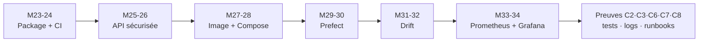

# Manuel de révision & d'auto-formation — Sprint 3 CISIA (InduSense 4.0)

> **À qui ça sert.** Ce manuel est conçu pour être **compris seul**, même si tu n'as pas pu assister au cours. Chaque module se lit comme un mini-chapitre : l'idée clé, la théorie complète, des rubriques illustrées (le saviez-vous, le jargon, l'analogie, les pièges…), le cas réel InduSense, les commandes-preuves, et un test pour t'auto-évaluer **avec les réponses**.
> **Comment lire une fiche.** 1) lis « En une phrase » ; 2) lis « La théorie » ; 3) regarde le schéma ; 4) survole les rubriques ; 5) fais le « Teste-toi » et compare aux réponses. Avance à ton rythme ou selon la consigne du formateur.
> **Légende des pictogrammes.** ❓ Le saviez-vous · ⚑ À retenir · ⚠ Attention–piège · ＋ Astuce de pro · ⓘ Le jargon décodé · ≈ L'analogie · → Cas réel InduSense · § Définition · ✱ Exemple · ↯ Idée reçue.
> **Données de référence (les vrais chiffres du projet).** Capteurs `temperature` + `pressure_bar` · **15 machines** · cible `panne` = **4,7802 %** · jointure `merge_asof` *nearest* ±90 min `by="machine"` · **Python 3.13** verrouillé · Variante A (`rf.joblib` livré dans l'image).
> 🎯 **Échelle des chiffres.** **4,7802 %** (3 137/65 625), **15 machines après normalisation** et +73 FP sont mesurés sur le **jeu complet**. Les sources locales prouvent les variantes d'identifiants (`MACH-01`, `MACH_01`, `M-06`, `M-2`) mais ne donnent pas le nombre brut d'identifiants distincts : ce nombre n'est donc pas affiché. L'échantillon `data/sample` du repo `CISIA_24082026_Parcours` (~1 900 lignes) donne ≈ **10,5 %** : sur l'échantillon, `panne.mean()` ≈ 10,5 % (pas 4,78 %). Pour retrouver 4,78 %, pointer le flux sur les **données complètes** (cf. `95_snippet_donnees_reelles.md`).

---

## 00 — Avant de commencer : c'est quoi « industrialiser » un modèle ?

**En une phrase.** Industrialiser, c'est transformer un modèle « qui marche sur ma machine » en **service fiable, reproductible et surveillé** que d'autres peuvent utiliser 24 h/24.

Un modèle de data science naît dans un **notebook** : génial pour explorer, catastrophique pour produire. Industrialiser, c'est répondre à 6 questions, dans l'ordre : le code est-il **propre et testé** ? est-il **reproductible** (mêmes versions partout) ? est-il **exposé** (API) ? est-il **sécurisé** ? est-il **déployable** (conteneur) et **orchestré** (automatisé) ? est-il **surveillé** (drift + métriques) ? Le Sprint 3 répond à ces 6 questions, une brique après l'autre.

@flow: Notebook > Package testé > CI + versioning > API REST > Sécurité > Docker + compose > Orchestration > [Service surveillé]

Le Sprint 3 est découpé en 6 *user stories* qui s'enchaînent : **US3.1** fondations de code (modules 23-24), **US3.2** exposition/API (25), **sécurité** (26), **US3.3** conteneurisation (27-28), **US3.4** orchestration (29-30), **US3.5** drift (31-32), **US3.6** observabilité (33-34). Chaque module **ajoute une brique** au même dépôt : rien n'est jeté, tout est réutilisé. C'est ce qui fait du sprint une **histoire**, pas un catalogue d'outils.

::: jargon | Le jargon décodé
**DevOps** : culture qui rapproche le développement (Dev) et l'exploitation (Ops). **MLOps** : DevOps appliqué au machine learning, avec en plus les **données** et le **modèle** à gérer (pas seulement le code).
:::

::: savez | Le saviez-vous ?
En MLOps, on versionne **trois** choses, pas une : le **code** (Git), les **données** (DVC) et le **modèle** (registry MLflow). Oublier l'une des trois = impossible de reproduire un résultat passé.
:::

::: analogie | L'analogie
Un notebook, c'est une **recette griffonnée** sur un coin de table. L'industrialisation, c'est en faire la **chaîne d'un restaurant** : ingrédients tracés, recette reproductible, plats contrôlés, service en continu.
:::

::: attention | Attention — le piège invisible
Le défaut le plus dangereux du notebook est **invisible** en exploration : la **fuite de données**. Le modèle semble excellent en validation… et s'effondre en production. On l'explique au module 23.
:::

---

## 23 — Refactoring & structure projet · US3.1 (C6)

**En une phrase.** Un projet industriel range son code par **responsabilité** dans un *package* `src/`, pas dans un notebook fourre-tout — pour qu'il soit **importable, testé et réutilisable**.

### La théorie

On éclate le notebook en modules à **responsabilité unique** : `data/` (charger et valider), `features/` (transformer), `models/` (entraîner et prédire), `api/` (exposer), `cli.py` (commandes). Chaque module devient **importable** (`import indusense`) et **testable** indépendamment. C'est le principe de **séparation des préoccupations** : chaque morceau fait une chose, bien.

Le fichier **`pyproject.toml`** est la **carte d'identité** du projet : il déclare les dépendances, la version de Python (**`>=3.13,<3.14`**), les *scripts* (la commande `indusense`) et le packaging. L'outil **`uv`** lit ce fichier **plus** un **`uv.lock`** (versions **exactes** figées) pour garantir que ta machine, la CI et la production installent **strictement les mêmes versions**.

@flow: notebook.ipynb > src/indusense/ > data + features + models + api + cli > [tests/ + configs/]

::: analogie | L'analogie
Passer du notebook au package, c'est ranger un **atelier en vrac** en **boîtes à outils étiquetées** : on retrouve, on réutilise, on prête sans tout casser.
:::

::: jargon | Le jargon décodé
**Package** : dossier Python importable. **Module** : un fichier `.py`. **Refactoring** : réorganiser le code **sans changer son comportement**. **Lockfile** (`uv.lock`) : la liste des versions exactes, figées jusqu'au numéro de patch.
:::

::: savez | Le saviez-vous ?
Le fameux « ça marche chez moi » vient presque toujours de **versions différentes**. Un *lockfile* tue ce bug : tout le monde installe la même chose, au patch près.
:::

### Construire le pyproject.toml, bloc par bloc

`pyproject.toml` est la **carte d'identité technique** du projet. Il répond à 4 questions : (1) c'est quoi ce projet ? (nom, version) ; (2) avec quel Python et quelles dépendances ? ; (3) comment l'installer comme un vrai package ? ; (4) quelles commandes et quels outils qualité ?

::: jargon | Le jargon décodé
**`[build-system]`** : l'outil qui sait construire le package (ici *hatchling*). **`[project]`** : nom, version, `requires-python`. **`dependencies`** : ce qu'il faut pour faire tourner l'app. **`[project.optional-dependencies] dev`** : les outils d'atelier (pytest, ruff, black), pas nécessaires en prod. **`[project.scripts]`** : crée la commande `indusense`.
:::

Le repo `CISIA_24082026_Parcours`, en version condensée :

```toml
[build-system]
requires = ["hatchling"]
build-backend = "hatchling.build"

[project]
name = "indusense"
version = "0.1.0"
requires-python = ">=3.13,<3.14"
dependencies = ["pandas>=2.2", "numpy>=2.0", "scikit-learn>=1.5",
                "joblib>=1.4", "pydantic-settings>=2.3", "typer>=0.12", "loguru>=0.7"]

[project.optional-dependencies]
dev = ["pytest>=8.0", "ruff>=0.5", "black>=24.0"]

[project.scripts]
indusense = "indusense.cli:main"

[tool.hatch.build.targets.wheel]
packages = ["src/indusense"]

[tool.ruff]
line-length = 100
target-version = "py313"

[tool.pytest.ini_options]
testpaths = ["tests"]
pythonpath = ["src"]
```

::: detail | Détail technique — Python 3.13 vs 3.14
Même si `python --version` (global) affiche **3.14**, c'est le **venv du projet** qui fait foi : `uv run python --version` doit dire **3.13.x**. Au besoin : `uv venv --python 3.13` puis `uv sync --frozen --extra dev`.
:::

::: astuce | Astuce de pro — extraire une fonction propre
Plutôt que répéter une transformation dans un notebook, on l'extrait dans `features/` : une fonction **testée**, au bon endroit. Ex. `clean_sensor_data(df)` impute les valeurs manquantes **par machine** (`groupby("machine").transform(...)`), et son test vérifie qu'une machine n'hérite pas de la médiane d'une autre.
:::

#### Le concept central : la fuite de données

En maintenance prédictive, les données sont **temporelles**. Si on découpe train/test **au hasard** (et non dans le temps), le modèle apprend sur des instants **postérieurs** à ceux qu'il devra prédire : c'est la **fuite de données** (*data leakage*). Résultat : 99 % en validation, échec en production. La parade : **trier et découper par machine ET par temps**, puis **tester** l'absence de fuite.

@flow: split aléatoire > passé+futur mélangés > [score qui ment] // split temporel > train=passé puis test=futur > score honnête

::: attention | Attention — piège
Un score **trop beau** (AUC 0,99) doit vous **alerter**, pas vous réjouir : c'est souvent une fuite. *Garbage temporel in, score bidon out.*
:::

::: cas | Cas réel InduSense
On trie par `(machine, timestamp)` puis on coupe à un point temporel. Un test dédié vérifie qu'aucune ligne « future » n'entre dans le jeu d'entraînement. Les capteurs nomment les machines de plusieurs façons (`MACH-01`, `MACH_01`, `M-06`, `M-2`) : la fonction `normalize_machine_id` ramène tout à `MACH-%02d`. **Attention à ne pas mélanger les deux univers de données.** Sur le **jeu complet** (hors dépôt, **65 625 lignes**, panne **4,78 %**), le référentiel contient **15 machines** canoniques ; la source de vérité ne chiffre pas le nombre total de variantes brutes. L'**échantillon du repo** (`data/raw`, byte-identique à `data/sample`) est bien plus petit : **4 machines** seulement et une prévalence **≈ 10,5 %** (jamais 4,78 %).
:::

### Commandes & preuve

```
uv sync --frozen --extra dev   # installe le package + ses dépendances de dev (déjà lockées)
uv run pytest -q           # tests verts (dont les tests anti-fuite)
uv run ruff check .        # qualité du code, 0 erreur
uv run indusense --help    # la commande répond (train / predict)
```

### Pièges à éviter

- **Split non temporel** = fuite de données (le piège n°1).
- **Import cassé** : on a oublié `uv sync --frozen` → le package n'est pas installé.
- **IDs non normalisés** → jointures qui échouent et machines comptées en double.

::: retenir | À retenir
1) Notebook → package `src/` **importable et testé**. 2) `pyproject.toml` + `uv.lock` = **reproductibilité** exacte. 3) Découpage **temporel** obligatoire pour éviter la **fuite de données**.
:::

### Teste-toi

1. Pourquoi transformer un notebook en package `src/` ?
2. À quoi servent `pyproject.toml` et `uv.lock` ?
3. D'où vient une « fuite de données » en maintenance prédictive ?

**Réponses.** 1) Pour rendre le code **importable, testable et réutilisable** (séparation des responsabilités). 2) Déclarer les dépendances/version de Python/commandes **et** figer les versions exactes pour que tout le monde installe la même chose. 3) D'un découpage train/test **non temporel** : des informations du **futur** entrent dans l'entraînement, le score devient mensonger.

---

## 24 — CI/CD + tests + versioning · US3.1 (C6)

**En une phrase.** La **CI** est un robot qui rejoue automatiquement *lint + tests + build* à chaque modification, pour que la branche `main` reste **toujours verte** ; en parallèle on apprend à **versionner les données et le modèle**.

### La théorie

À chaque *push* ou *pull request*, un serveur (**GitHub Actions**) rejoue ce que tu fais à la main : formatage, lint, tests, build. Avantage : les régressions sont attrapées **avant** le *merge*, et `main` devient un **contrat** (elle compile et passe les tests, toujours).

@flow: commit / PR > lint (ruff) > format (black) > tests (pytest) > build wheel > [artefact]

En local, **`pre-commit`** est la première ligne de défense : il exécute des *hooks* avant chaque commit (ruff, black, et surtout **gitleaks** qui détecte les secrets). C'est crucial car un **secret committé est compromis à vie** : même supprimé ensuite, il reste dans l'historique Git et doit être **révoqué**.

Git n'est pas fait pour les gros fichiers (datasets, modèles) : il gonfle et le `clone` devient interminable. **DVC** garde un **pointeur léger** (`.dvc`) dans Git et stocke le contenu réel sur un *remote*. **MLflow** (registry) gère le **cycle de vie du modèle** par **stages**.

@flow: candidate > Staging > Production > [Archived]

::: analogie | L'analogie
La CI, c'est le **contrôle qualité en bout de chaîne** d'une usine : aucun produit ne sort sans avoir passé les tests.
:::

::: jargon | Le jargon décodé
**CI** (Continuous Integration) : intégration continue. **CD** (Continuous Delivery/Deployment) : livraison/déploiement continus. **Pipeline** : suite d'étapes automatisées. **Registry** : catalogue versionné des modèles. **Stage** : statut du modèle (candidate → Staging → Production → Archived). **Rollback** : revenir à la version précédente.
:::

#### La pyramide des tests

Beaucoup de tests **unitaires** (une fonction isolée, rapides, nombreux), quelques tests d'**intégration** (deux composants qui discutent, ex. API↔DB), très peu de tests **bout-en-bout** (tout le parcours, lents et fragiles). Un bon test de CI est **hermétique** : il ne dépend d'aucun fichier externe.

::: attention | Attention — piège
« Vert en local, rouge en CI » = test **non hermétique** : il lit un fichier présent seulement sur ta machine. Construis la donnée **dans** le test (`tmp_path`).
:::

::: savez | Le saviez-vous ?
Des bots scannent GitHub en **continu** : une clé AWS poussée par erreur peut être exploitée en **quelques minutes**. D'où gitleaks en pre-commit.
:::

::: idee | Idée reçue
« Je peux mettre mon dataset dans Git. » → **Faux** : Git versionne mal les gros binaires ; c'est exactement le rôle de **DVC** (pointeur léger + remote).
:::

### Commandes & preuve

```
# .github/workflows/ci.yml : setup-python "3.13"  (PAS 3.11 !)
if (-not (Test-Path -LiteralPath .\.dvc)) { uv run dvc init }
New-Item -ItemType Directory -Force -Path ..\dvc-store | Out-Null
uv run dvc remote add -d -f localstore ..\dvc-store
git rm --cached -- data/gold/gold_dataset.csv artifacts/models/rf.joblib
uv run dvc add data/gold/gold_dataset.csv artifacts/models/rf.joblib
uv run dvc push
uv run dvc status      # propre = rien à pousser
```
Preuve : **pipeline vert** sur une PR · `dvc status` propre · `versioning_strategy.md` rédigé · gitleaks vert (faux secret refusé).

### Aller plus loin — le job build & la stratégie de versioning

La CI du repo a un job `quality` ; on ajoute un job `build` qui ne démarre **que si** `quality` passe (`needs: quality`) et publie le *wheel* en artefact :

```yaml
build:
  needs: quality
  runs-on: ubuntu-latest
  steps:
    - uses: actions/checkout@v4
    - uses: astral-sh/setup-uv@v3
    - run: uv build
    - uses: actions/upload-artifact@v4
      with: { name: indusense-wheel, path: dist/*.whl }
```

On documente tout dans `versioning_strategy.md` : **Code** (PR + CI verte), **Données** (DVC, Git ne garde que les pointeurs), **Modèle** (`model_metadata.json`, Candidate → Staging → Production → Archived), **Secrets** (`.env` local, secrets GitHub en CI).

::: idee | Idée reçue
« CI verte en local = verte sur GitHub. » → **Pas toujours** : si un test dépend d'un **fichier local non committé**, il passe chez toi et échoue en CI. Un bon test est **hermétique** (il construit sa donnée lui-même).
:::

### Pièges à éviter

- **Secret committé** → le **révoquer** (pas seulement le supprimer).
- **Mauvais pin de Python** (`3.11` au lieu de `3.13`).
- **Test non hermétique** (vert en local, rouge en CI).
- `needs:` oublié entre les jobs (build lancé avant les tests).

::: retenir | À retenir
Reproduire un résultat = retrouver **les trois ensemble** : la même version de **code** (Git) + de **données** (DVC) + de **modèle** (MLflow). La CI garantit que `main` reste verte.
:::

### Teste-toi

1. À quoi sert une CI ?
2. Quelle différence entre DVC et Git pour les données ?
3. Dans quel ordre vont les stages d'un registry MLflow ?

**Réponses.** 1) Rejouer **automatiquement** lint + tests + build à chaque changement pour attraper les régressions avant le merge. 2) Git versionne le **code** (mal les gros fichiers) ; DVC garde un **pointeur léger** + le contenu sur un remote. 3) `candidate → Staging → Production → Archived` (avec rollback possible vers Staging).

---

## 25 — API Design & REST (FastAPI) · US3.2 (C7)

**En une phrase.** Une API expose le modèle via des **endpoints** au comportement **prévisible** (entrées, sorties, erreurs) : c'est un **contrat**.

### La théorie

REST organise l'accès par **ressources** et **verbes HTTP**. Pour InduSense : `POST /predict-tabular`, `POST /predict-image`, `GET /health`, `GET /ready`. Les entrées/sorties sont **validées par Pydantic** — le **contrat I/O** défini au module 22, réutilisé partout. Les **codes HTTP** disent ce qui s'est passé : `200` ok, `401` non authentifié, `422` entrée invalide, `503` pas prêt.

@flow: client + clé > FastAPI > valide (Pydantic) > modèle > [proba_panne]

Deux sondes ont des rôles **distincts** : `/health` dit « le process tourne » (**liveness**, 200 dès le lancement) ; `/ready` dit « le modèle est chargé, je peux prédire » (**readiness**, **503** tant que le modèle n'est pas chargé). L'orchestrateur (compose, plus tard Kubernetes) s'en sert pour ne router le trafic que vers les instances **prêtes**.

::: jargon | Le jargon décodé
**REST** : style d'API basé sur HTTP. **Endpoint** : une URL + un verbe. **Pydantic** : valide et documente les données. **Swagger/OpenAPI** : la doc interactive auto-générée, accessible sur `/docs`.
:::

::: savez | Le saviez-vous ?
FastAPI génère **tout seul** la doc interactive `/docs` à partir de tes schémas Pydantic : la doc ne peut pas « mentir », elle est **dérivée du code**.
:::

::: retenir | À retenir
Le modèle se charge **une seule fois au démarrage** (*lifespan*), **jamais** à chaque requête — sinon la latence explose.
:::

::: idee | Idée reçue
« `/health` et `/ready`, c'est pareil. » → **Faux** : un service peut être **vivant** (health 200) mais **pas prêt** (ready 503, modèle en cours de chargement).
:::

::: cas | Cas réel InduSense
Sans clé API → **401** ; historique trop court → **422** ; modèle absent → **503** ; requête correcte → **200** + `proba_panne`. Astuce : on **normalise au bord** (`M-7 → MACH-07`) pour accepter des entrées hétérogènes sans polluer la logique interne. Un **`request-id`** par requête permet de la suivre de bout en bout dans les logs.
:::

### Le contrat de l'API, en vrai (repo `CISIA_24082026_Parcours`)

L'API expose quatre routes ; le **contrat** est porté par Pydantic (`api/schemas.py`) et les **codes HTTP** disent ce qui s'est passé.

```python
GET  /health           -> 200 {"status":"ok"}            # liveness
GET  /ready            -> 200 {"model_version":...} | 503 # readiness
POST /predict-tabular  -> 200 {proba_panne, decision, ...}
#   en-tête X-API-Key requis (sinon 401) ; readings: min 7 (sinon 422)
class TabularPredictionRequest(BaseModel):
    machine_id: str
    readings: list[SensorReading] = Field(..., min_length=7)
```

::: jargon | Le jargon décodé
**Liveness** (`/health`) : le process tourne. **Readiness** (`/ready`) : le modèle est chargé (503 sinon). **Swagger/OpenAPI** (`/docs`) : doc interactive auto-générée. **lifespan** : on charge le modèle **une seule fois** au démarrage.
:::

::: cas | Cas réel InduSense
`require_api_key` renvoie **401** si la clé est absente **ou** invalide (pas 422 : c'est de l'authentification). Le middleware **request-id** ajoute `X-Request-ID` à chaque requête pour la tracer de bout en bout.
:::

### Commandes & preuve

```
uv run uvicorn indusense.api.main:app --reload   # API locale, /docs s'ouvre
uv run pytest tests/test_api.py -q          # /health 200, 401, 422, 503, 200
```

### Pièges à éviter

- **401 vs 422** : clé absente = **401** (auth), pas 422 (validation).
- **Modèle rechargé à chaque requête** (latence catastrophique).
- **Schéma divergent** du contrat I/O du module 22.

### Teste-toi

1. Quelle différence entre `/health` (liveness) et `/ready` (readiness) ?
2. À quoi sert Pydantic dans l'API ?
3. Quel code HTTP renvoie une requête **sans clé API** ?

**Réponses.** 1) `/health` = le **process tourne** ; `/ready` = le **modèle est chargé et prêt** (503 sinon). 2) **Valider et documenter** les entrées/sorties (le contrat I/O). 3) **401** (non authentifié).

---

## 26 — Sécurité & menaces sur l'IA · Sécurité (C2)

**En une phrase.** Avant de coder des défenses, on **cartographie les menaces** (STRIDE), puis on distingue sans ambiguïté ce qui est priorisé, implémenté et prouvé.

### La théorie

**STRIDE** couvre 6 familles de menaces : **S**poofing (usurpation), **T**ampering (altération), **R**epudiation (déni d'action), **I**nformation disclosure (fuite), **D**enial of service (déni de service), **E**levation of privilege (élévation de privilège). On l'applique à l'API **et** au pipeline de données, via des **arbres d'attaque** (« comment compromettre `/predict` ? »).

Un modèle ML ajoute des vulnérabilités que le logiciel classique n'a pas : **adversarial** (entrées subtilement modifiées pour tromper le modèle), **vol de modèle** (le reconstituer par requêtes massives), **empoisonnement** (corrompre les données d'entraînement), **fuite d'information** (le modèle ou les logs révèlent des données sensibles).

Les **5 contrôles prioritaires** d'InduSense n'ont pas tous le même statut. Quatre sont **implémentés et prouvés** : **auth** par clé API (→ `401`), **validation** Pydantic v2 (→ `422`), **rate limit** 60 req/min/IP (→ `429`) et **taille de payload** plafonnée à 64 Ko (→ `413`). **Audit logging** reste **Planifié v0** : sa preuve future sera un événement structuré (`request_id`, méthode, chemin, statut, durée) sans clé, payload ni PII, avec un test dédié. Principe directeur : **moindre privilège**.

@flow: requête > clé ? > [débit ?] > taille ? > Pydantic valide ? > 200  (sinon 401 / 429 / 413 / 422)

::: jargon | Le jargon décodé
**Threat model** : modèle de menaces (ce qui peut mal tourner et comment l'atténuer). **Attack tree** : arbre des chemins d'attaque. **Surface d'attaque** : tout ce qui est exposé à un attaquant.
:::

::: analogie | L'analogie
Modéliser les menaces, c'est **faire le tour de la maison** avant d'acheter des serrures : inutile de blinder la porte si la fenêtre est ouverte.
:::

::: savez | Le saviez-vous ?
En *adversarial*, changer quelques pixels invisibles à l'œil peut faire prendre un panneau « stop » pour une limitation de vitesse par un modèle de vision. La robustesse ne va pas de soi.
:::

::: attention | Attention — piège
Ne **jamais** journaliser la clé API ou le payload : un log trop bavard devient une **fuite** d'information (on le reverra au module 33 avec les *labels* Prometheus).
:::

### Les 4 contrôles prouvés dans le code (repo `CISIA_24082026_Parcours`)

La sécurité applicative est répartie entre `api/security.py`, `api/main.py`, les schémas Pydantic et les tests. Le request-id corrèle les requêtes mais **n'est pas** un audit log.

```python
MAX_BODY_BYTES = 64 * 1024                 # payload > 64 Ko -> 413
def rate_limit_dependency(request):        # politique fixe 60/60 -> 429
def require_api_key(...):                  # clé absente/invalide -> 401
# validation Pydantic v2 -> 422
# audit logging -> Planifié v0 (aucun middleware/test dédié)
```

::: attention | Attention — piège
Un contrôle priorisé n'est pas automatiquement acquis. Les preuves actuelles sont **401/422/429/413**. Ne jamais réintroduire `Depends(rate_limit)` directement : conserver `rate_limit_dependency` afin de ne pas exposer `limit`/`window` dans OpenAPI. Et ne **jamais journaliser** clé, payload ou PII.
:::

::: cas | Cas réel InduSense
STRIDE appliqué à `/predict-tabular` : usurpation → clé API ; déni de service → rate limit ; fuite → non-divulgation ; altération → validation Pydantic. Le `threat_model.md` documente l'arbre d'attaque ; `security_controls.md` affiche **4 Implémenté + 1 Planifié v0** et les risques résiduels.
:::

### Commandes & preuve

```powershell
uv sync --frozen --extra dev
uv run python --version
uv run pytest tests/test_api.py tests/test_security.py -q
```
Preuve : Python **3.13.x** ; suites à **0 échec** prouvant `401/422/429/413` ; `threat_model.md` + `security_controls.md` (**4 Implémenté + 1 Planifié v0**). Le test direct accepte 60 appels et bloque le 61e ; une rafale API de 70 appels doit seulement contenir au moins un 429.

### Pièges à éviter

- **Secrets en clair** dans le code/les logs.
- **Image qui tourne en root** (on corrige au module 27).
- **Logs qui fuient** des données sensibles (clé, payload).

::: retenir | À retenir
« Documenté » ≠ « en place ». Les quatre contrôles acquis ont leurs preuves **401/422/429/413** ; l'audit logging reste **Planifié v0** jusqu'à son événement structuré et son test dédié. Et **moindre privilège** partout.
:::

### Teste-toi

1. Que veut dire l'acronyme STRIDE (l'idée) ?
2. Différence entre attaque *adversarial* et *empoisonnement* ?
3. À quoi sert le *rate limiting* et quel code renvoie-t-il ?

**Réponses.** 1) Un **modèle de menaces** en 6 familles (usurpation, altération, déni d'action, fuite, déni de service, élévation de privilège). 2) *Adversarial* = tromper le modèle **à l'inférence** (entrées truquées) ; *empoisonnement* = corrompre les **données d'entraînement**. 3) Limiter le **débit** de requêtes (anti-abus/DoS) → **429**.

---

## 27 — Conteneurisation (Dockerfile) · US3.3 (C6)

**En une phrase.** Une image Docker est un **empilement de couches** mises en cache ; on **construit** dans une image lourde et on **livre** une image mince, **non-root**, avec le modèle dedans.

### La théorie

Chaque instruction (`FROM`, `COPY`, `RUN`) crée une **couche** réutilisée tant que son entrée ne change pas. **Règle d'or** : copier **ce qui change le moins en premier** (les dépendances), le **code en dernier**. Sinon, la moindre modification de code réinstalle **tout**.

@flow: pyproject + uv.lock > install deps (cache stable) > [COPY src (change souvent)] > image

Le **multi-stage** sépare la construction de la livraison : le stage **build** contient `uv`, compilateurs, cache ; le stage **runtime** repart d'une base **`python:3.13-slim`** et ne récupère que l'environnement virtuel (`/app/.venv`). Résultat : image **plus petite** et **surface d'attaque réduite**. On durcit : utilisateur **non-root** (`appuser`), `.dockerignore`, **`HEALTHCHECK`** sur `/health`.

@flow: stage build (uv + deps + code) > [stage runtime slim, non-root] > image finale légère

::: savez | Le saviez-vous ?
Lancer un conteneur en **root** est un défaut classique : si l'app est compromise, l'attaquant est root **dans le conteneur**. Un simple `USER appuser` réduit fortement l'impact.
:::

::: cas | Cas réel InduSense — Variante A
Le modèle `rf.joblib` est **livré dans l'image** → `/ready` répond 200 dès `docker run`, sans entraînement. Mais attention : `artifacts/` est **gitignoré**, donc un `git clone` propre n'a pas le modèle. Si le `.dockerignore` l'exclut aussi, l'image part **sans modèle** → `/ready` 503. La parade : garder l'exception `!artifacts/models/**` dans `.dockerignore` **et** `COPY artifacts/models` dans le runtime.
:::

::: attention | Attention — piège
« gitignoré » ≠ « absent du build ». Le **contexte Docker** et **Git** sont **deux périmètres distincts** : un fichier ignoré par Git peut être copié par Docker (et inversement).
:::

::: astuce | Astuce de pro
Dans un conteneur, `uvicorn` **doit** écouter `--host 0.0.0.0` : sinon il n'écoute qu'en interne et l'API est **injoignable** depuis l'hôte.
:::

### Commandes & preuve

```
docker build -t indusense-api .
docker run -p 8000:8000 -e INDUSENSE_API_KEY=dev-key indusense-api
# /health 200 → /ready 200 → /predict-tabular 200
docker exec <id> whoami     # → appuser  (pas root)
```

### Pièges à éviter

- **Image root** (oubli de `USER appuser`).
- **`COPY . .` avant l'install** (casse le cache, build lent).
- **`uvicorn` sans `--host 0.0.0.0`** (API injoignable).
- **`/ready` 503** dans un clone propre = modèle dockerignoré.

::: retenir | À retenir
Multi-stage = image **mince** + **surface réduite**. Non-root par défaut. Variante A : modèle **dans l'image** → prêt d'emblée. Dépendances **avant** le code pour profiter du cache.
:::

### Teste-toi

1. Quel est le bénéfice principal d'un build multi-stage ?
2. Pourquoi faire tourner le conteneur en utilisateur non-root ?
3. Pourquoi `/ready` peut renvoyer 503 dans un clone « propre » ?

**Réponses.** 1) Une image **runtime mince**, sans les outils de build → plus légère et **moins de surface d'attaque**. 2) Pour **réduire l'impact** d'une compromission (l'attaquant n'est pas root). 3) Le modèle (`artifacts/`) est **gitignoré/dockerignoré**, donc **absent de l'image**.

---

## 28 — Déploiement local & compose · US3.3 (C6)

**En une phrase.** `docker-compose` décrit **plusieurs services** (API + base de données) et leur **réseau privé** dans un seul fichier, avec des **healthchecks** pour démarrer dans le bon ordre.

### La théorie

Une appli réelle = API + base de données (+ monitoring plus tard). **Compose** les déclare, crée un **réseau privé**, des **volumes** (données persistantes) et gère l'**ordre de démarrage**. Dans ce réseau, un service se joint par son **nom** (`db:5432`), **jamais** par `localhost`.

@flow: réseau compose privé : api:8000 > [db:5432 (postgres)] // smoke test > api

Le piège classique : `depends_on` garantit qu'un service est **lancé**, pas qu'il est **prêt**. Sans healthcheck, l'API démarre avant que Postgres accepte les connexions → plantage au premier accès, **par intermittence** (le pire des bugs). La solution : un **healthcheck** (`pg_isready`) sur la base + `condition: service_healthy` côté API.

@flow: db démarre > pg_isready ? > [api démarre]  (si non : attendre)

::: idee | Idée reçue
« L'API joint la base sur `localhost`. » → **Faux** dans Compose : `localhost` désigne le conteneur **lui-même** ; il faut le **nom du service** (`db`).
:::

::: jargon | Le jargon décodé
**Service** : un conteneur déclaré dans compose. **Volume** : stockage persistant. **Smoke test** : test rapide « ça démarre et ça répond ? ». **Canary / blue-green** : déploiements progressifs avec rollback.
:::

::: attention | Attention — piège
Un bug **intermittent** au démarrage = quasi toujours une **course** (*race condition*) : le service dépendant n'attend pas que l'autre soit **prêt**. Réponse = healthcheck + `condition: service_healthy`.
:::

::: retenir | À retenir
Config et secrets dans un **`.env` non versionné** ; on ne versionne que `.env.example` (les clés, sans les valeurs). On joint un service par son **nom**, pas `localhost`.
:::

### Commandes & preuve

```
docker compose up -d --wait        # services healthy
docker compose ps                  # api + db : healthy
uv run pytest tests/test_smoke_compose.py   # (test à créer) 3 smoke tests verts
# /predict-tabular : 401 sans clé, 200 avec
```

### Pièges à éviter

- **`depends_on` sans healthcheck** (course au démarrage).
- **DB jointe par `localhost`** au lieu de `db`.
- **`.env` committé** (secrets exposés).
- **Port déjà pris** sur l'hôte.

### Teste-toi

1. Dans Compose, par quel hôte l'API joint-elle la base ?
2. « Démarré » est-il égal à « prêt » ?
3. Quelle différence entre un *smoke test* et un test d'intégration ?

**Réponses.** 1) Par le **nom du service** (`db:5432`), pas `localhost`. 2) **Non** : `depends_on` dit « lancé », le **healthcheck** dit « prêt ». 3) Le smoke test vérifie **rapidement** que ça démarre et répond ; l'intégration vérifie en détail que deux composants **coopèrent** correctement.

---

## 29 — Orchestration Prefect — design · US3.4 (C6/C7)

**En une phrase.** Un orchestrateur (Prefect) ajoute à un simple `cron` les **réessais**, l'**observabilité** et les **dépendances** entre étapes ; on **conçoit** d'abord le flow `ingest→feature→predict→store`.

### La théorie

`cron` lance une commande à l'heure dite — et c'est tout. **Prefect** apporte : **retries** automatiques sur erreurs transitoires, **logs/UI** (qui a tourné, échoué, quand), **graphe de dépendances** (l'étape B attend A). On modélise le cycle de prédiction comme un **flow** composé de **tasks**.

@flow: task ingest > task feature > task predict > task store > [predictions]

Une panne **transitoire** (DB indisponible 1 s) mérite un **retry** ; une erreur **déterministe** (schéma invalide) échouera toujours → inutile de réessayer. L'**idempotence** (rejouer = même résultat) est la condition d'une **reprise** sûre après incident. Bonne pratique : figer les **contrats** des tasks (entrées/sorties/erreurs) **avant** de coder.

::: jargon | Le jargon décodé
**Task** : une étape unitaire. **Flow** : l'orchestration des tasks. **Backoff** : délai croissant entre réessais. **Idempotent** : rejouer ne change pas le résultat.
:::

::: analogie | L'analogie
`cron` est un **réveil** (il sonne à l'heure). Un orchestrateur est un **chef de gare** : il enchaîne les trains, gère les retards et les correspondances.
:::

::: idee | Idée reçue
« Il faut réessayer toutes les erreurs. » → **Faux** : réessayer une erreur **déterministe** = boucle inutile. Retry = **transitoire uniquement**.
:::

#### Le piège data : la fuite inter-machines

La task `ingest` joint deux séries temporelles par `merge_asof` (« la mesure la plus proche dans le temps »). **Sans `by="machine"`**, `MACH-01` peut récupérer la pression de `MACH-02` au même instant : une **fuite inter-machines silencieuse**. La correction : ajouter `by="machine"` (tolérance ±90 min, *nearest*). Le résidu non-joint attendu ≈ **1,76 %**.

::: attention | Attention — piège
`merge_asof` **sans `by`** ne lève **aucune erreur** : le bug est **silencieux**, visible seulement si on inspecte les valeurs. D'où l'intérêt d'un **test dédié**.
:::

### Commandes & preuve

```
uv sync --frozen                    # prefect 3.7.6 déjà au lock (pas de uv add)
uv run python -m indusense.flows.hello     # flow "hello" : pong + run Completed
uv run python scripts/demo_prefect_idempotence.py --flaky  # retry observable puis succès
# preuve C7 : docs/flow_design.md = diagramme ingest→feature→predict→store + table I/O
```

### Pièges à éviter

- **`merge_asof` sans `by="machine"`** = fuite inter-machines.
- **Coder le flow complet trop tôt**, avant d'avoir figé les contrats I/O.
- **Retry sur une erreur déterministe** (boucle inutile).

::: retenir | À retenir
Orchestrer = **retries + observabilité + dépendances**. On **conçoit** (contrats I/O, schéma) **avant** d'implémenter. Le piège data du jour : `by="machine"`.
:::

### Teste-toi

1. Quelle différence entre une *task* et un *flow* ?
2. Que signifie « idempotent » ?
3. Que casse l'oubli de `by="machine"` dans `merge_asof` ?

**Réponses.** 1) Une **task** = une étape unitaire ; un **flow** = l'**orchestration** des tasks. 2) **Rejouer** l'étape ne change pas le résultat (pas de doublon, pas d'effet de bord). 3) Une **fuite inter-machines** : une machine hérite de la pression d'une **autre**.

---

## 30 — Implémentation du flow · US3.4 (C6/C7)

**En une phrase.** On implémente le flow réel, on **historise** chaque prédiction dans une table avec une **clé naturelle**, et on prouve l'**idempotence** : rejouer ne crée **aucun doublon**.

### La théorie

Le flow écrit ses résultats dans une table `predictions` dont la **clé naturelle** est `(machine, prediction_ts)`. On **réutilise la lib** (`build_dataset`, `add_temporal_features`, `predict_proba`) : le flow **orchestre**, il ne **réécrit pas** la logique métier. Historiser permet ensuite de surveiller le modèle (drift, dashboards).

Un simple `INSERT` crée des **doublons** à chaque relance. La parade : l'**upsert** (`INSERT … ON CONFLICT (machine, prediction_ts) DO UPDATE`) : si la ligne existe, on la met à jour. La **preuve** : **deux exécutions → même nombre de lignes**.

@flow: nouvelle prédiction > clé existe ? > UPDATE  (sinon INSERT)

::: jargon | Le jargon décodé
**Clé naturelle** : les colonnes qui identifient une ligne de façon unique. **Upsert** : « insère ou met à jour ». **Historisation** : conserver la trace de chaque prédiction dans le temps.
:::

::: astuce | Astuce de pro
La task `store` touche la **DB** (ressource externe) → on lui met des **retries** ; les tasks de calcul pur, non.
:::

#### Le piège data : la cible `date` seule

La cible `panne` regarde si un incident survient dans une fenêtre après l'observation. L'horodatage d'incident doit combiner **`date` + `time`**. Si on n'utilise que **`date`** (heure forcée à minuit), la prévalence passe de **4,7802 %** (3 137/65 625) à **4,8914 %** (3 210) : **+73 faux positifs**, invisibles à l'œil.

@flow: date seule (minuit) > [4,8914 % • +73 FP] // date + time > 4,7802 % • correct

::: cas | Cas réel InduSense
Symptôme : `panne.mean()` ≈ 4,89 %. Diagnostic : `incident_ts.dt.time` à minuit. Correction : `pd.to_datetime(date.astype(str) + " " + time.astype(str))`. Retour à **4,7802 %**, +73 fausses alarmes évitées.
:::

::: savez | Le saviez-vous ?
Un écart de **+0,11 point** de prévalence paraît minuscule… mais ce sont **73 fausses alarmes** qui dégradent la confiance dans le modèle. En prod, le diable est dans le `time`.
:::

### Commandes & preuve

```
uv sync --frozen                    # sqlalchemy 2.0.51 + psycopg 3.3.4 déjà au lock
python -m indusense.flows.predict_flow    # run 1
python -m indusense.flows.predict_flow    # run 2
SELECT count(*) FROM predictions;   # identique aux 2 runs → 0 doublon
# panne ≈ 4,7802 %
```

### Pièges à éviter

- **`INSERT` au lieu d'upsert** → doublons à la relance.
- **Cible `date` seule** → 4,8914 % (+73 FP).
- **Drop silencieux** des lignes non-jointes (~1,76 %).

::: retenir | À retenir
Le flow **réutilise** le package (zéro réécriture). **Upsert** = idempotence (preuve : `count(*)` stable). Horodatage = **`date` + `time`**, sinon prévalence faussée.
:::

### Teste-toi

1. Comment prouve-t-on l'idempotence du flow ?
2. Quel est le bon horodatage d'un incident ?
3. Que vaut `panne.mean()` correctement calculé ?

**Réponses.** 1) **Deux exécutions** → **même nombre de lignes** (`count(*)` stable), grâce à l'upsert. 2) **`date` + `time`** combinés (pas `date` seule). 3) **4,7802 %** (3 137 / 65 625).

---

## 31 — Data drift & métriques (concepts) · US3.5 (C3/C8)

**En une phrase.** Un modèle figé se dégrade quand le **monde** (donc la donnée) change : c'est le **drift**. On le mesure avec le **PSI** (de combien) et le test **KS** (est-ce significatif).

### La théorie

Deux familles de dérive : le **covariate drift** (la distribution des **entrées** P(X) change — un capteur qui dérive de +8 °C ; détectable **sans labels**) et le **concept drift** (la **relation** entrée→panne P(y\|X) change — après une maintenance ; nécessite des **labels récents**, donc un délai).

@flow: référence (train) > compare > fenêtre courante > [drift ? covariate / concept]

Le **PSI** (Population Stability Index) compare référence et courant par tranches : `<0,1` ok, `0,1–0,25` surveiller, `>0,25` agir. Le test **KS** (Kolmogorov-Smirnov) renvoie une *p-value* (≈ 0 = distributions différentes). Les deux sont **complémentaires** : **ampleur** (PSI) + **significativité** (KS). On documente le tout dans une **drift spec** : par feature, la référence, la fenêtre courante, le test, le seuil, la fréquence de revue.

::: jargon | Le jargon décodé
**Drift** : dérive de la donnée. **Covariate** : les entrées. **Concept** : la relation entrée→sortie. **Référence** : distribution de référence (souvent le train). **PSI** : indice d'ampleur de la dérive. **KS** : test de significativité.
:::

::: cas | Cas réel InduSense — preuve nominale J5
Dans le miroir officiel `tp_drift_indusense`, un décalage **+8 °C** de `temperature` en fenêtre 2 contre la référence normale donne un PSI **≈ 6,845** (KS p ≈ 0), détecté **sans aucun label** ; en fenêtre 3, le PSI reste muet tandis que le rappel tombe à **≈ 0,053**. La suite complète donne **11 passed**. Le TP intégré du dépôt principal (**6,834 / 0,092 / 8 tests**) et la simulation synthétique (**≈ 3,32**) sont des **extensions / références Game Day distinctes** : toujours nommer l'univers, la référence et le binning.
:::

::: detail | Détail technique
Le PSI se calcule sur des *bins* ; un bin **vide** donne `ln(x/0) = ∞`. On **lisse** (`+1e-6`) pour éviter l'infini.
:::

::: idee | Idée reçue
« Un bon modèle reste bon. » → **Faux** : sans surveillance, **tout** modèle se dégrade quand la donnée dérive. Le monitoring n'est pas optionnel.
:::

### Commandes & preuve

```powershell
Set-Location -LiteralPath .\tp_drift_indusense
uv sync --frozen --extra dev
uv run python .\scripts\train_model.py
uv run python .\scripts\drift_lab.py --fenetre 2 --reference normale
uv run python .\scripts\evaluate_fenetre.py --fenetre 2
uv run python .\scripts\evaluate_fenetre.py --fenetre 3
uv run python -m pytest .\tests -q -p no:cacheprovider   # 11 passed
```

### Pièges à éviter

- **PSI sans lissage** → `inf` sur un bin vide.
- **Pas de référence figée** (on compare à une cible mouvante).
- **Seuils sans justification** ; **fenêtre** mal dimensionnée.

::: retenir | À retenir
**Covariate** (entrées, sans labels) vs **concept** (relation, avec labels). **PSI** = ampleur (>0,25 agir), **KS** = significativité. Sans **référence figée** ni **seuil justifié**, le monitoring n'a aucun sens.
:::

### Teste-toi

1. Différence entre covariate drift et concept drift ?
2. Que signifie un PSI > 0,25 ?
3. Quel PSI obtient-on avec un décalage de +8 °C sur `temperature` ?

**Réponses.** 1) Covariate = la distribution des **entrées** P(X) change (détectable sans labels) ; concept = la **relation** entrée→sortie P(y\|X) change (nécessite des labels). 2) Une **dérive forte** → il faut **agir**. 3) Dans le miroir officiel J5 : **≈ 6,845** (avec KS p ≈ 0). Les valeurs 6,834 et ≈ 3,32 ne valent que dans leurs scénarios d'extension respectifs.

---

## 32 — Drift report + alerting (JSON + SQLite) · US3.5 (C3/C8)

**En une phrase.** On **emballe** le calcul de drift en **rapport JSON**, on trace l'alerte dans **SQLite**, puis on **alerte sans spammer** (cooldown / hystérésis), sans dépendre d'Evidently.

### La théorie

Le module 31 calcule ; le 32 **industrialise**. Dans le miroir officiel, `scripts/alerting_demo.py` compare la fenêtre courante à la référence, écrit `reports\drift_report_f2.json` et décide d'**alerter** en ajoutant une ligne à la table **SQLite `drift_events`**. Le contrat se branche ensuite après `predict` ; le miroir reste autonome et sans Evidently.

@flow: predict > drift_check > [alerte + drift_events]  (sinon : silencieux)

Le vrai danger, c'est la **fatigue d'alerte**. Si le flow tourne toutes les heures, un drift de 2 jours génère **48 alertes identiques** → l'équipe les ignore et **rate la vraie suivante**. Remèdes : **cooldown** (pas de ré-alerte avant N heures — **6 h** dans le corrigé), **hystérésis** (réarmer seulement quand le PSI repasse sous 0,1), **agrégation** par fenêtre. Preuve attendue : séquence **0 → 1 → 0**.

::: jargon | Le jargon décodé
**JSON** : rapport lisible par l'humain et la machine. **SQLite** : base locale autonome utilisée pour la preuve. **drift_events** : table qui trace chaque alerte. **Cooldown** : délai minimal entre deux alertes. **Hystérésis** : on ne ré-arme l'alerte que lorsque la situation est clairement revenue à la normale. Evidently reste une extension optionnelle.
:::

::: attention | Attention — piège
Une alerte qu'on **ignore** ne sert à rien. La qualité d'un système d'alerte se mesure à son **silence** quand tout va bien.
:::

::: savez | Le saviez-vous ?
La « fatigue d'alerte » est un vrai sujet… en **médecine** aussi : à force de bips d'alarme, les soignants finissent par ne plus réagir. Même cause, même remède : **alerter juste, pas tout le temps**.
:::

### Commandes & preuve

```powershell
uv run python .\scripts\alerting_demo.py --report-out .\reports\drift_report_f2.json
Get-Content -LiteralPath .\reports\drift_report_f2.json
uv run python -m pytest .\tests -q -p no:cacheprovider   # 11 passed
```
Preuve : rapport JSON généré · une alerte simulée enregistrée dans SQLite `drift_events` · **test 0 → 1 → 0** vert · **11 passed** · sans Evidently.

### Pièges à éviter

- **Alerter à chaque run** (fatigue d'alerte).
- **Rapport non intégré au flow** (calcul orphelin).
- **Seuil trop bas** (faux positifs) ; **pas de trace** `drift_events`.

::: retenir | À retenir
L'étape drift se branche **après predict**. Une bonne alerte est **silencieuse** quand tout va bien : **cooldown + hystérésis**. Preuve : **0 → 1 → 0**.
:::

### Teste-toi

1. Où se branche l'étape de drift dans le flow ?
2. À quoi sert le cooldown ?
3. Que prouve la séquence 0 → 1 → 0 ?

**Réponses.** 1) **Après `predict`** (on a besoin de la fenêtre courante de prédictions). 2) Éviter de **ré-alerter** en boucle pour le même drift (anti-spam). 3) Que l'alerte se déclenche **à l'entrée** en drift puis **se tait** (cooldown actif) : pas de spam.

---

## 33 — Observabilité API (Prometheus) · US3.6 (C6/C8)

**En une phrase.** On instrumente le **service** (latence, erreurs, débit) avec trois types de métriques — **counter, gauge, histogram** — en maîtrisant la **cardinalité** des labels.

### La théorie

Trois types de métriques suffisent : **Counter** (valeur qui ne fait que monter : nb de requêtes, d'erreurs), **Gauge** (monte/descend : requêtes en cours, modèle chargé 0/1), **Histogram** (distribution → permet les **percentiles**, ex. latence p95). L'API expose un endpoint **`/metrics`** que **Prometheus** vient *scraper* (tirer) périodiquement, puis **Grafana** visualise. La gauge sans label **`indusense_model_loaded` est obligatoire** : `0` avant/si le chargement échoue, `1` juste après le chargement réussi. `up{job="indusense-api"}` ne prouve que le scrape `/metrics` ; la readiness combine `up × indusense_model_loaded`.

@flow: API /metrics > scrape > Prometheus > [Grafana]

Le **piège n°1** : la **cardinalité**. Chaque **valeur de label** crée une **série temporelle**. Mettre `machine_id` (ou `request_id`, un timestamp…) en label multiplie les séries jusqu'à **saturer** Prometheus. Règle : labels à **faible cardinalité** uniquement (méthode, route, code HTTP, classe de prédiction). Bonus sécurité : un identifiant ou une clé en label, c'est aussi une **fuite** (rappel module 26).

@flow: label route (5 valeurs) > quelques séries // label machine_id (1000+) > [explosion]

::: jargon | Le jargon décodé
**Scrape** : Prometheus interroge `/metrics` à intervalle régulier. **p95** : 95 % des requêtes sont plus rapides que cette valeur. **SLI** : indicateur mesuré. **SLO** : objectif chiffré sur cet indicateur. **Cardinalité** : nombre de valeurs distinctes d'un label.
:::

::: analogie | L'analogie
**Counter** = compteur kilométrique (ne recule jamais). **Gauge** = jauge d'essence (monte et descend). **Histogram** = distribution des temps d'une course (permet les percentiles).
:::

::: attention | Attention — piège
Un label « innocent » comme `machine_id` peut générer **des milliers** de séries et faire tomber le monitoring. La cardinalité se réfléchit **avant**, pas après.
:::

### Commandes & preuve

```powershell
$projectRoot = (Get-Location).Path
if (-not (Test-Path -LiteralPath (Join-Path $projectRoot 'pyproject.toml')) -or
    -not (Test-Path -LiteralPath (Join-Path $projectRoot 'uv.lock'))) {
    throw "Ouvrir PowerShell à la racine CISIA_24082026_Parcours."
}
$courseRoot = (Resolve-Path -LiteralPath (Join-Path $projectRoot '..\..')).Path
$m33ResourceRoot = Join-Path $courseRoot 'LIVRABLES_FINAUX_SPRINT3_20260824\KIT_FORMATEUR_SPRINT3_CISIA_20260824'
$m33Locustfile = Join-Path $m33ResourceRoot 'perf\locustfile.py'
uv sync --frozen        # instrumentator 8.0.2 déjà au lock, déjà câblé dans api/main.py
curl.exe -fsS http://localhost:8000/metrics | Select-String '^indusense_model_loaded '
# attendu avec le modèle livré : indusense_model_loaded 1.0

# PromQL p95 :
# histogram_quantile(0.95, sum(rate(http_request_duration_seconds_bucket[5m])) by (le))
# PromQL readiness ≥ 99 %, panne du scrape ET modèle absent comptés à 0.
# La concaténation garde une commande copiable sans ligne hors marge dans le PDF.
$readinessPromql = (
  'avg_over_time((' +
  'up{job="indusense-api"} * on(job,instance) (' +
  'indusense_model_loaded{job="indusense-api"} ' +
  'or on(job,instance) (0 * up{job="indusense-api"})))' +
  '[1h:15s])'
)
$readinessPromql

# Charge optionnelle : utiliser le SEUL Locust canonique résolu par le préflight M33.
if (-not (Test-Path -LiteralPath $m33Locustfile)) { throw "Locust canonique introuvable : $m33Locustfile" }
$m33KeyLine = Get-Content -LiteralPath (Join-Path $projectRoot '.env') |
  Where-Object { $_ -match '^\s*INDUSENSE_API_KEY\s*=' } |
  Select-Object -Last 1
if (-not $m33KeyLine) { throw "INDUSENSE_API_KEY absente de .env : interrompre avant Locust." }
$env:INDUSENSE_API_KEY = (($m33KeyLine -split '=', 2)[1]).Trim().Trim('"').Trim("'")
if ([string]::IsNullOrWhiteSpace($env:INDUSENSE_API_KEY)) { throw "INDUSENSE_API_KEY est vide." }
$m33LocustArgs = @(
  'run', '--with', 'locust==2.44.4', 'locust',
  '-f', $m33Locustfile, '--headless', '-u', '20', '-r', '5', '-t', '30s',
  '--host', 'http://localhost:8000'
)
uv @m33LocustArgs
if ($LASTEXITCODE -ne 0) { throw "Locust a échoué (code $LASTEXITCODE)." }
# 5 SLO v0 : p95, erreurs 5xx, readiness /ready ≥ 99 %, débit predict,
#   taux de 401 (isolé via Instrumentator(should_group_status_codes=False)).
```

### Pièges à éviter

- **Label haute cardinalité** (Prometheus saturé).
- **Donnée sensible en label** (fuite).
- **Histogram mal bucketé** ; **mesurer sans SLO**.
- **Prendre `up` pour la readiness** : faux si `/metrics` répond alors que le modèle n'est pas chargé.

::: retenir | À retenir
Counter (monte) · Gauge (fluctue) · Histogram (percentiles). **Jamais** `machine_id`/clé en label (explosion + fuite). La readiness est `up × indusense_model_loaded`, cible **≥ 99 %**. On fixe **5 SLI/SLO** dès le départ.
:::

### Teste-toi

1. Quel type de métrique pour mesurer la latence (et ses percentiles) ?
2. Pourquoi ne pas mettre `machine_id` en label ?
3. Quelle différence entre un SLI et un SLO ?
4. Pourquoi `up{job="indusense-api"}=1` ne suffit-il pas à prouver la readiness ?

**Réponses.** 1) Un **histogram** (il permet `histogram_quantile`, donc p95). 2) Cardinalité **trop élevée** → explosion des séries (et fuite de donnée). 3) Le **SLI** est l'indicateur **mesuré** ; le **SLO** est l'**objectif chiffré** qu'on se fixe dessus. 4) `up=1` dit seulement que Prometheus scrape `/metrics` ; `/ready` peut encore répondre 503 si le modèle manque, d'où la gauge obligatoire `indusense_model_loaded`.

---

## 34 — Dashboards & runbooks (Grafana) · US3.6 (C6/C8)

**En une phrase.** Chaque **SLO** devient un **panneau** Grafana avec sa ligne de seuil ; on pose **2 alertes** (avec `for:` anti-flap) et un **runbook joué** (symptôme → diagnostic → action → escalade).

### La théorie

Un **dashboard** Grafana = des **panels**, chacun affichant une requête **PromQL**, regroupés par thème (Service / Modèle / Données). Une **alerte** = une condition (PromQL > seuil) + une **durée** `for: 5m` (anti-flap) + une destination.

@flow: SLO (p95 < 300 ms) > panel + seuil > alerte for:5m > [runbook]

Le **runbook** transforme une alerte en **action** : que regarder, quoi faire, qui prévenir si ça persiste (**symptôme → diagnostic → action → escalade**). Observabilité **sans** procédure = jolis graphes pendant que le service brûle. Et un runbook **non joué** est **probablement faux** : on le **teste** sur un incident simulé. La **sécurité opérationnelle** clôt le sprint (accès dashboards restreints, logs sans données sensibles).

::: jargon | Le jargon décodé
**Panel** : un graphique. **PromQL** : le langage de requête de Prometheus. **Alert rule** : règle qui déclenche une alerte. **`for: 5m`** : la condition doit **durer** 5 min pour déclencher. **Runbook** : procédure d'incident.
:::

::: attention | Attention — piège
Une alerte **sans `for:`** « flappe » (firing/normal en boucle) au moindre pic. `for: 5m` ne déclenche que si la condition **dure**.
:::

::: idee | Idée reçue
« On verra bien le jour de l'incident. » → **Faux** : un runbook se **répète** comme un exercice incendie. Le jour J, on n'improvise pas.
:::

::: astuce | Astuce de pro
Rédige le runbook **pendant** que tu construis le dashboard : tu sais exactement quel panel regarder pour chaque symptôme.
:::

### Commandes & preuve

```
# datasource Grafana = http://prometheus:9090   (nom de service, pas localhost)
# règles de production p95/5xx = for: 5m ; export séparé JSON/YAML
# exercice API-down/401 = for: 1m → firing → runbook → résolution → normal
# dashboard exporté en JSON (importable)
```
Preuve : dashboard **exporté JSON** · règles de production exportées · incidents déterministes API-down/401 **Firing → Normal** · runbook qui **mène à la résolution**.

### Pièges à éviter

- **Datasource via `localhost`** (→ `prometheus:9090`).
- **Alerte sans `for:`** (flapping).
- **Panel sans seuil** ; **runbook non joué** ; **accès non restreint**.

::: retenir | À retenir
SLO → panel + seuil. `for:` = anti-flap. Un runbook **non joué** est probablement faux : on le **répète**. Datasource par **nom de service**, pas localhost.
:::

### Teste-toi

1. À quoi sert le `for: 5m` d'une alerte ?
2. Que vaut un runbook qui n'a jamais été joué ?
3. Où voit-on le drift dans le dashboard ?

**Réponses.** 1) **Anti-flapping** : l'alerte ne se déclenche que si la condition **dure** 5 min. 2) Il est **probablement faux** (non testé) — à jouer sur un incident simulé. 3) Dans la section **Données / Modèle** (panels PSI/KS et `drift_events`).

---

## La chaîne complète (à mémoriser)

@flow: 23 package > 24 CI > 25 API > 26 sécu > 27 image > 28 stack > 29-30 flow > 31-32 drift > [33-34 observabilité]

### Carte de révision — la progression du Sprint 3

Un fil unique : chaque binôme de modules **ajoute une brique** que le suivant réutilise, jusqu'aux **preuves** de certification. *(Carte de repérage : elle montre l'**enchaînement** des modules, pas les réponses du « Teste-toi ».)*



::: retenir | Le fil rouge du Sprint 3
Chaque module **ajoute une brique réutilisée** par les suivants : un service InduSense **industrialisé** (package, CI, image), **orchestré** (flow idempotent) et **observable** (drift, dashboards) — sur les vraies données (panne **4,7802 %**). En une phrase : **du notebook au service en production** — industrialisé, orchestré, observable, prêt pour le Game Day J6.
:::
