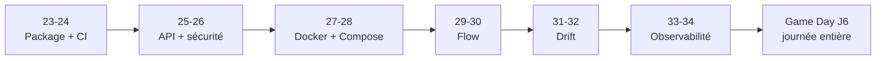

# Guide de l'apprenant — Sprint 3 CISIA · InduSense 4.0

> **Compétences (référentiel CISIA).** Sprint 3 = **C6** implémenter · **C7** architecture · **C8** mesurer/maintenir · **C2** menaces · **C3** données. **Épreuves certifiantes** : **questionnaire écrit — 45 min · 15 questions** (C1-C2-C4) · **oral — 1 h** (30 min présentation + 30 min échange, C1→C9), appuyés sur le **notebook (journal de bord) + support**. **Validation** : **70 % des compétences** **ET** **≥ 50 % des indicateurs de chaque compétence**.
> **Dates 2026.** J1 **lun 24/08** (23-24) · J2 **mar 25/08** (25-26) · J3 **mer 26/08** (27-28) · J4 **mar 01/09** (matin M29-M30 · après-midi M31-M32, passe 1 PayGuard) · J5 **mer 02/09** (matin M31-M32, passe 2 InduSense · après-midi M33-M34) · J6 **jeu 03/09** : Game Day. Le formateur annonce le rythme, les pauses et les transitions selon l'avancement réel du groupe.

> Ce guide t'accompagne pendant tout le Sprint 3 (formation à distance). Garde-le sous la main : il dit **ce que tu vas construire**, **comment se déroulent les journées**, **quels supports utiliser** et **comment tu es évalué**. Données de référence : capteurs `temperature` + `pressure_bar`, cible `panne` ; gold de démarrage généré depuis **`data/raw/`** (= `data/sample/`, **4 machines**) → **1 896 lignes entraînables**, `panne` ≈ **10,5 %** (échelle détaillée juste après). Repo de travail : **`github.com/thomasfesq/CISIA_24082026_Parcours`** — Python **3.13**, `uv`.
> 🎯 **Échelle des chiffres — nomme la population avant de citer un taux.** Ce que tu vois d'emblée = l'**échantillon du repo `CISIA_24082026_Parcours`**, dans **`data/raw/`** (**byte-identique à `data/sample/`**, **4 machines**) : **1 920 lignes brutes → `panne` ≈ 10,4 %** (200/1 920) ; le **gold** généré (`gold_dataset.csv`, `uv run indusense build-gold`) = **1 896 lignes entraînables → ≈ 10,5 %** (`panne_rate` 0,1055, après `dropna` des features temporelles). Les **4,7802 %** (3 137/65 625), le référentiel de **15 machines** et +73 FP si `date` est pris sans `time` ne valent **que sur le jeu complet** — **hors dépôt** (`indusense/datas/`, via `INDUSENSE_DATA_DIR`). Les formats `MACH-01`, `MACH_01`, `M-06` et `M-2` sont vérifiés, mais leur nombre total n'est pas sourcé. Pour retrouver 4,78 %, pointe le flux complet (cf. `95_snippet_donnees_reelles.md`). ⚠️ Ne confonds pas non plus avec le **gold synthétique de Sprint 4** (`generate_synthetic_gold.py`, m38) : **2 096 fenêtres · ≈ 9,9 %** — encore un autre univers.
> **🔗 Pont Sprint 2 → Sprint 3 (à savoir).** Le repo `CISIA_24082026_Parcours` livre un modèle **de démo** (`rf.joblib`, RandomForest, cible ≈ 10,5 %) pour que tout tourne d'emblée. Ton **vrai modèle** (celui de ton Sprint 2 ; cf. corrigé de référence `indusense_ml_dl` de M. Lannes) est un **XGBoost · horizon 24 h · seuil ≈ 0,41 · PR-AUC ≈ 0,62 · prévalence ≈ 16,6 %**, entraîné sur **HF `dacodemaniak/indusense`** (134 280 fenêtres, déjà Gold + split temporel) avec des **features fenêtrées** (rolling 1/6/12/24 h, trends, deltas, z-scores). En S3 tu industrialises **ton** modèle → chiffres/artefact/contrat différents de la démo, **c'est normal** : la mécanique d'industrialisation est **identique**. Points de passage : artefact **3.11 → 3.13** (vérifier `joblib.load`, ré-`joblib.dump` si besoin) · ajouter **`xgboost`** aux deps · adapter le **schéma Pydantic** à tes vraies features (pas les 7 relevés bruts de la démo) · utiliser **ton seuil** (≈ 0,41) · exclure la fuite **`future_incident_count_*`**.

## Bienvenue — le Sprint 3 en bref

🎯 **Le projet (fil rouge InduSense).** Tu **industrialises** une solution d'IA de maintenance prédictive : passer d'un modèle « qui marche en notebook » à un **service déployable, orchestré et observable**. À la fin : une **API** de prédiction de pannes, **conteneurisée**, **automatisée** par un flow, **surveillée** (drift) et **observée** (dashboards).

🗺️ **Le déroulé.** Le drift M31-M32 se construit en deux passes : PayGuard le J4 après-midi, puis InduSense le J5 matin. Chaque module conserve les quatre gestes **théorie → travaux dirigés → autonomie tutorée → corrigé**, avec priorité au socle et à la preuve. Le formateur vous indique en direct quand passer à l'étape suivante.

🧱 **La chaîne.** Chaque module ajoute une **brique réutilisée** par le suivant : package → CI → API → sécurité → Docker → compose → flow → drift → observabilité. C'est une **histoire**, pas un catalogue d'outils.

**Carte de progression du Sprint 3 (23 → 34, puis Game Day J6) — vue d'ensemble, non exhaustive.**

## Avant de commencer & tes supports

🧰 **Installation.** Clone **`github.com/thomasfesq/CISIA_24082026_Parcours`**, puis suis `SETUP_poste_codex.md` (ou demande au formateur) : WSL2 + Docker Desktop, uv + Python 3.13, **`uv sync --frozen --extra dev`** (toujours **`--frozen`** : même environnement que la CI et le Dockerfile, verrouillé par `uv.lock`). Lance ensuite **toutes** tes commandes via **`uv run`** — vérifie que `uv run pytest -q` est **vert** avant la 1re séance.

📚 **Tes supports.** Pour chaque module : un **deck PowerPoint** (théorie + schémas + rubriques), une **fiche TD** (version apprenant), une **fiche de révision** (recto récap), et un **QCM de fin de journée**. Le **corrigé** est tenu par le formateur (dévoilé au fil de l'eau).

🧭 **Comment avancer.** Lis le **Rappel théorique** de la fiche TD **avant** le TP. Pendant le TP, complète les trous **étape par étape** et **vérifie la sortie attendue** (« ce que tu dois voir ») avant de continuer.

## Réussir à distance & être évalué

🧭 **Autonomie tutorée.** Le **formateur reste disponible** en visio/chat et ajuste la durée à votre progression. Si tu bloques, appelle-le. On débriefe en groupe au signal.

✅ **Évaluation = des preuves.** Chaque module se valide par une **preuve concrète** (un test vert, un endpoint qui répond, un `count(*)` stable…). Garde tes captures : elles constituent ton **dossier de preuves certifiantes** (grille en clôture du sprint).

💡 **Conseils pour réussir.** Caméra / partage d'écran encouragés ; pose tes questions dans le chat dédié ; refais le **QCM de fin de journée** et relis la **fiche de révision** le soir. Souviens-toi : le diable est dans les détails (ex. cible `date` **+** `time`, jointure `by="machine"`).
