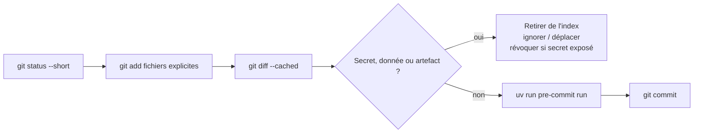

# Prérequis express & glossaire — Sprint 3 InduSense 4.0

> **Pour qui ?** Si tu découvres Git, le terminal ou les environnements Python, lis cette page **avant J1**. Objectif : ne perdre personne au démarrage.
> **Comment l'utiliser.** Garde-la ouverte à côté de toi pendant le sprint. Le **glossaire** (page 2) décode chaque mot qui revient.

---

## 1. Le terminal (Windows, macOS et Linux)

Le terminal exécute des commandes texte. Dans VS Code, utilisez **Terminal >
Nouveau terminal** : PowerShell sous Windows, zsh sous macOS ou bash sous Linux.

| Action | Commande | Note |
|---|---|---|
| Voir où je suis | `Get-Location` (PowerShell) · `pwd` (macOS/Linux) | dossier courant |
| Lister les fichiers | `Get-ChildItem` (PowerShell) · `ls -la` (macOS/Linux) | tout, détaillé |
| Aller dans un dossier | `cd mon_dossier` | `cd ..` = remonter d'un cran |
| Chemin avec espaces | `cd "mon dossier"` | **entoure de guillemets** |

> ⚑ Sous **Windows**, les chemins de shell utilisent souvent `\`
> (`C:\Users\...`) ; macOS/Linux utilisent `/`. Python, Git et Docker acceptent
> les chemins de projet écrits avec `/` sur les trois systèmes.

---

## 2. Git en 6 gestes

Git **versionne** ton code (historique + collaboration). Les seuls gestes utiles cette semaine :

| Geste | Commande | Ce que ça fait |
|---|---|---|
| Cloner | `git clone <url>` | Récupère le dépôt sur ton poste |
| État | `git status` | Ce qui a changé |
| Préparer | `git add <fichiers explicites>` | Sélectionne pour le prochain commit (évite `git add .` à l'aveugle) |
| Enregistrer | `git commit -m "message"` | Fige une version |
| Brancher | `git checkout -b ma-branche` | Travaille à côté de `main` |
| Fusionner | `git merge ma-branche` | Ramène les changements |

> ⚠ **Ne committe jamais un secret** (mot de passe, clé d'API) **ni une donnée** : commence par `git status --short`, ajoute des **fichiers explicites** (`git add <fichier>`, pas `git add .` à l'aveugle qui embarque ce qui n'est pas ignoré), puis relis avec `git diff --cached`. Le pre-commit / **gitleaks** (module 24) **aide** à bloquer les secrets **s'il est installé** : c'est un filet, **pas une garantie**. Un secret déjà poussé est **compromis** → **révoque-le**.

**Commit sûr, en un coup d'œil :**

---

## 3. Python & uv

On gère l'environnement avec **uv** (rapide, reproductible). Pas besoin de connaître `pip` ou `venv` à la main.

| Action | Commande |
|---|---|
| Installer les dépendances | `uv sync --frozen --extra dev` |
| Lancer un outil du projet | `uv run <commande>` (ex. `uv run pytest -q`) |
| Lancer l'API | `uv run uvicorn indusense.api.main:app --reload` |

> ⓘ `uv run` exécute la commande **dans l'environnement du projet** : tu n'as rien à « activer ». Si une commande « n'existe pas », préfixe-la par `uv run`.

---

## 4. L'éditeur

**VS Code** suffit pour tout : ouvrir le dossier du projet (`File > Open Folder`), éditer, et utiliser le **terminal intégré** (`Terminal > New Terminal`). Installe l'extension **Python**.

> **Check de départ (à faire une fois) :** `git --version`, `uv --version`, `docker --version` répondent → tu es prêt. Sinon, signale-le au formateur **avant** le module concerné.
> **Bon interpréteur ?** Après `uv sync --frozen --extra dev`, vérifie **`uv run python --version`** → il doit afficher **3.13.x** (l'interpréteur **du projet**, pas celui du système : un `python --version` global peut afficher 3.12 ou 3.14 sans que ça compte).

---

## 5. Compatibilité Windows · macOS · Linux · WSL

Le **code du projet est portable** (chemins via `pathlib`). Les supports
principaux montrent souvent PowerShell ; le fichier
`guide_multiplateforme_apprenant_sprint3.md` fournit les équivalents zsh/bash
module par module. Choisis une colonne et conserve le même terminal pendant une
séquence.

| Élément | macOS / Linux / WSL / Git Bash | Windows PowerShell |
|---|---|---|
| Lancer un outil | `uv run …` (pas d'activation à faire) | `uv run …` (idem) |
| Variable d'environnement | `export VAR=val` | `$env:VAR="val"` |
| Continuation de ligne | antislash en fin de ligne | accent grave en fin de ligne |
| Appeler curl | `curl …` | `curl.exe …` (pas l'alias `curl`) |
| Chemin de fichier | `/chemin/x` | `C:\chemin\x` |
| Remote DVC local (module 24) | `../dvc-store` | `..\dvc-store` |

> ⚠️ **Le remote DVC se donne en chemin *relatif*** (`..\dvc-store`, hors du dépôt) — **jamais** `/tmp/…` ni `C:\…` en dur : un chemin absolu ne se rejoue pas d'un poste à l'autre, et c'est précisément la reproductibilité qu'on cherche à prouver. C'est le chemin que le formateur dicte au module 24.

> Sous Windows, PowerShell est la voie de référence. Si vous choisissez WSL,
> suivez la colonne Linux et placez le dépôt dans `~/CISIA`, pas sous
> `/mnt/c/...`. Git Bash convient aux scripts explicitement lancés avec `bash`,
> mais ne remplace pas WSL pour Docker Engine Linux.

**Pièges WSL à connaître :**

- **Ne partage pas le même `.venv`** entre Windows natif et WSL (binaires incompatibles) : fais `uv sync --frozen --extra dev` **séparément** dans chaque environnement (tout extra utile est déjà figé dans `uv.lock`).
- Scripts `.sh` édités sous Windows : le **`.gitattributes`** du repo force déjà les fins de ligne **LF** — rien à faire.
- **Docker** : sous Windows installe Docker Desktop avec l'**intégration WSL** ; sous WSL/macOS, `docker compose up` fonctionne directement. **Scripts fournis dans le dépôt** : `install_docker_windows.ps1` / `install_docker_macos.sh` pour l'installer, puis `run_j3_stack.ps1` / `run_j3_stack.sh` qui lance et teste toute la stack du **J3** d'un coup.

## 6. Glossaire transverse (S1 → S3)

**Données & modèle (S1-S2)**
- **Gold dataset** : le jeu de données **propre et prêt à entraîner** (nettoyé, features calculées). Notre socle : 4 machines, ~10,5 % de pannes.
- **Feature** : une variable d'entrée du modèle (ex. moyenne glissante de température).
- **Fuite de données (leakage)** : quand une feature contient de l'info du futur (ou de la cible) → score truqué. Parade : `shift(1)` **avant** toute moyenne glissante.
- **PR-AUC** : métrique adaptée aux **classes rares** (les pannes), plus honnête que l'accuracy.
- **Model card** : fiche d'identité du modèle (données, perfs, limites) qui **justifie le choix**.

**Industrialisation (S3)**
- **API REST** : une porte d'entrée standardisée pour interroger le modèle par le réseau.
- **Endpoint** : une URL d'action de l'API (`/predict-tabular`, `/health`).
- **`/health` vs `/ready` (liveness / readiness)** : `/health` = « le process tourne » (liveness) ; `/ready` = « le modèle est chargé, je peux prédire » (readiness, **503** tant que non).
- **FastAPI / Pydantic / Uvicorn** : le framework d'API / la validation des données entrantes / le serveur qui fait tourner l'API.
- **Conteneur / image (Docker)** : un colis qui embarque l'app **et** son environnement → « ça marche pareil partout ». L'**image** est un **paquet immuable** (application + runtime) construit une fois ; en **Variante A**, l'**artefact modèle** (`rf.joblib`) y est **copié dedans**. Le **conteneur** est l'**instance en exécution** de cette image. (⚠ « image » ≠ « modèle IA » : l'image *contient* le modèle, elle ne l'est pas.)
- **Multi-stage (Docker)** : on **construit** dans une 1re étape avec les outils lourds, on **livre** une image finale mince — pour InduSense ≈ **450-550 Mo** (réaliste avec numpy/pandas/scikit-learn).
- **docker compose** : lance **plusieurs** services d'un coup (API + base + monitoring).
- **Orchestration / flow (Prefect)** : enchaîner des étapes automatiquement (ingérer → prédire → stocker) avec reprises sur erreur.
- **Idempotent** : rejouer une opération **ne crée pas de doublon** (clé d'unicité + upsert).
- **Data drift** : les données de production **s'éloignent** de celles d'entraînement → le modèle se dégrade.
- **PSI / KS** : deux mesures de drift (écart de distribution). PSI < 0,1 = RAS · PSI > 0,25 = dérive forte → agir (repère : +8 °C sur `temperature` → PSI ≈ 3,32).
- **Evidently** : la bibliothèque qui calcule le drift et produit un rapport.
- **Prometheus / `/metrics`** : collecte des métriques techniques (latence, trafic) exposées par l'API.
- **SLI / SLO** : un **indicateur** de service (ex. p95 de latence) / l'**objectif** qu'on se fixe dessus.
- **Grafana** : les **tableaux de bord** et les **alertes** au-dessus de Prometheus.
- **Runbook** : la procédure pas-à-pas à suivre **quand une alerte sonne**.
- **CI/CD** : l'usine automatique qui **teste** et **construit** à chaque push (GitHub Actions).
- **pre-commit** : des contrôles **avant** le commit (format, lint, secrets).
- **DVC / MLflow** : versionner les **données** / suivre et **enregistrer les modèles** (registry).

*Prérequis & glossaire — Sprint 3 CISIA · InduSense 4.0 · AELION. En cas de doute sur un mot, reviens ici.*
